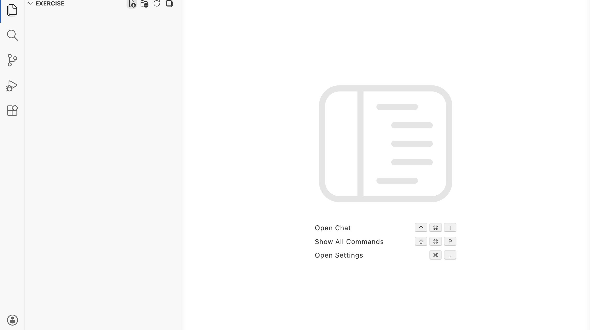
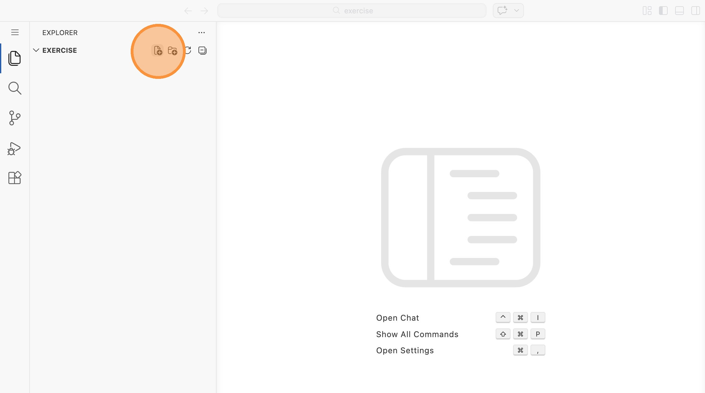
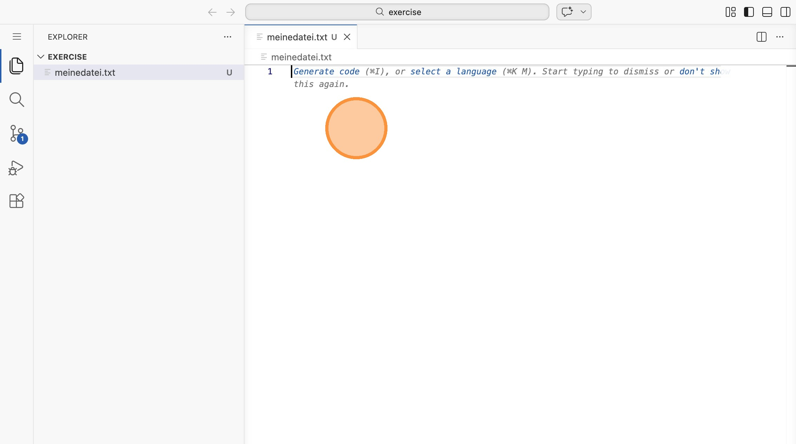
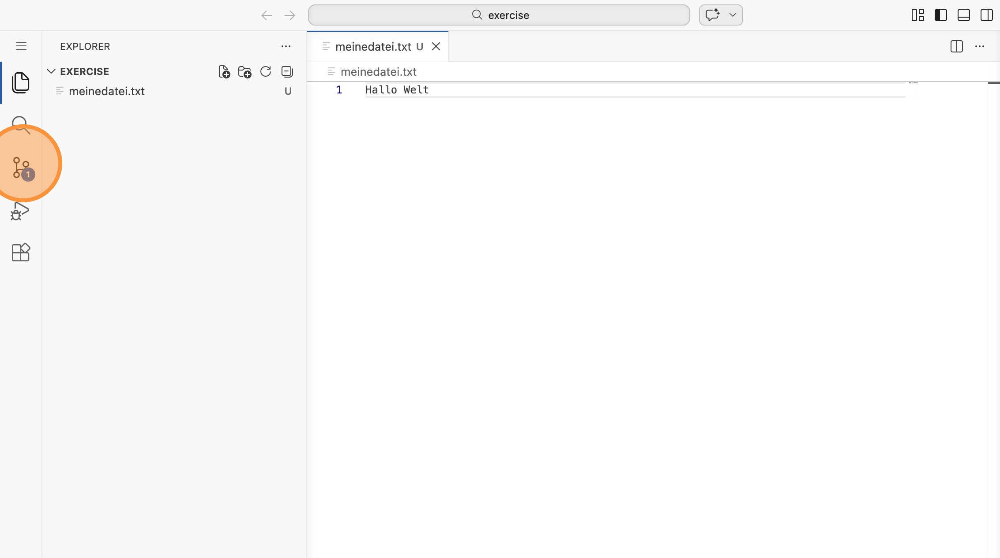
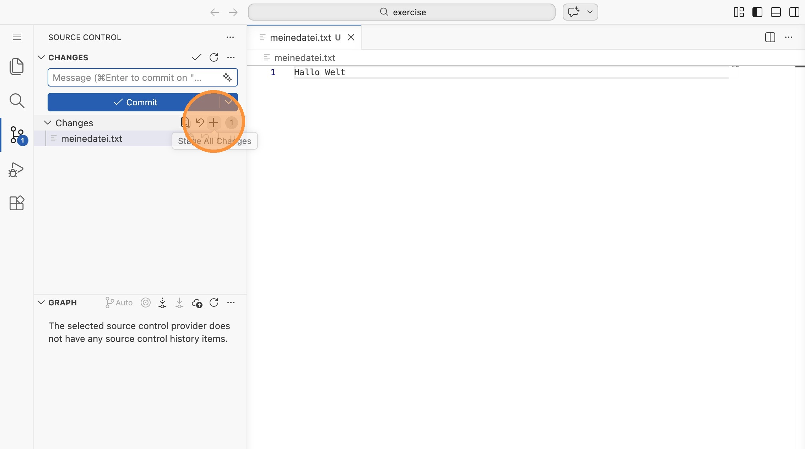
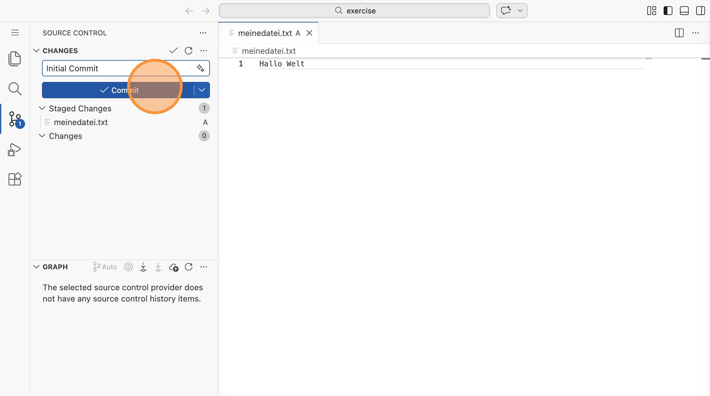
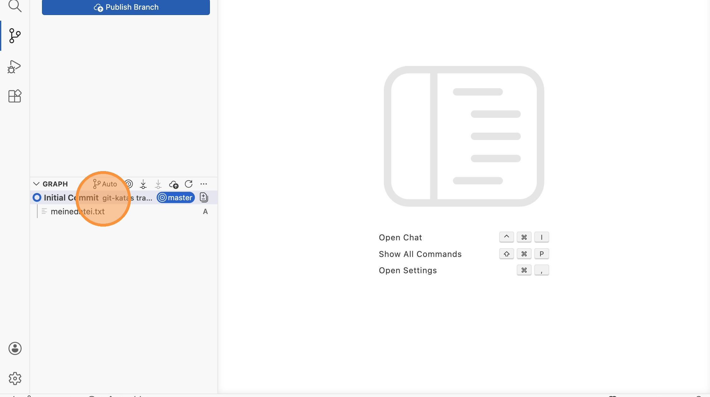

# Lab 01: Erste Commits (VS Code)

In dieser Aufgabe erstellst du deinen ersten Commit in VS Code und schaust dir danach das Ergebnis an.

1\. Öffne Visual Studio Code in dem Exercise-Verzeichnis für Lab 01 (`labs/01-basic-commits/exercise`)

2\. Klicke auf diesen Knopf

3\. Tippe `meinedatei.txt`

4\. Kicke auf `meinedatei.txt`

5\. Tippe "Hallo Welt"

6\. **Klicke auf das** Repository-Symbol

7\. Klicke auf das +

8\. Gebe als Message "Initial Commit" ein

9\. Klicke "Commit"

10\. Klicke auf den Commit unten in der Liste, um dir Details anzuzeigen.

