# Lab 02: Die Staging Area (VS Code)

Lerne, wie Änderungen am Repository in VS Code angezeigt und rückgängig gemacht werden können.

1\. Öffne VS Code im Verzeichnis `labs/02-basic-staging/exercise`.

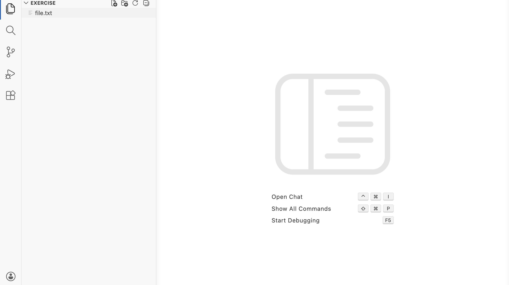

2\. Klicke auf die Datei "file.txt" und schau dir den Inhalt an

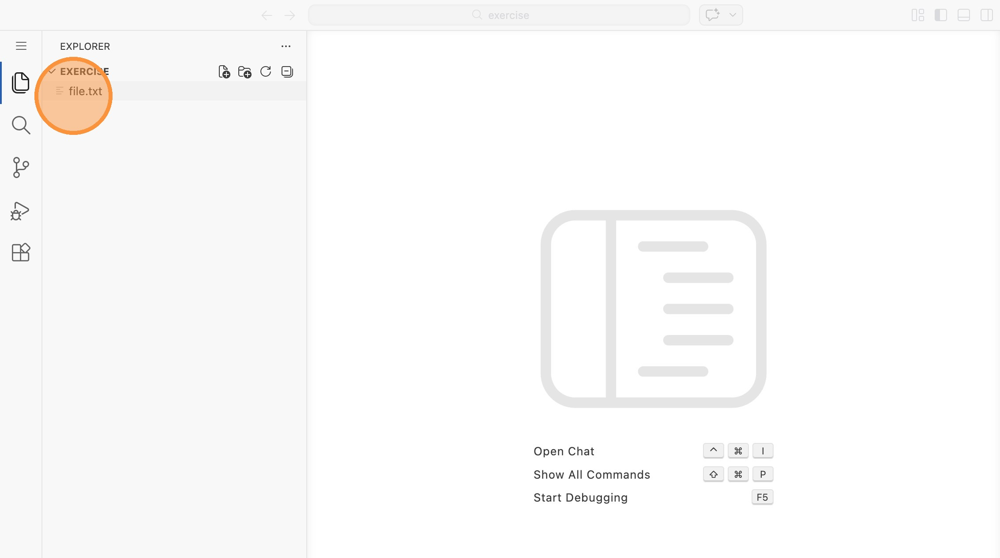

3\. Klicke nun auf das Repository-Symbol

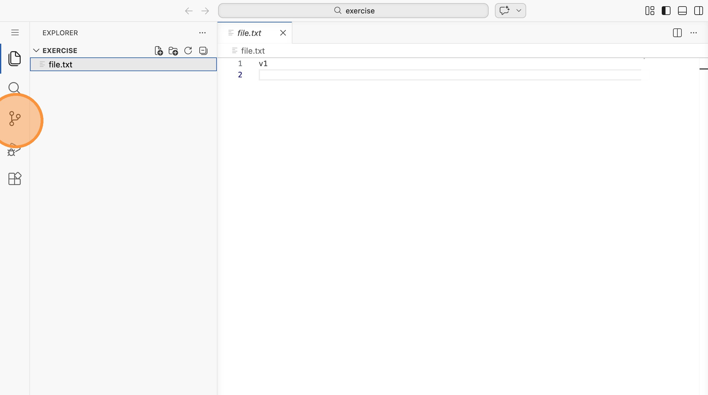

4\. Du siehst: Aktuell gibt es keine Änderungen. Gehe zurück in die Dateiansicht

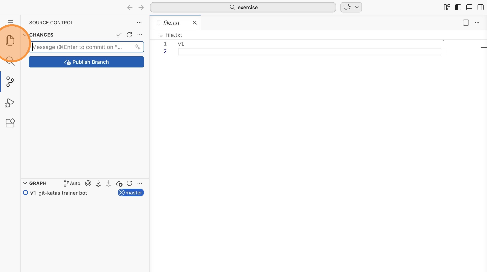

5\. Ändere den Inhalt der Datei zu "v2". Klicke dann auf die blaue Linie neben dem Text

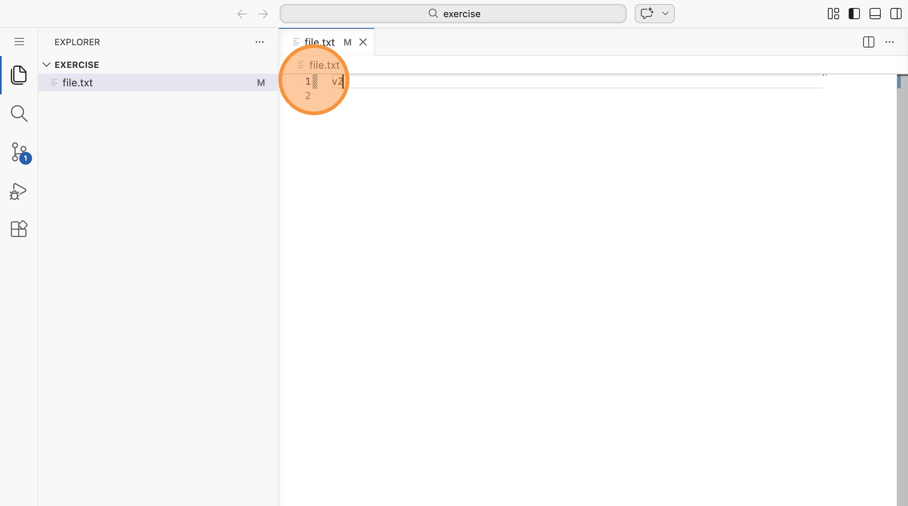

6\. Click here.

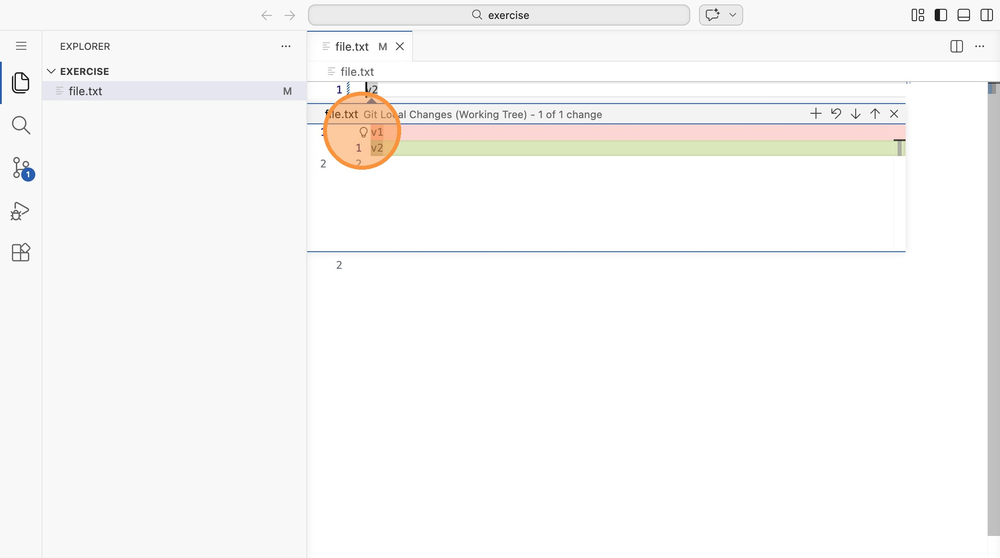

7\. Du siehst die Änderungen im Vergleich zum Stand des Repositories. Hier könntest du sie auch rückgängig machen - tu
dies aber nicht

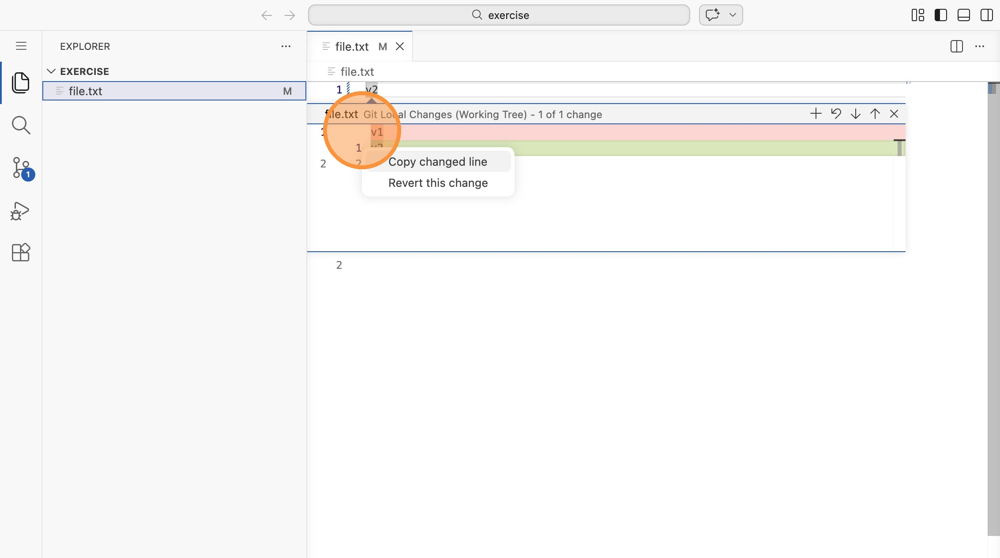

8\. Gehe in die Repository-Ansicht

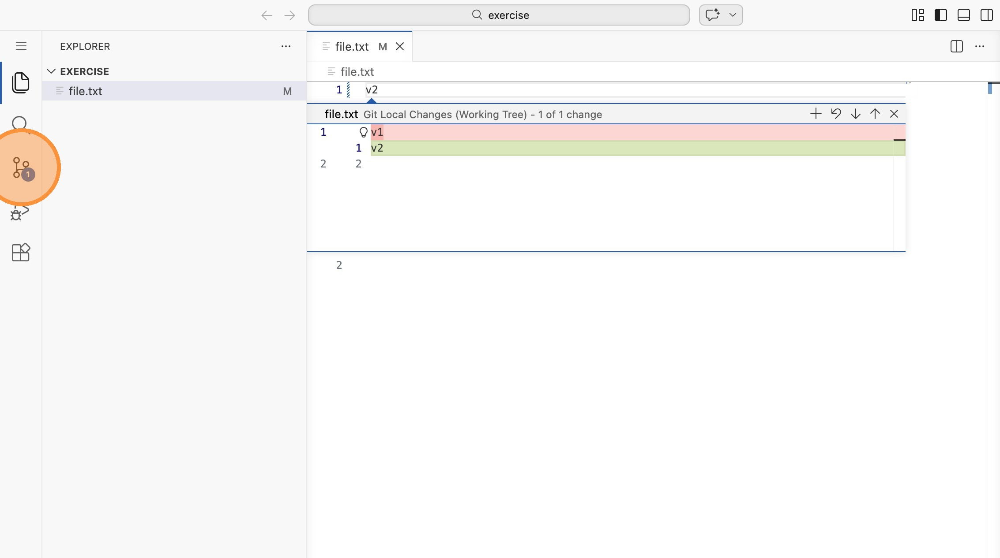

9\. Klicke auf das "+", um deine Änderung dem Staging hinzuzufügen

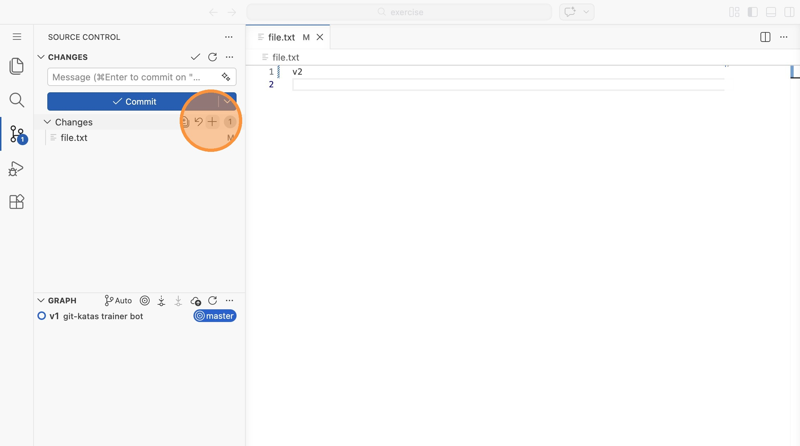

10\. Ändere den Dateinhalt zu "v3". Die blaue Linie zeigt wieder an, dass es Änderungen gibt. Klicke auf sie

11\. Über den Dropdown kannst du nun auswählen, ob du den Unterschied der Zeile zum Stand des Repositories sehen willst
oder zum Stand des Stagings.

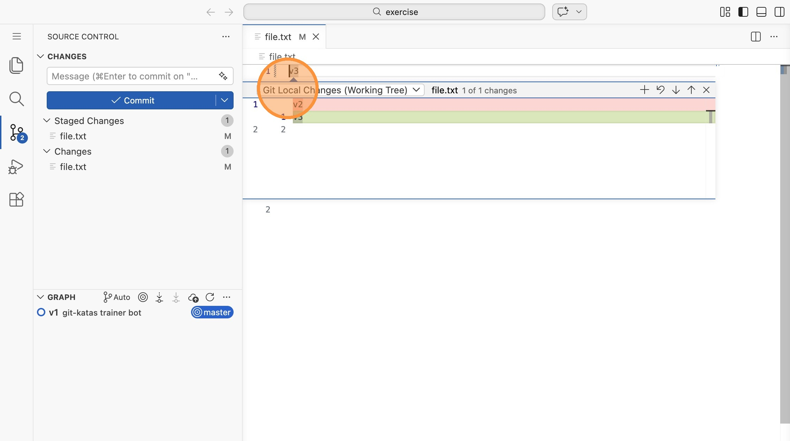

12\. Klicke auf "Git Local Changes (Index)". Dies zeigt den Unterschied deiner Zeile zum letzten Stand, den du mit dem
"+" zum Staging hinzugefügt hast.

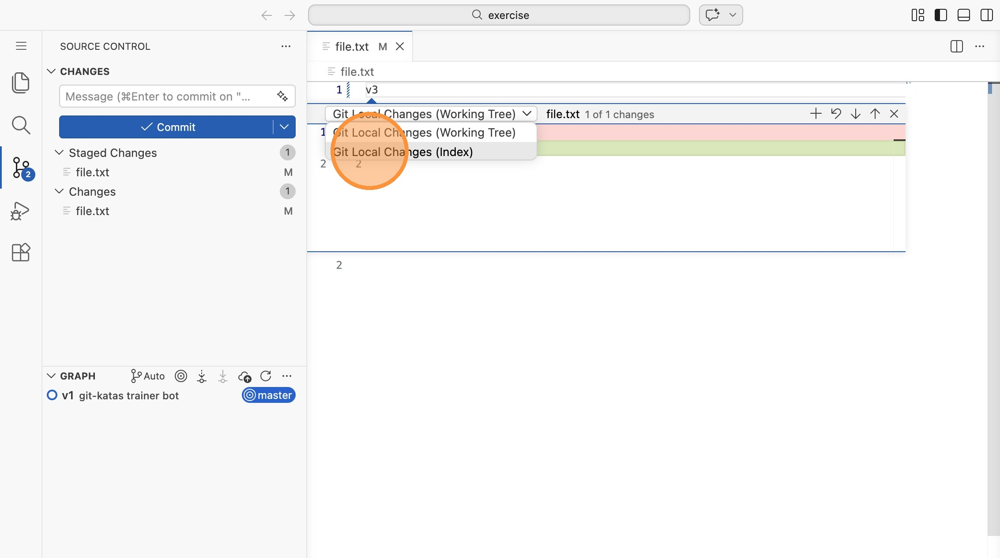

13\. Wechsle auf "Git Local Changes (Working Tree)". Du siehst die Änderungen im Vergleich zum zuletzt committeten Stand.

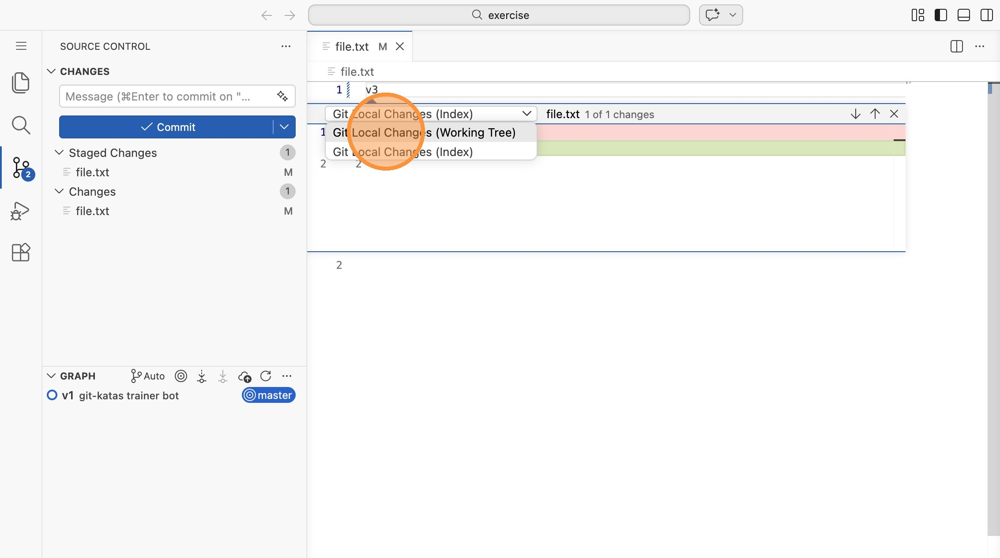

14\. Klicke nun auf das "-", um die Änderungen im Staging zurückzusetzen. Dies wird die Datei selbst nicht verändern,
aber dein Staging leeren.

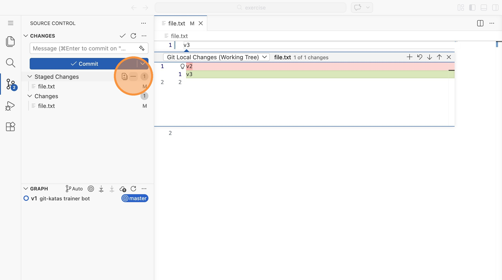

15\. Klicke wieder auf die blaue Linie

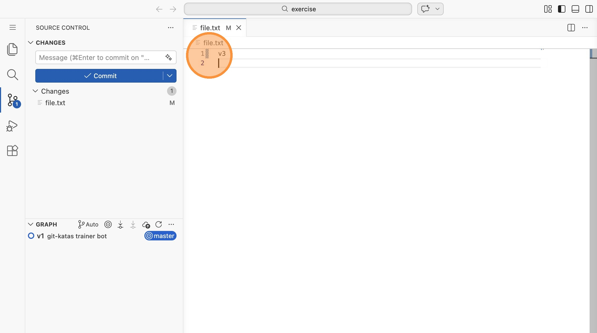

16\. Du siehst, dass nur noch ein Diff zur Verfügung steht: Das vom lokalen Dateizustand zum committeten Stand. Dar
Index ("staging") ist verschwunden.

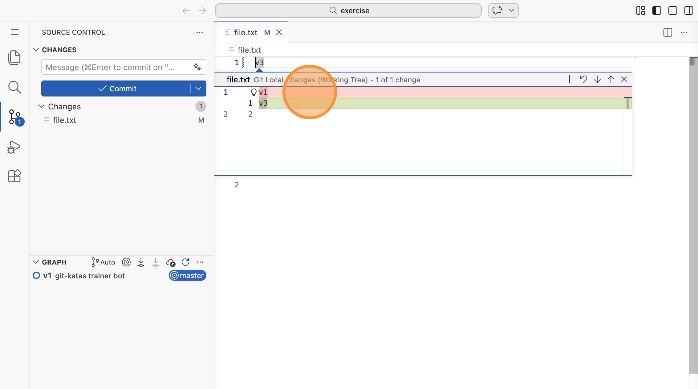

17\. Klicke rechts auf die Datei "file.txt"

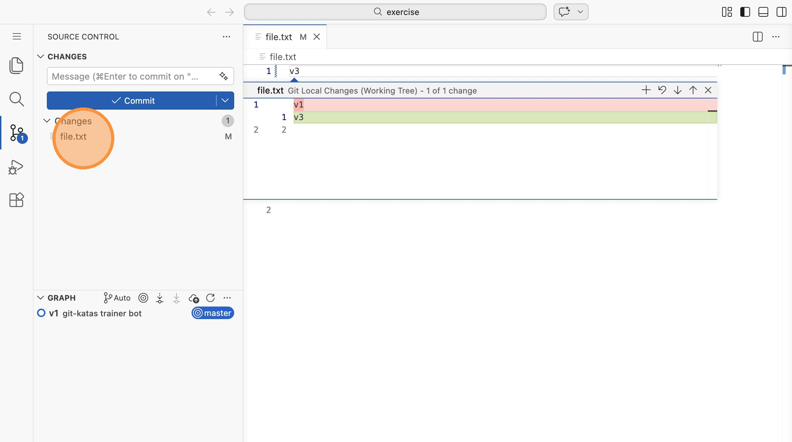

18\. Klicke auf "Discard Changes"

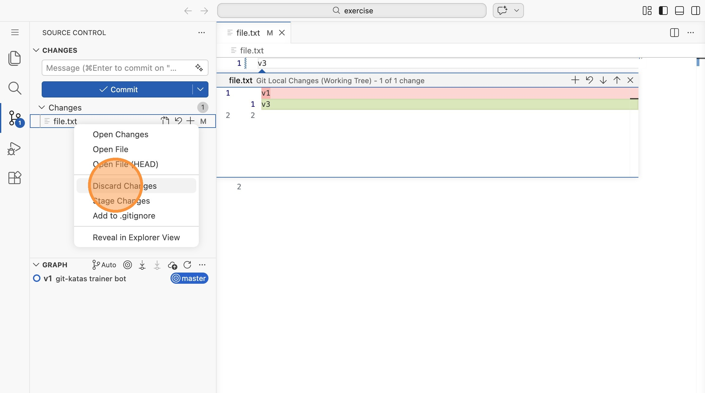

19\. Klicke auf "Discard File". Deine Änderungen sind nun auch in der Datei selbst rückgängig gemacht.

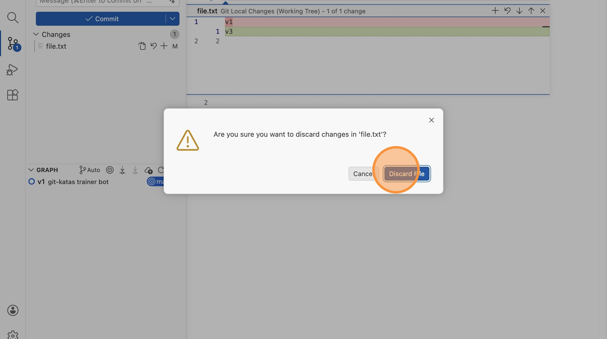
