# Lab 03: .gitignore (VS Code)

Sehe das Verhalten von .gitignore in VS Code.

Öffne VS Code im Verzeichnis `labs/03-ignore/exercise`.

1\. Klicke auf "New File..."

2\. Vergebe den Namen [[foo.s]]. Füge beliebigen Inhalt in die neue Datei hinzu. Füge danach mit "New file..." eine
weitere Datei hinzu.

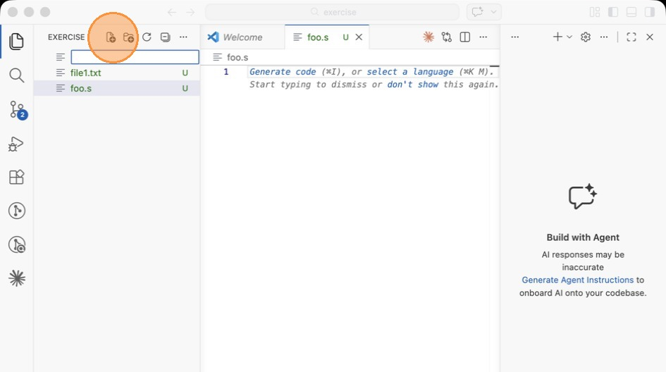

3\. Nenne die Datei [[.gitignore]]

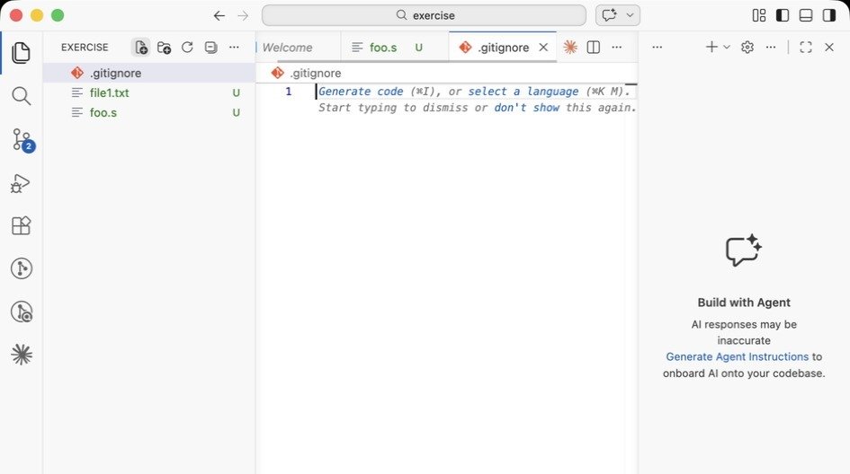

4\. Füge in die neue Datei den Inhalt [[\*.s]] hinzu. Dir wird kurz darauf auffallen, dass die Datei [[foo.s]] im
Dateibrowser ausgegraut ist. Das bedeutet, dass Änderungen an dieser Datei nun von Git ignoriert werden

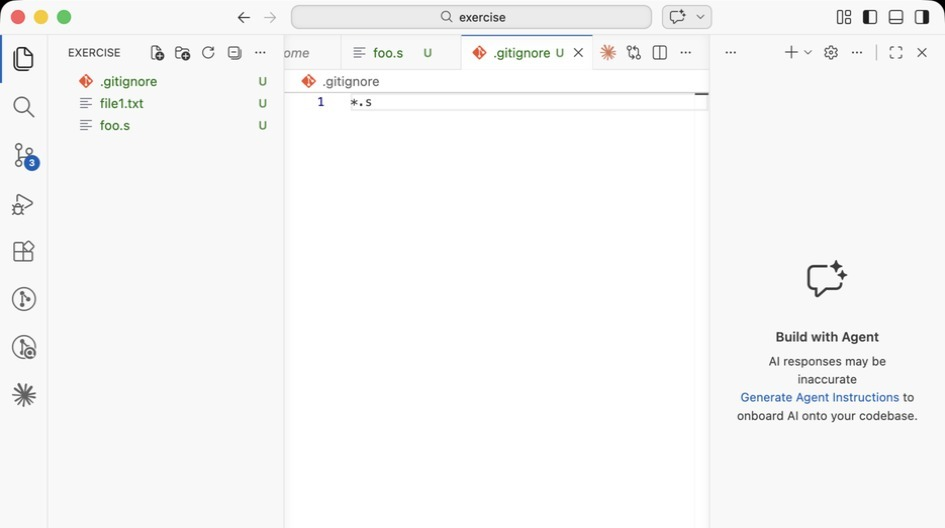

5\. Klicke auf den Knopf für die Repository-Ansicht

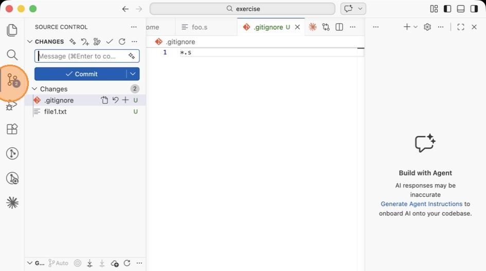

6\. Füge mit dem [[+]]  beide offenen Änderungen der Staging Area hinzu

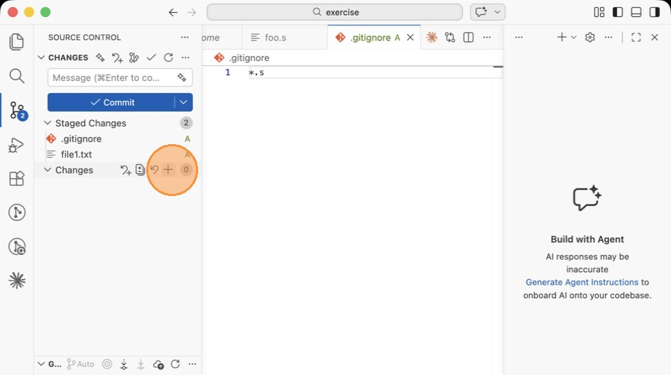

7\. Committe die Änderungen mit einer beliebigen Message. Nun ist auch die .gitignore im Repository committet.

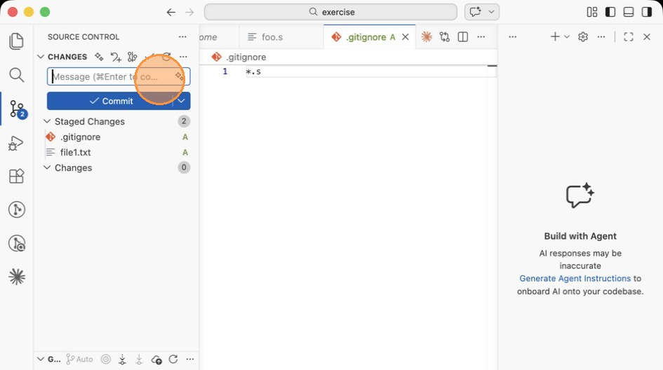

8\. Wir wollen nun sehen, was passiert, wenn man Änderungen an Dateien macht, die nicht von Anfang an in der
[[.gitignore]] waren. Füge der [[.gitignore]] die Zeile [[file1.txt]] hinzu

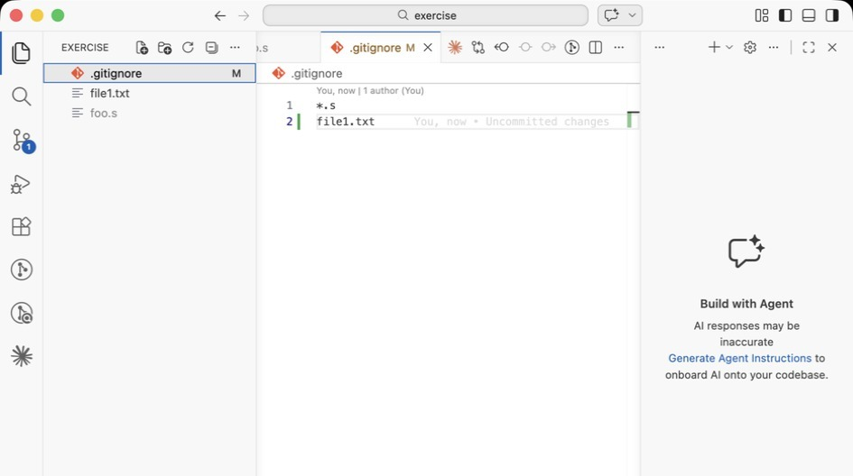

9\. Öffne die Dateiansicht

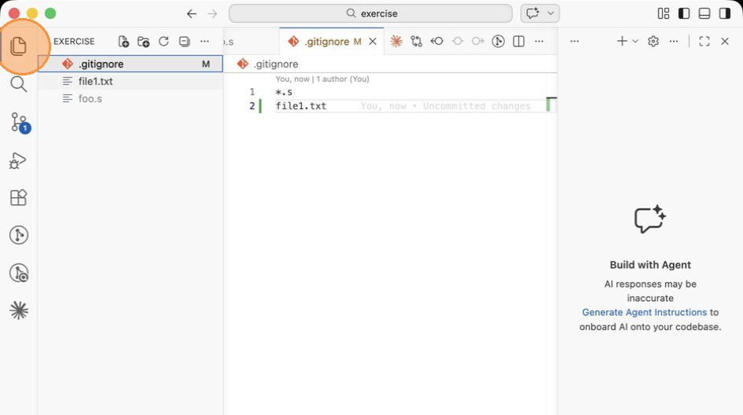

10\. Wähle die Datei [[file1.txt]]

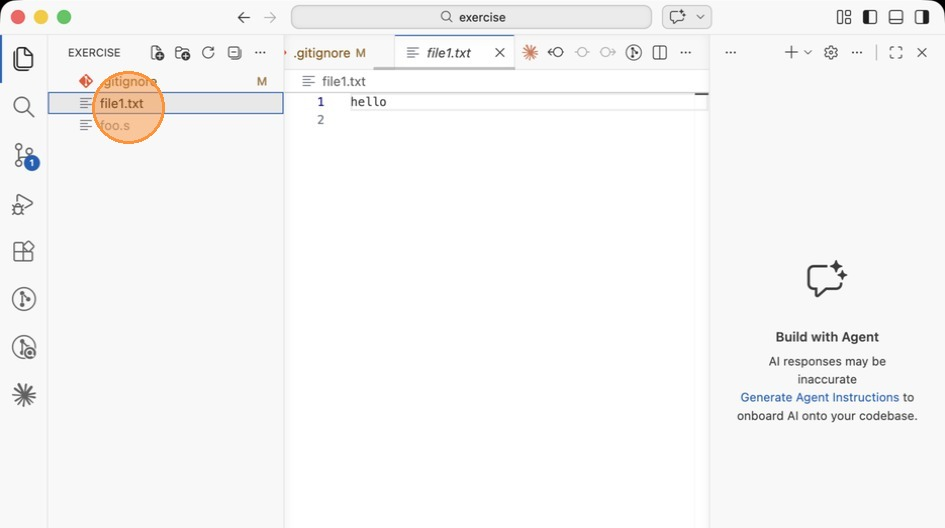

11\. Füge eine weitere Zeile in der Datei hinzu mit beliebigem Inhalt

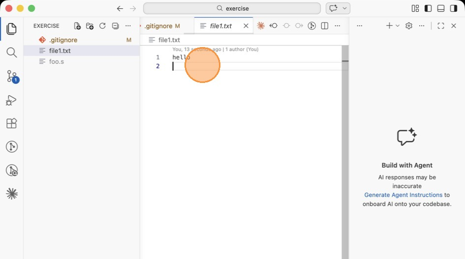

12\. Gehe wieder in die Repository-Ansicht. Die Datei test.txt wird als geändert erscheinen, obwohl sie in der
.gitignore ist! Das liegt daran, dass sie schon existierte, als sie noch nicht von Git ignoriert wurde.

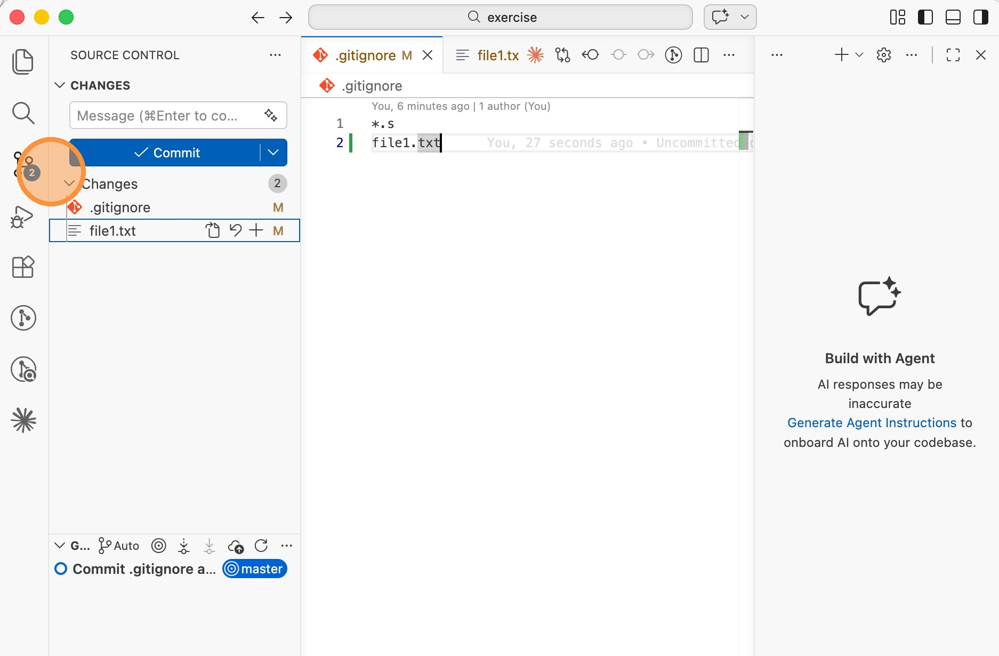

13\. Klicke im Menü auf "View" -> "Terminal" und gebe den Befehl [["git rm --cached file1.txt"]]  ein.

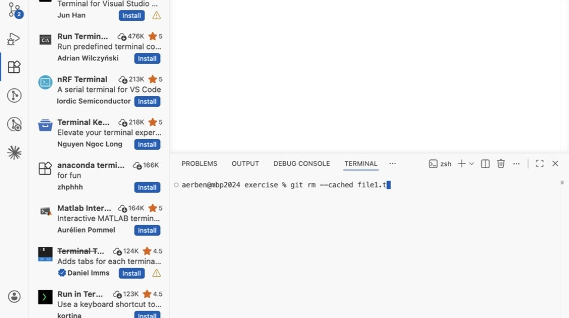

14\. Wechsle auf die Repository-Ansicht. Du siehst, dass die endgültige Löschung von [[file1.txt]] im Staging ist.

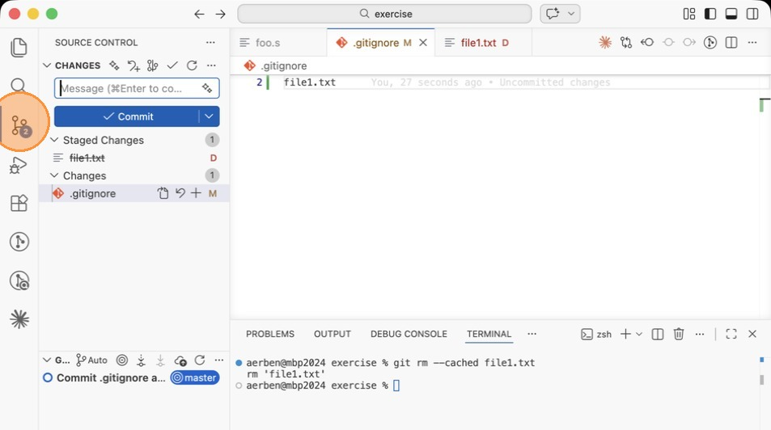

15\. Commite die Änderung mit einer beliebigen Message. Die Datei ist nun aus dem Index entfernt, aber weiterhin auf
deiner Festplatte vorhanden.

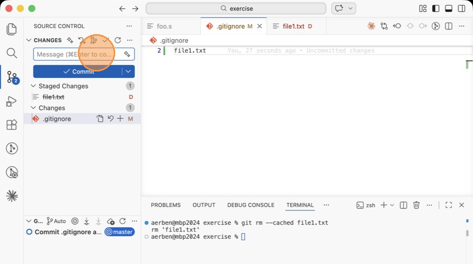
