# Lab 04: Branching (VS Code)

Lerne, wie du einen neuen Branch erstellst, neue Dateien hinzufügst und Änderungen über eine webbasierte Git-Oberfläche
commitest. Diese Anleitung ist ideal, um grundlegende Branching- und Commit-Workflows in Git zu verstehen.

1. Öffne VS Code im Verzeichnis `labs/04-basic-branching/exercise`.

2. Wechsle auf die Repository-Ansicht.

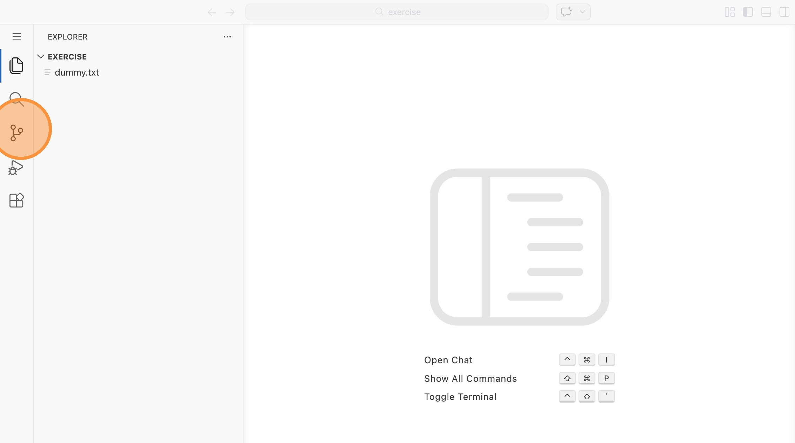

3. Klicke auf "master"

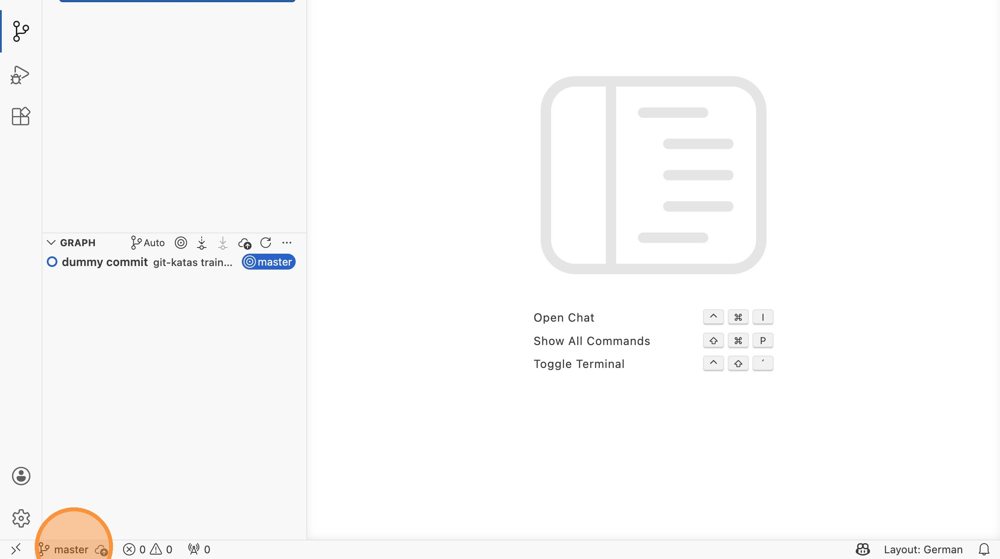

4. Klicke auf "Create new branch..."

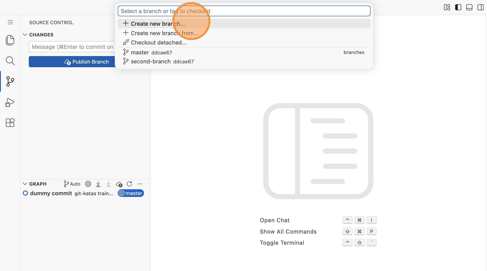

5. Vergebe den Namen "mybranch"

6. Erstelle daraufhin eine neue Datei über das `+`-Symbol

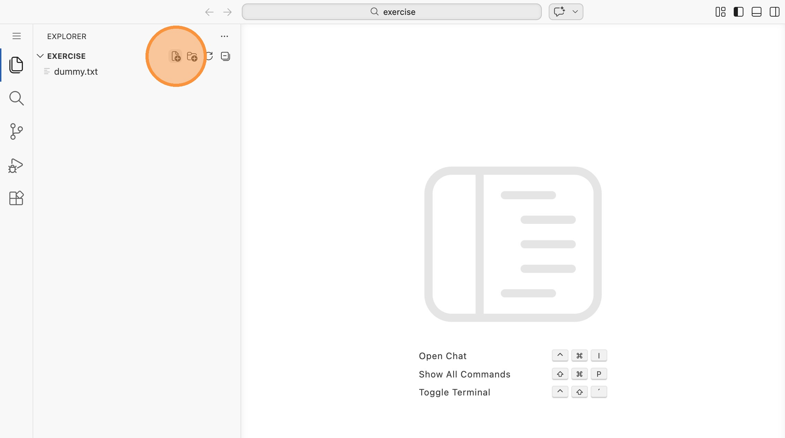

7. Vergebe den Namen `testfile.txt` und deinen Namen als Inhalt

8. Wechsle auf die Repository-Ansicht, füge die Datei zum Staging hinzu und
   commite sie.

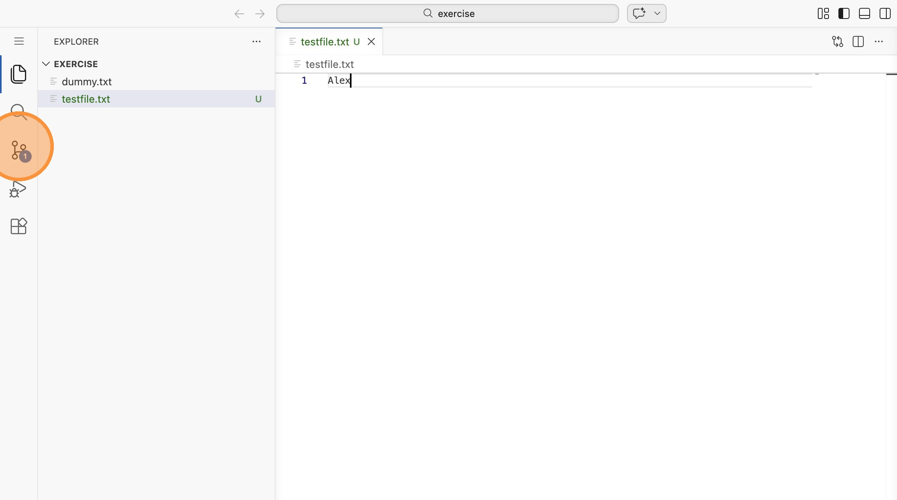

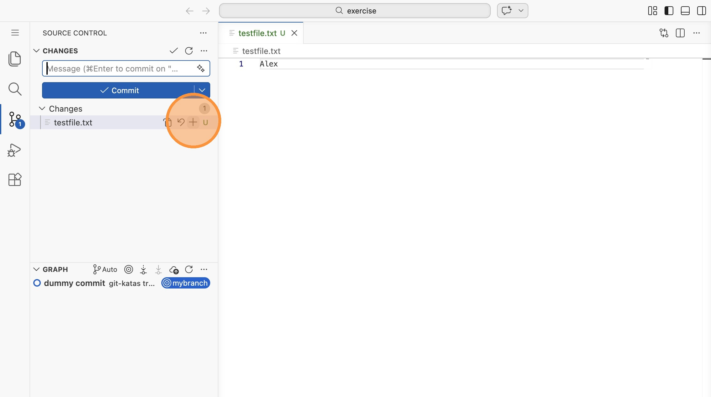

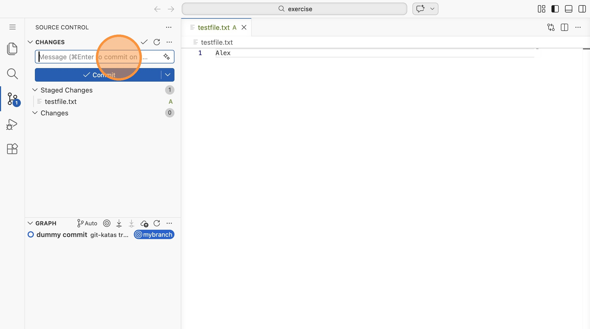

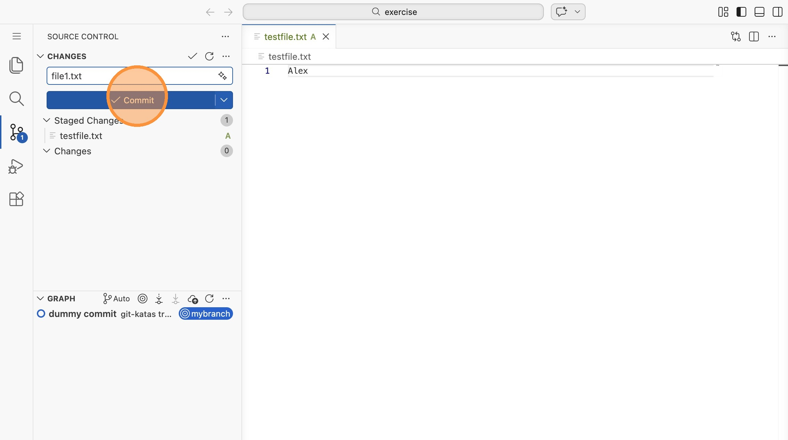

9. Klicke nun auf den Commit unten in der Liste. Du siehst Details.

10. Klicke nun unten auf "mybranch" und wechsle zurück auf den master.

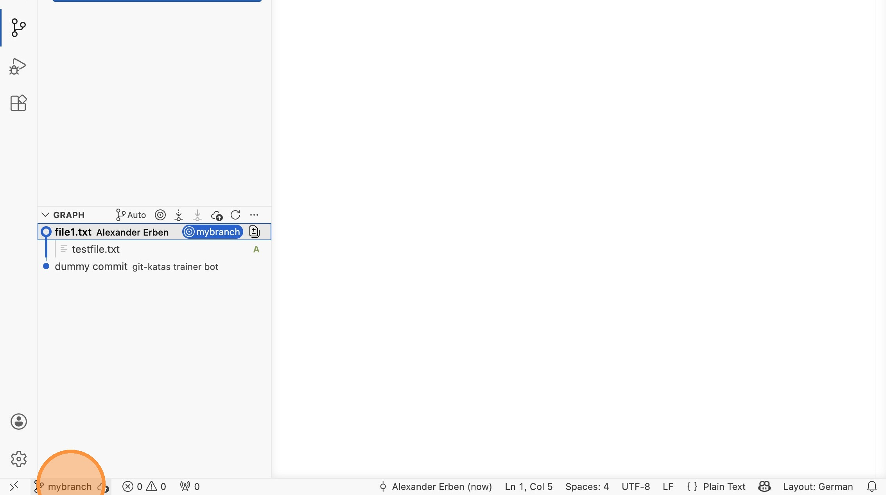

11. Erstelle eine neue Datei `file2.txt` mit beliebigem Inhalt

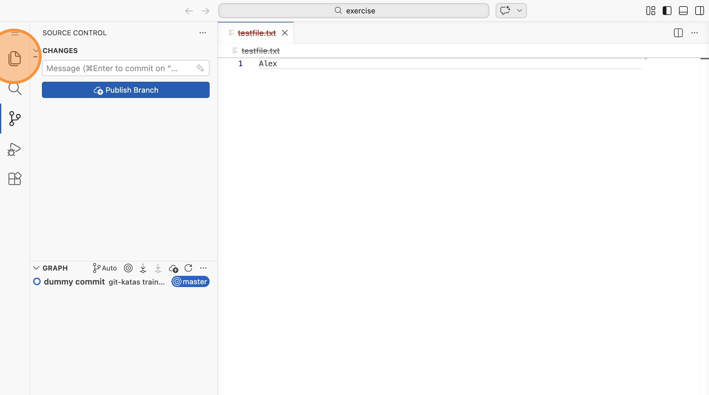

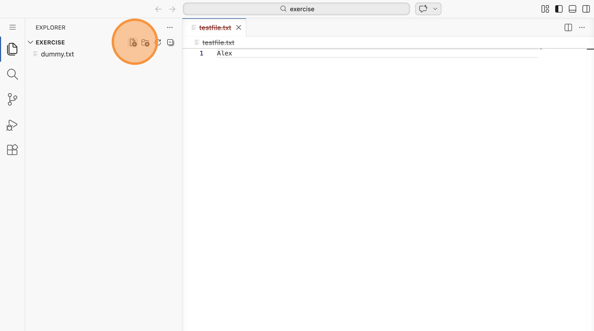

12. Commite die neue Datei

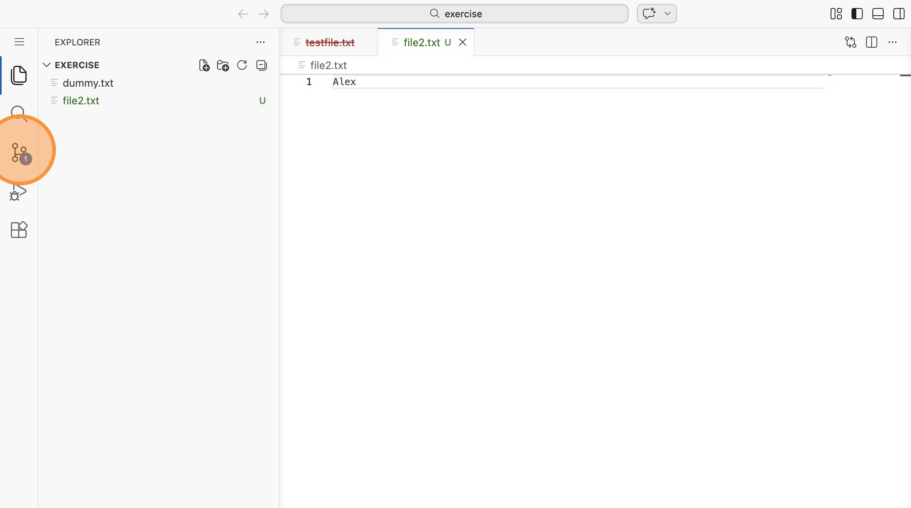

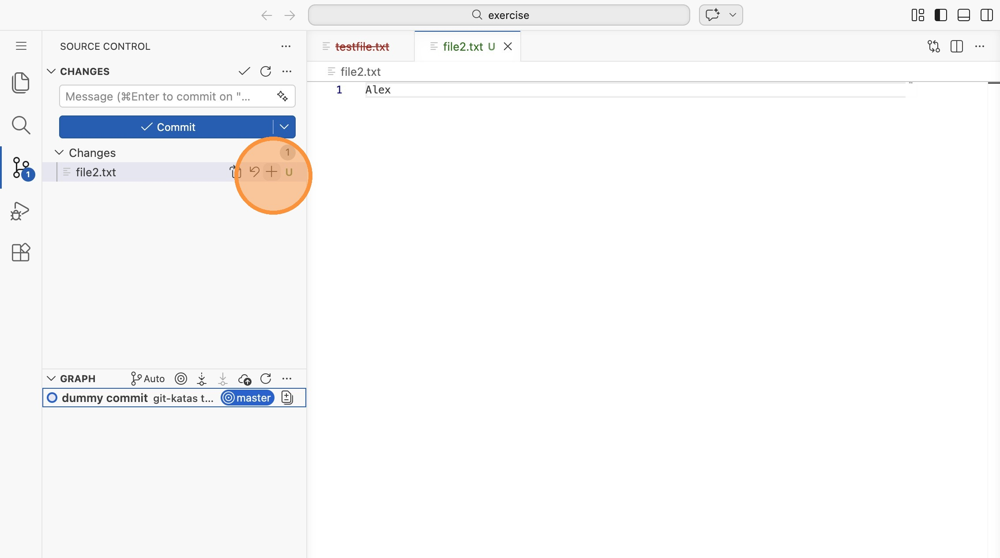

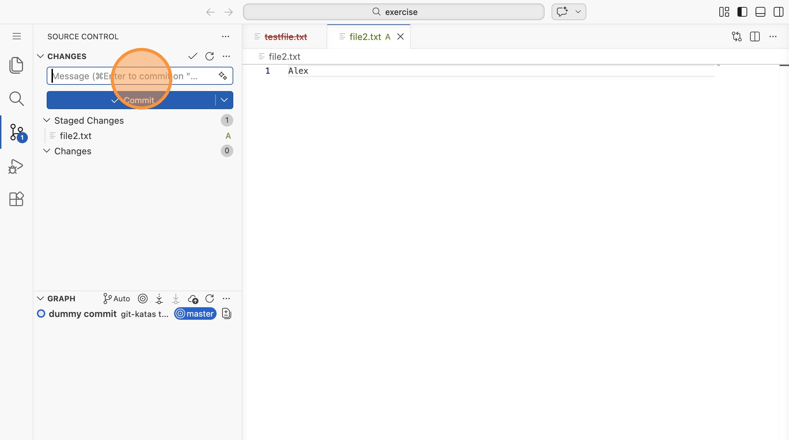

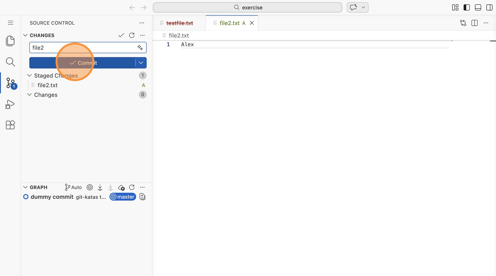

13. Um die Branch-Struktur zu sehen, klicke auf "Auto"

14. ...und daraufhin in dem erscheinenden Fenster auf "All"

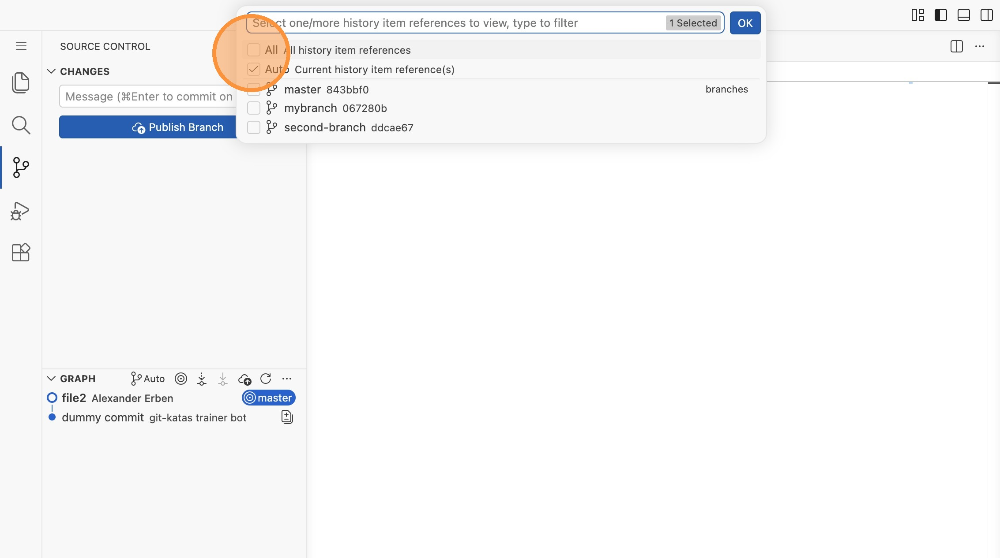

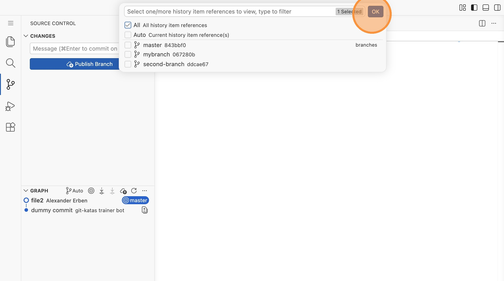

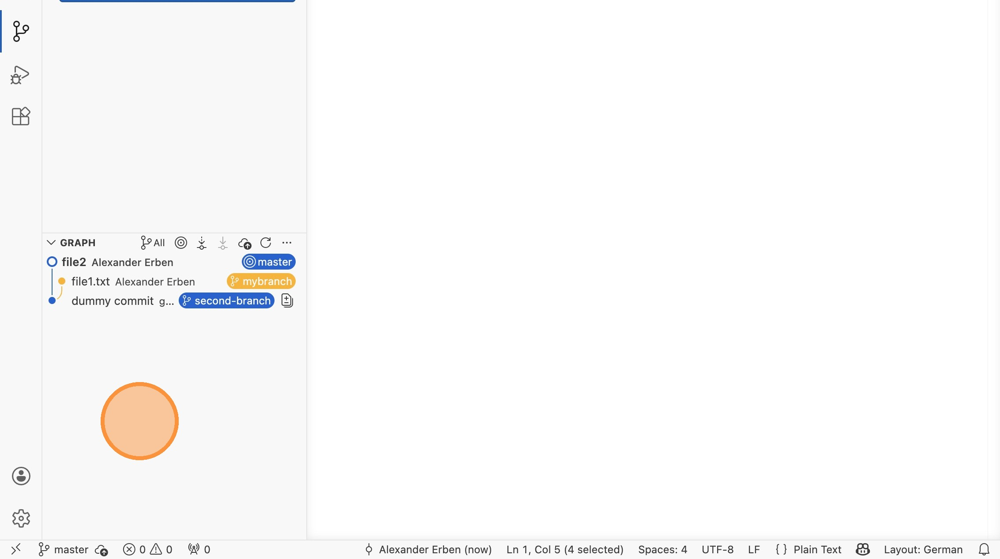
