# Lab 05: Fast-Forward-Merge (VS Code)

Lerne, wie du einen neuen Branch in VS Code erstellst, Änderungen an einer Datei vornimmst und diese commitest. Anschließend führst du einen Fast-Forward-Merge durch. Diese Anleitung behandelt die grundlegenden Schritte für das Arbeiten mit Branches und Merges.

1. Öffne VS Code im Verzeichnis `labs/05-ff-merge/exercise`.

2. Klicke auf "master"

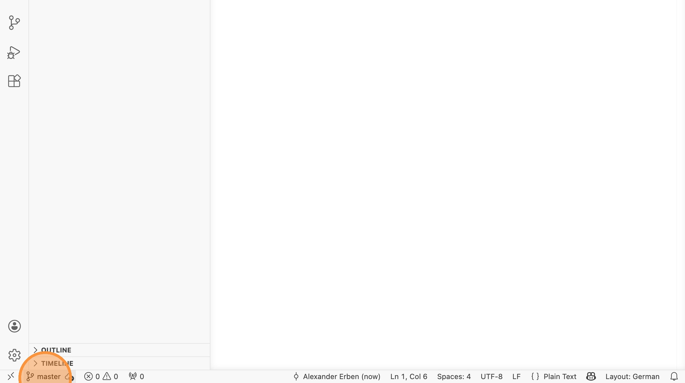

3. Klicke auf "Create new branch..."

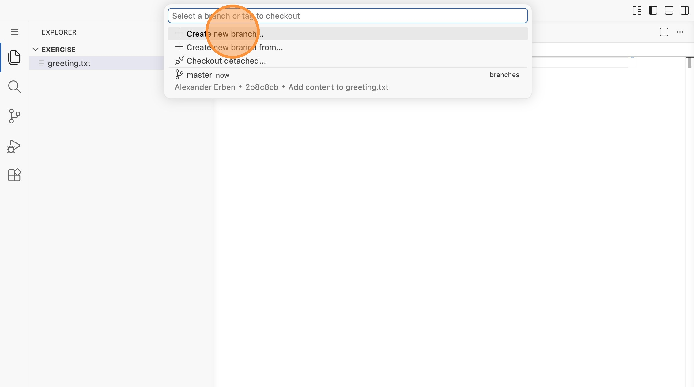

4. Vergebe den Namen "feature/my-changes"

5. Öffne die Datei `greeting.txt` und ändere "hello" zu "HELLO"

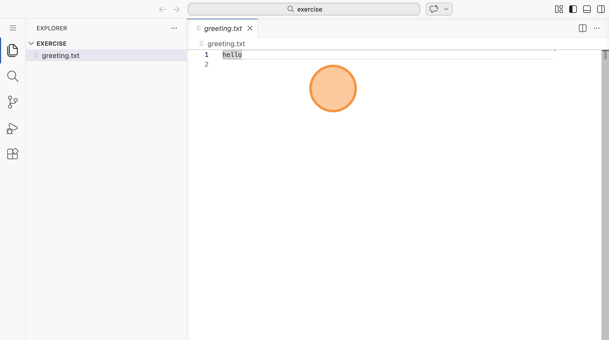

6. Wechsle auf die Repository-Ansicht, füge die Datei zum Staging hinzu und
commite sie mit der Nachricht "to uppercase".

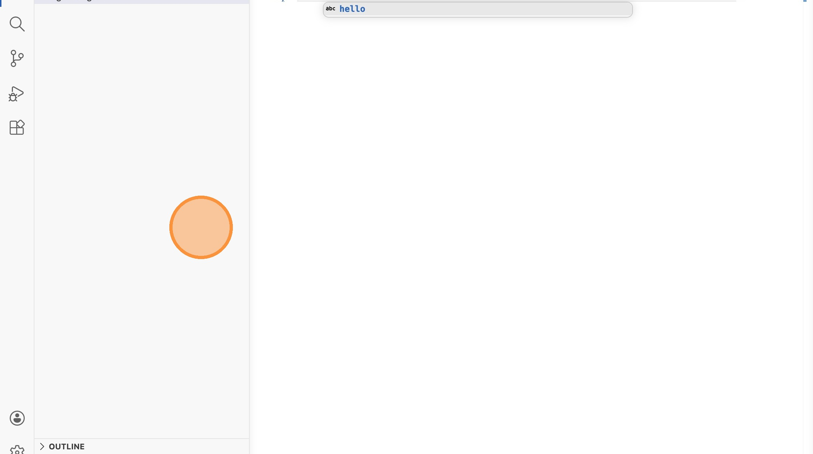

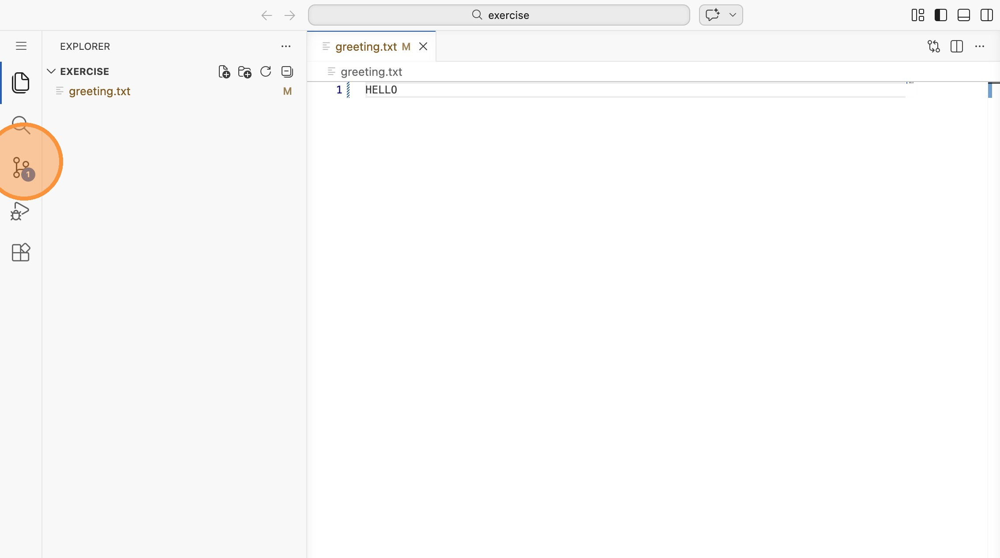

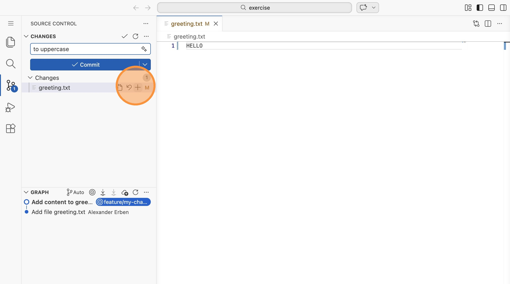

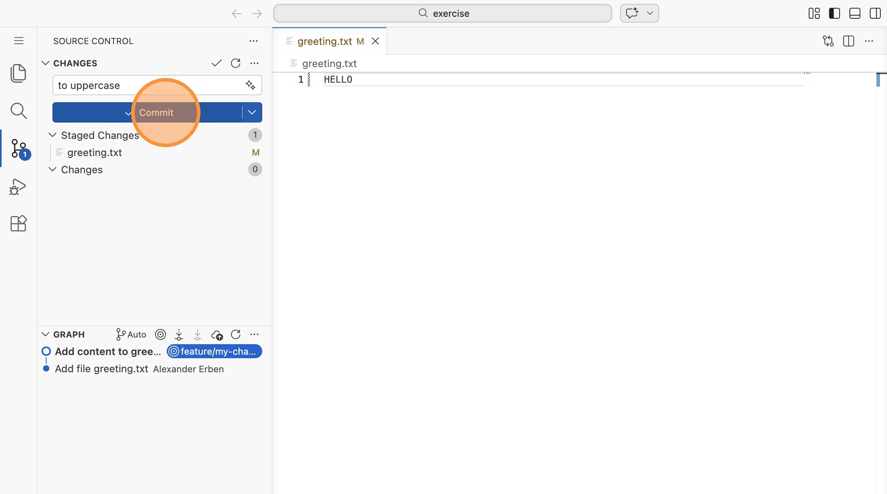

7. Klicke nun unten auf "feature/my-changes" und wechsle zurück auf den master.

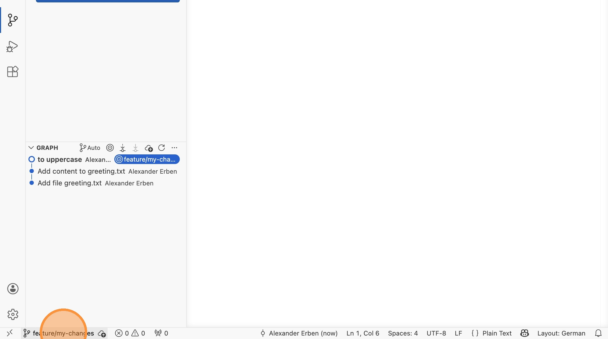

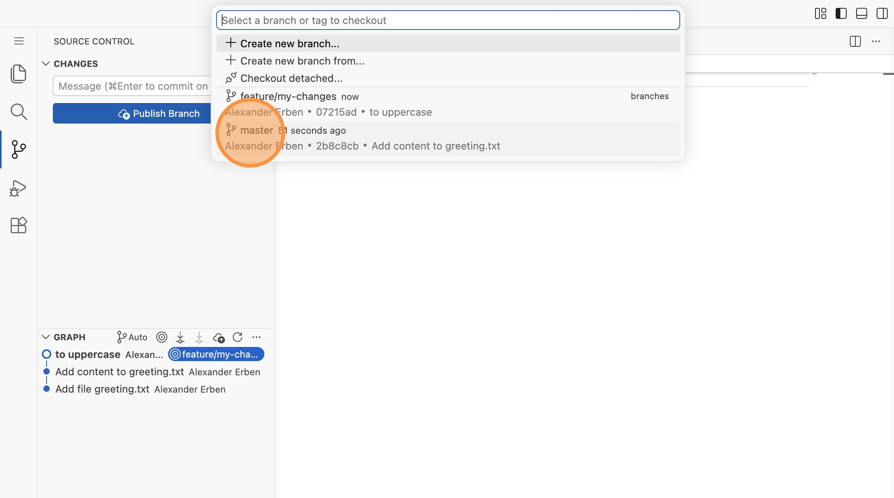

8. Öffne die Branch-Ansicht und merge den Branch "feature/my-changes" in den master.

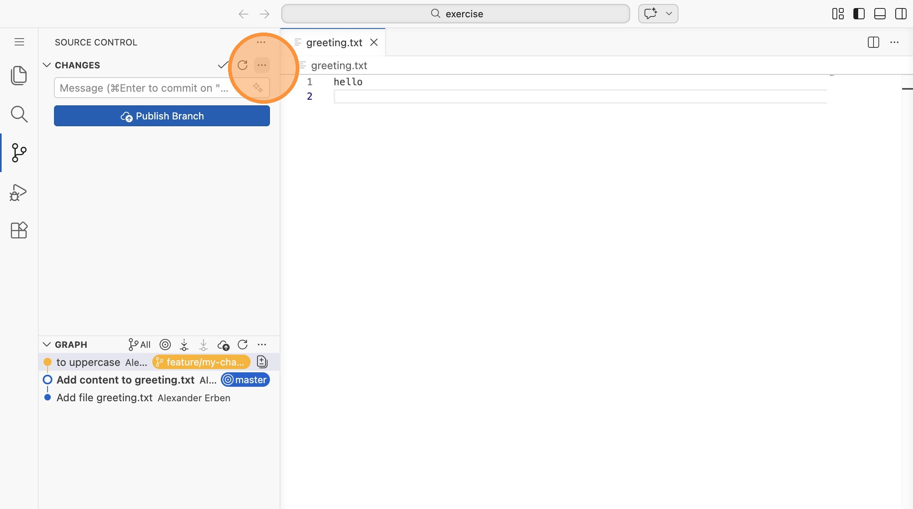

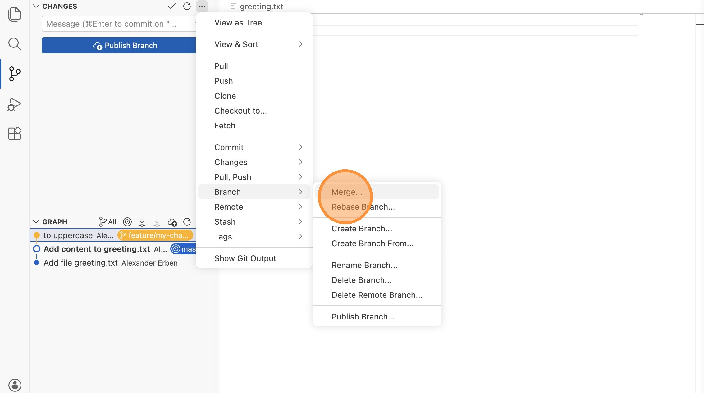

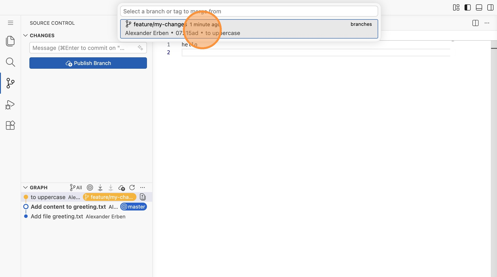

9. Prüfe das Ergebnis in der Branch-Ansicht.

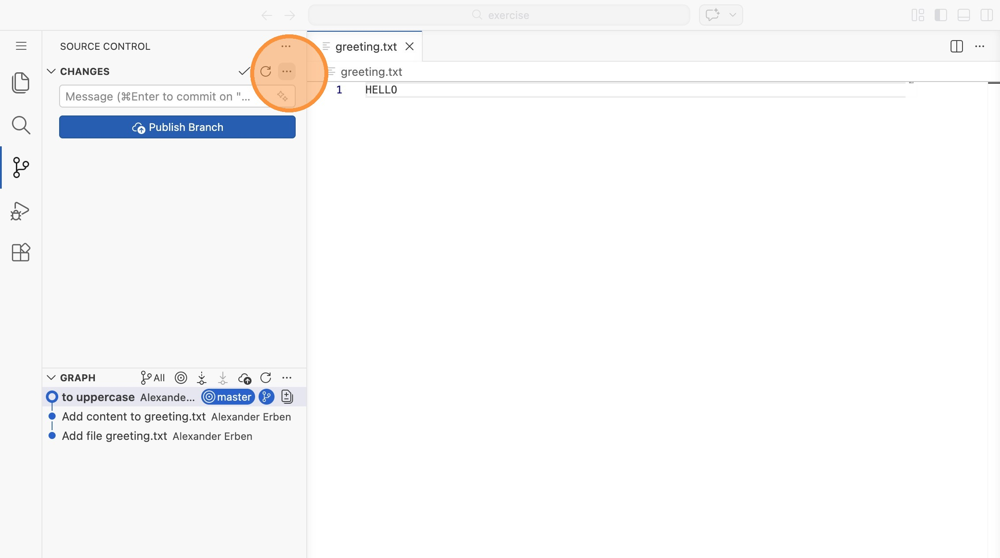

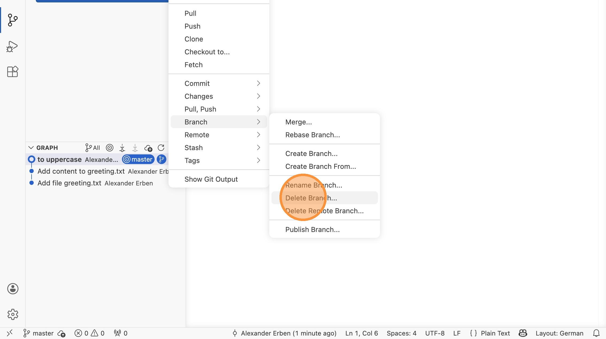

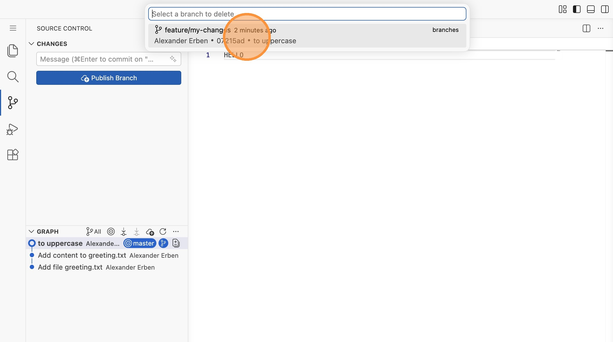
