# Lab 07: Merge-Konflikte lösen in VS Code

In der vorherigen Übung hat Git die Änderungen zweier Branches automatisch
zusammengeführt, weil sie unterschiedliche Dateien betroffen haben. Aber was
passiert, wenn auf beiden Branches **die gleiche Stelle** in der gleichen Datei
geändert wurde? Dann meldet Git einen **Merge-Konflikt**. In dieser Übung lernst
du, wie du Konflikte mit dem VS Code Merge Editor löst.

Öffne VS Code im Verzeichnis `labs/07-merge-conflict/exercise`.

## Den Konflikt auslösen

1. Wechsle auf die Repository-Ansicht. Es gibt neben `master` einen Branch
   `merge-conflict-branch1`, der Änderungen an der gleichen Datei enthält.

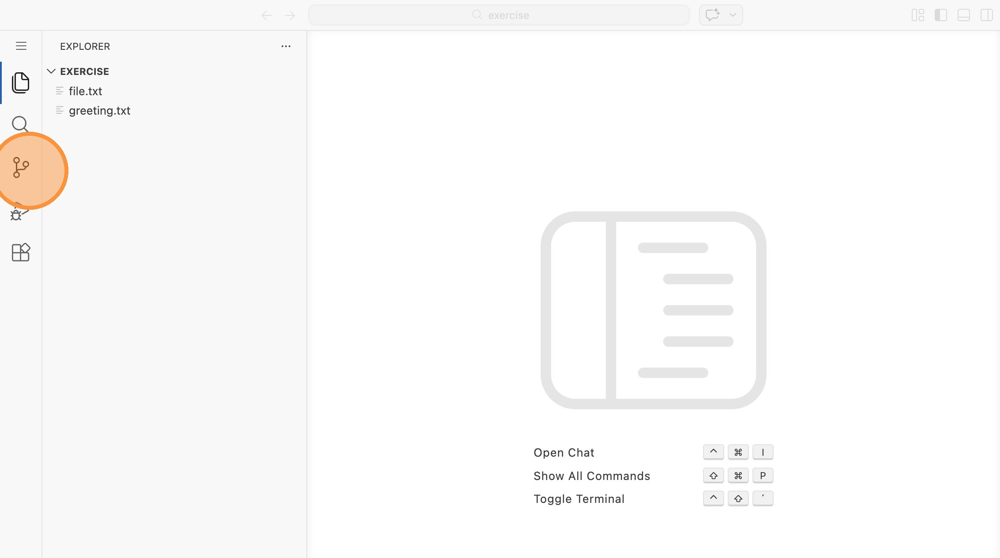

2. Klicke auf das `...`-Menü und wähle "Branch" > "Merge..."

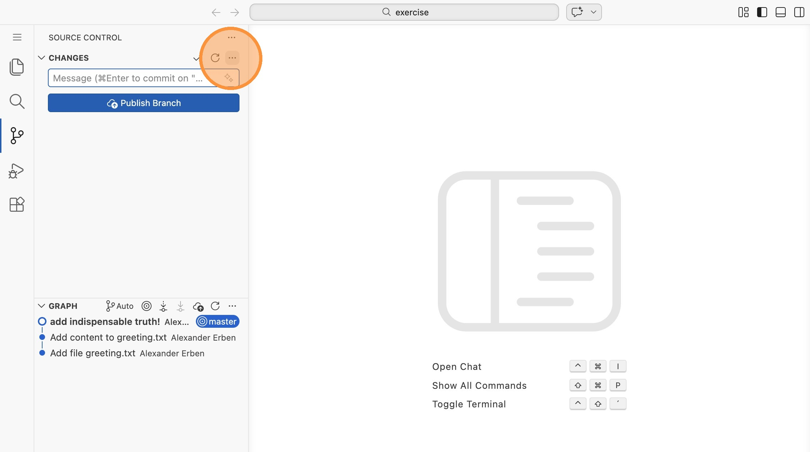

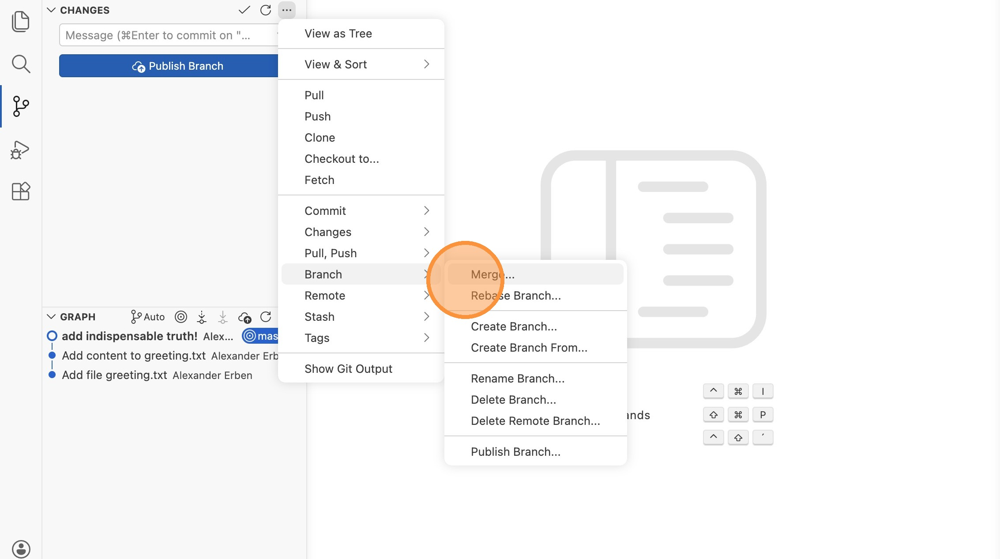

3. Wähle den Branch `merge-conflict-branch1` aus.

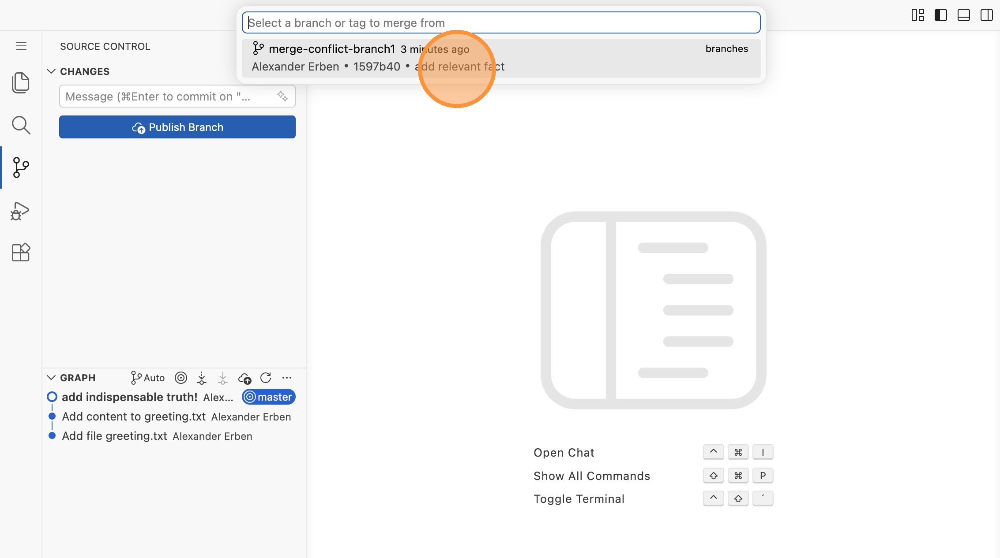

4. VS Code zeigt eine Warnung: "There are merge conflicts." Klicke auf "Show
   Changes".

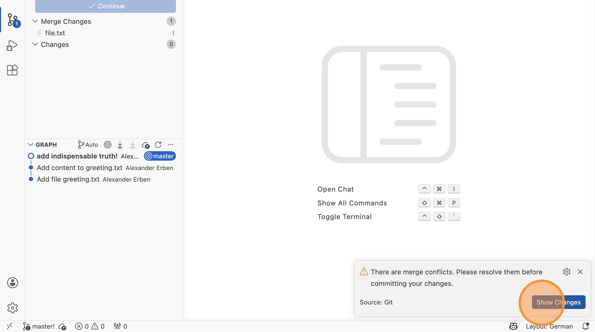

## Den Konflikt verstehen

5. Unter "Merge Changes" siehst du die Datei `file.txt` mit einem
   Ausrufezeichen. Klicke auf die Datei, um den Konflikt zu sehen.

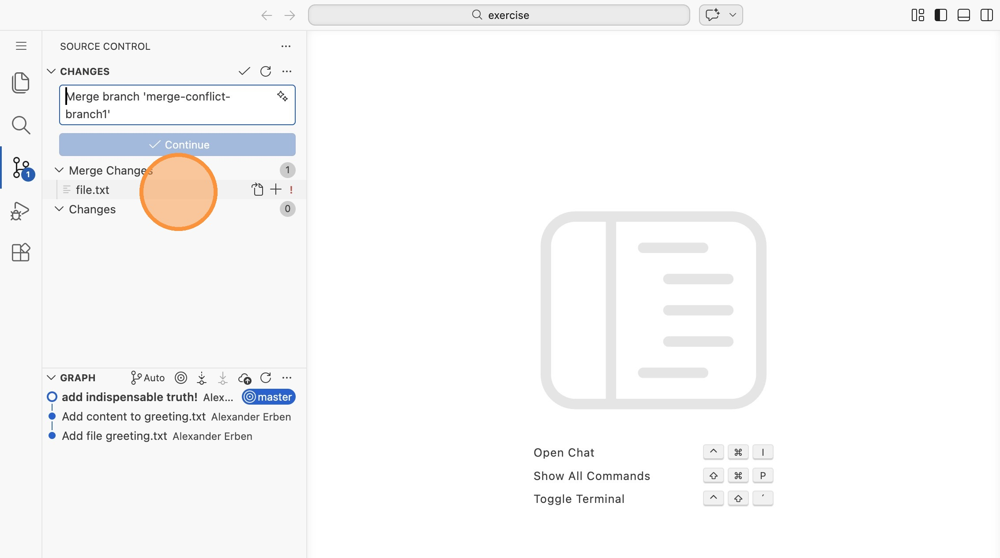

6. Du siehst die Konfliktmarker in der Datei. Klicke auf "Resolve in Merge
   Editor", um den visuellen Merge Editor zu öffnen.

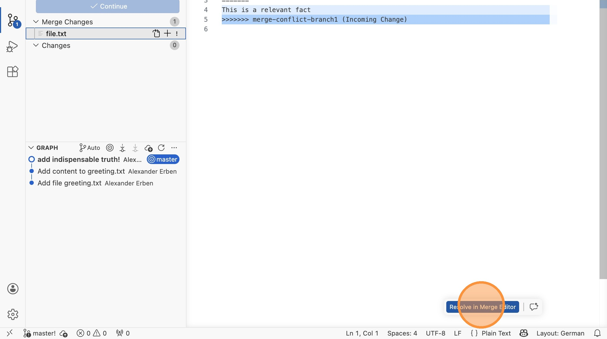

## Den Konflikt lösen

7. Der Merge Editor zeigt dir drei Bereiche: links die eingehenden Änderungen
   ("Incoming"), rechts den aktuellen Stand ("Current") und unten das Ergebnis
   ("Result"). Wähle über die Schaltflächen aus, welche Änderung du übernehmen
   möchtest (z.B. "Accept Incoming").

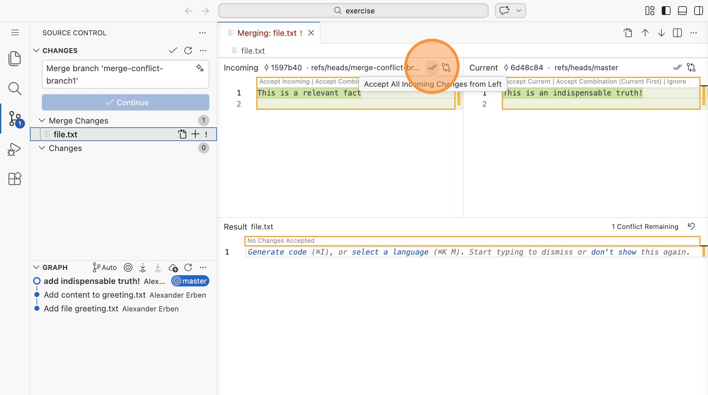

8. Das Ergebnis wird unten angezeigt. Es sollte "0 Conflicts Remaining" stehen.
   Klicke auf das `+`-Symbol neben `file.txt`, um die Lösung zu stagen.

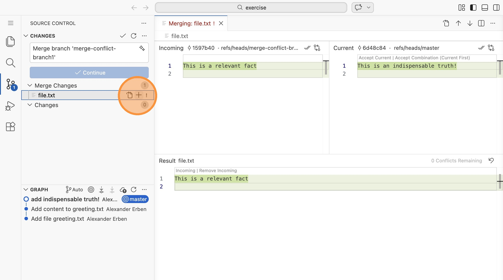

9. Klicke auf "Continue", um den Merge-Commit abzuschließen.

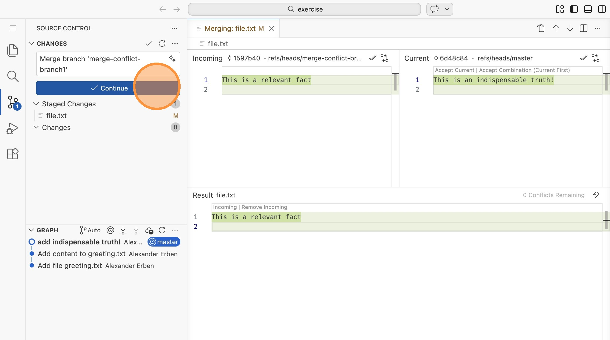

## Ergebnis prüfen

10. In der Branch-Ansicht siehst du nun den Merge-Commit mit dem typischen
    Diamanten: Die Branches laufen auseinander und kommen wieder zusammen.

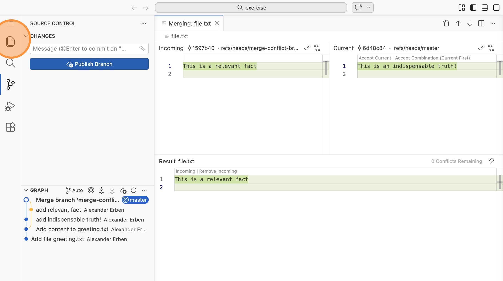

11. Wechsle in die Dateiansicht und prüfe den Inhalt von `file.txt` und
    `greeting.txt`.

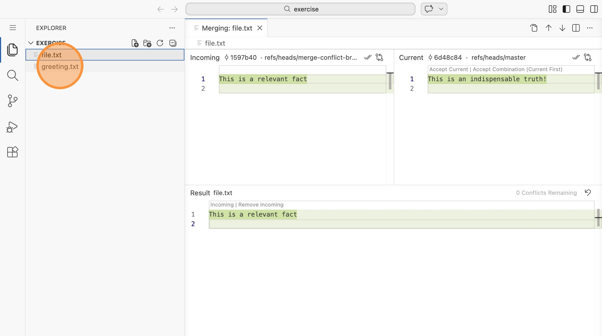

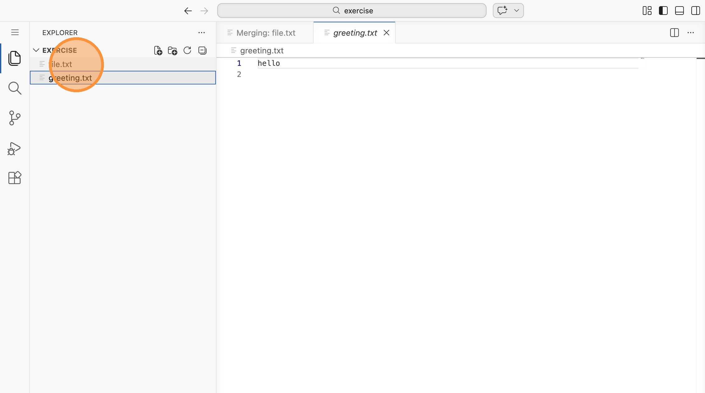

> **Tipp:** Der Merge Editor in VS Code zeigt die verschiedenen Versionen
> nebeneinander an und lässt dich per Klick entscheiden, welche Änderung
> übernommen wird. Du kannst auch beide Versionen kombinieren oder das Ergebnis
> manuell bearbeiten.
