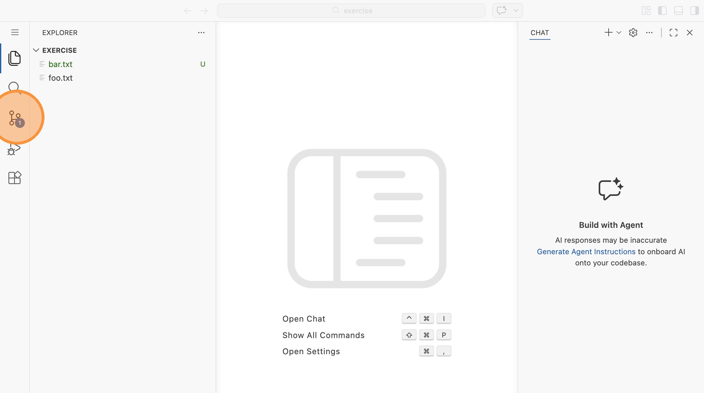
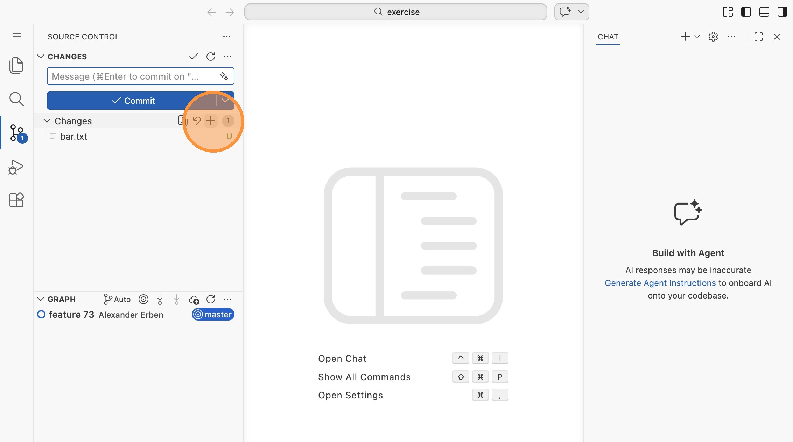
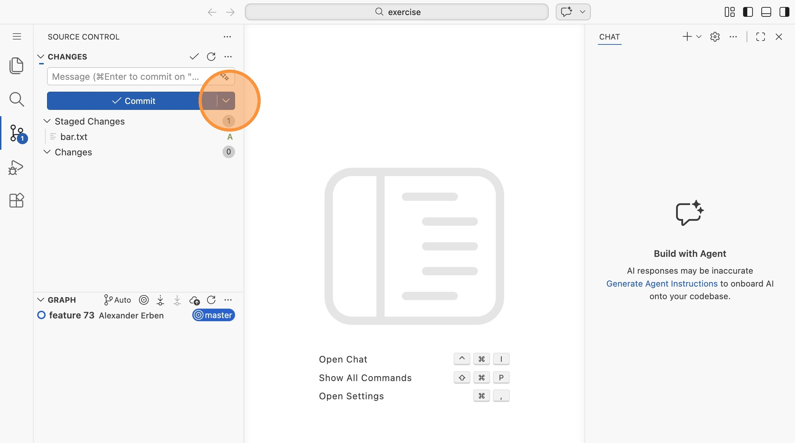
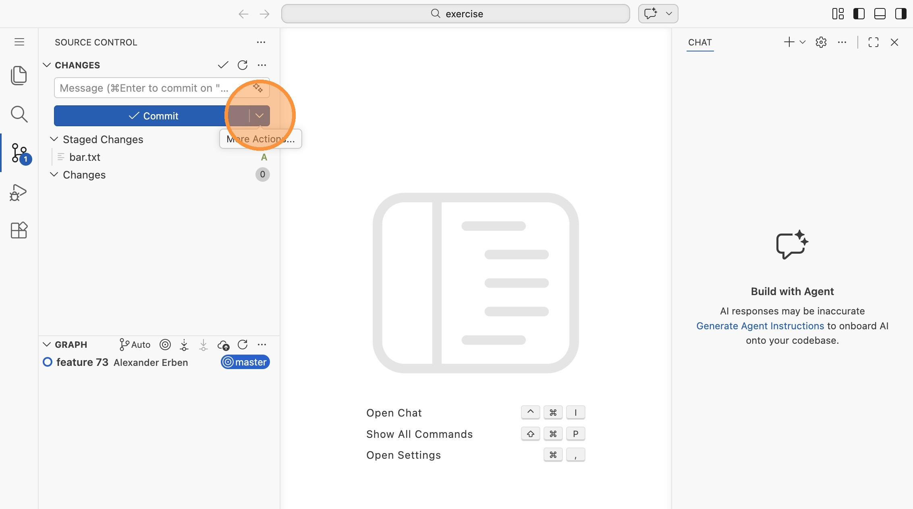
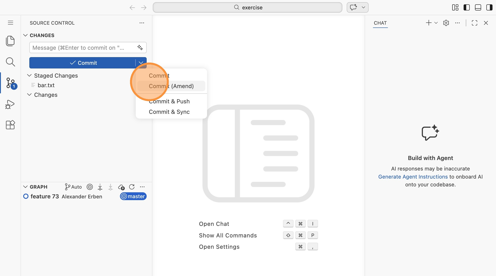
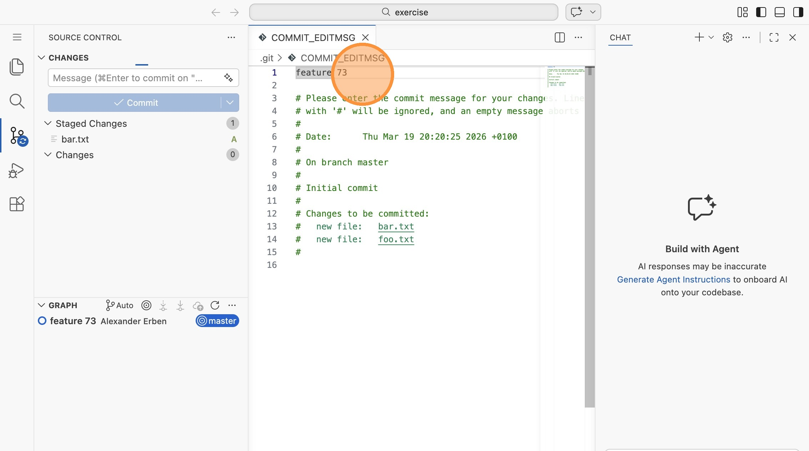
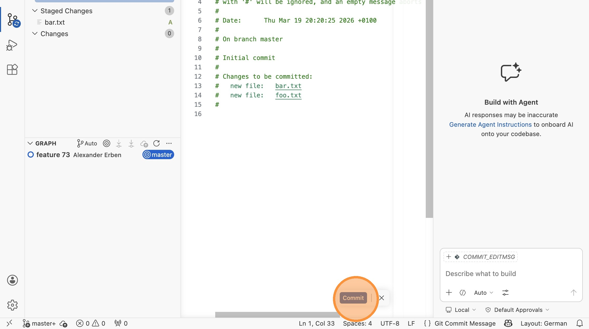

# Lab 08: Commits nachträglich ändern mit Amend in VS Code

Es passiert jedem: Du hast gerade einen Commit erstellt und merkst dann, dass du
eine Datei vergessen hast oder ein Tippfehler in der Commit-Nachricht steckt.
Für genau diese Fälle gibt es "Commit (Amend)" in VS Code.

> **Wichtig:** Verwende Amend nur bei Commits, die noch nicht gepusht wurden. Da
> der Commit ersetzt wird, ändert sich sein Hash - und das kann Probleme
> verursachen, wenn andere bereits mit dem alten Commit arbeiten.

Öffne VS Code im Verzeichnis `labs/08-amend/exercise`.

## Den Ausgangszustand verstehen

1. Im Explorer siehst du zwei Dateien: `foo.txt` und `bar.txt`. Die Datei
   `bar.txt` ist mit "U" (untracked) markiert - sie wurde im letzten Commit
   vergessen. Wechsle auf die Repository-Ansicht.

## Eine vergessene Datei zum letzten Commit hinzufügen

2. In der Repository-Ansicht siehst du `bar.txt` unter "Changes". Klicke auf
   das `+`, um die Datei zu stagen.

3. `bar.txt` ist jetzt unter "Staged Changes". Klicke auf den kleinen
   Dropdown-Pfeil neben dem "Commit"-Button.

4. Wähle "Commit (Amend)" aus dem Dropdown-Menü.

5. VS Code öffnet die Datei `COMMIT_EDITMSG` mit der bisherigen
   Commit-Nachricht "feature 73". Du kannst die Nachricht anpassen - beachte,
   dass nun sowohl `bar.txt` als auch `foo.txt` im Commit enthalten sind.

6. Klicke auf "Commit", um den geänderten Commit abzuschließen.

> **Merke:** Es wurde kein neuer Commit erstellt - der alte Commit wurde durch
> eine korrigierte Version ersetzt, die jetzt beide Dateien enthält.
