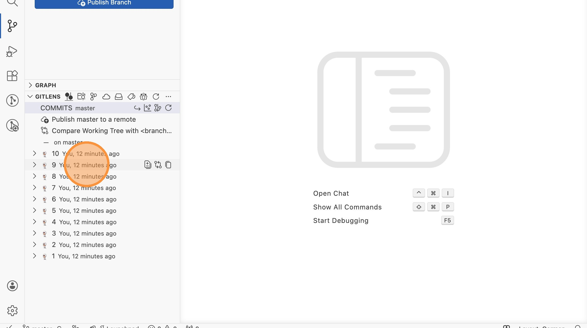
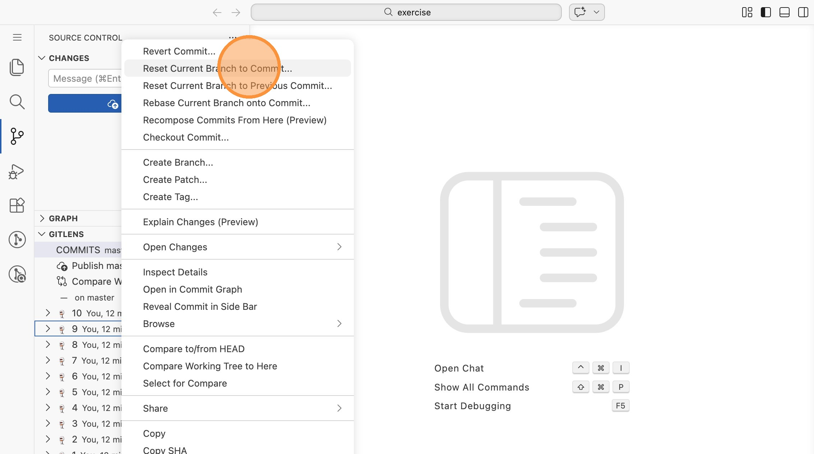
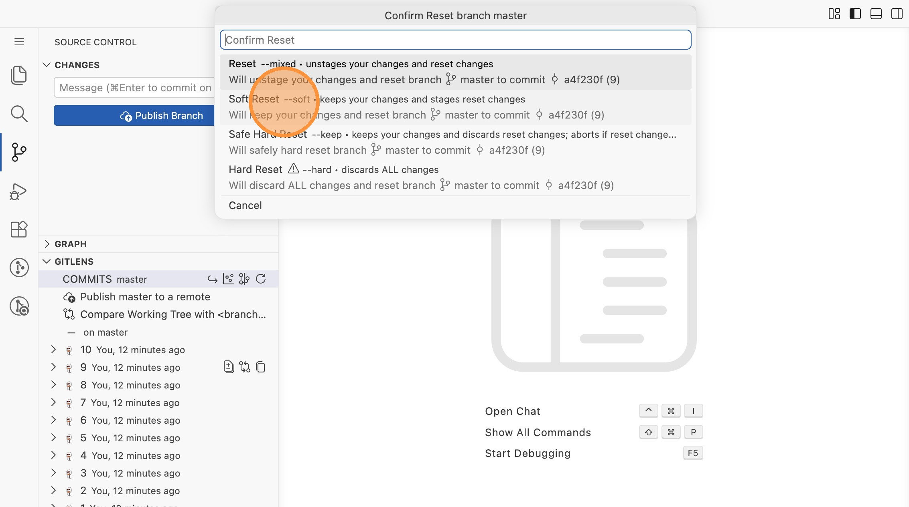
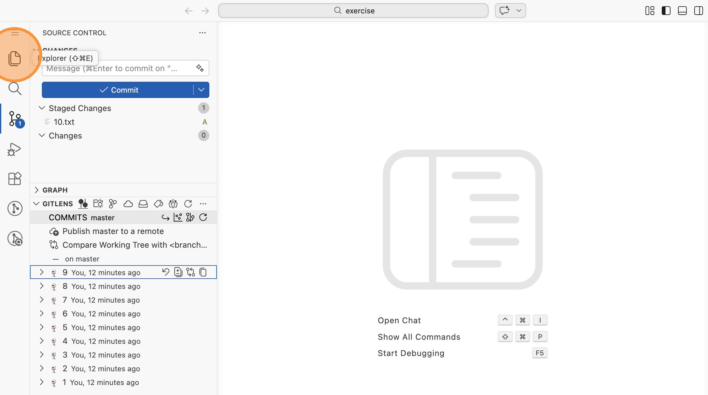
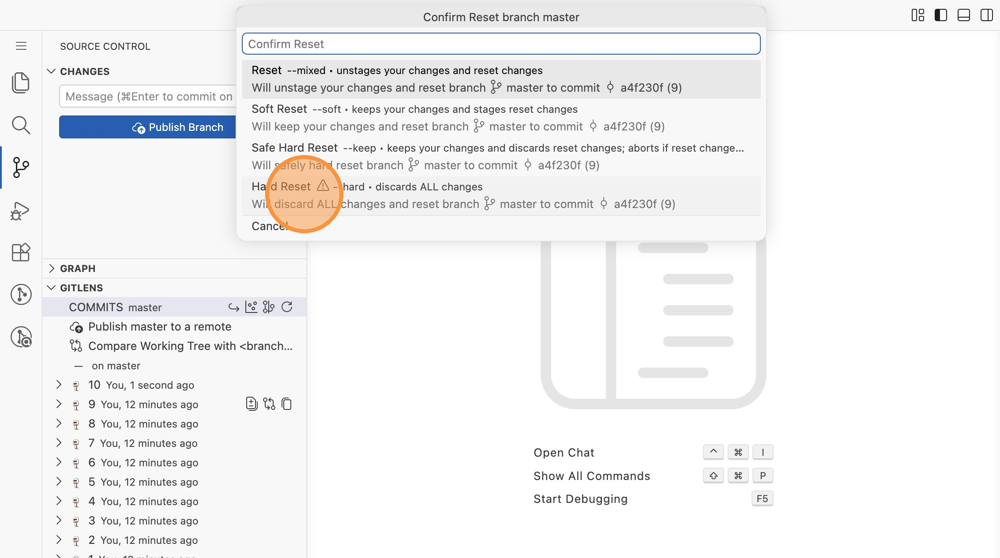
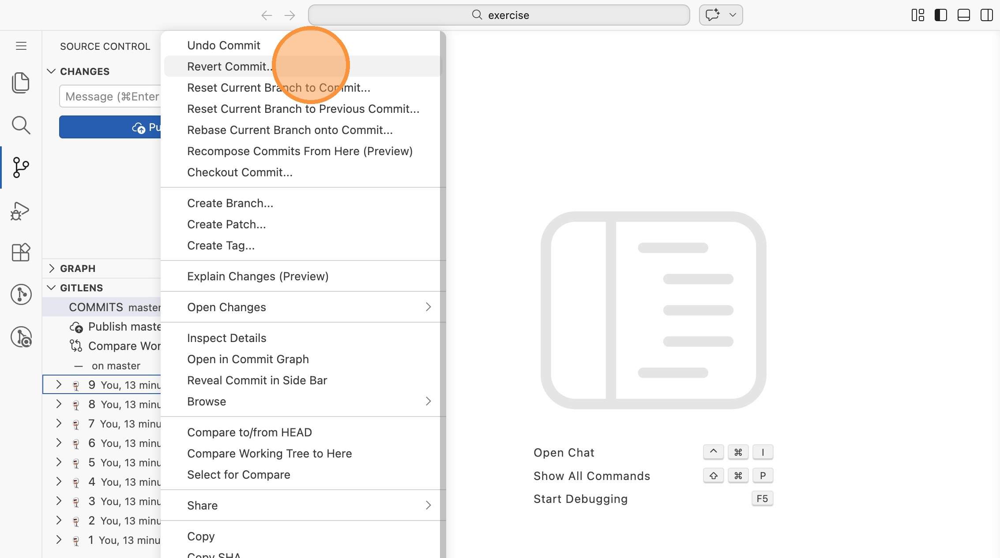
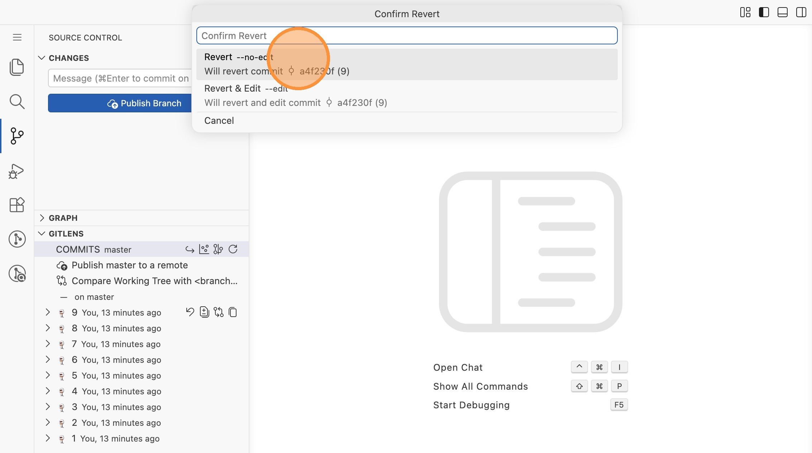
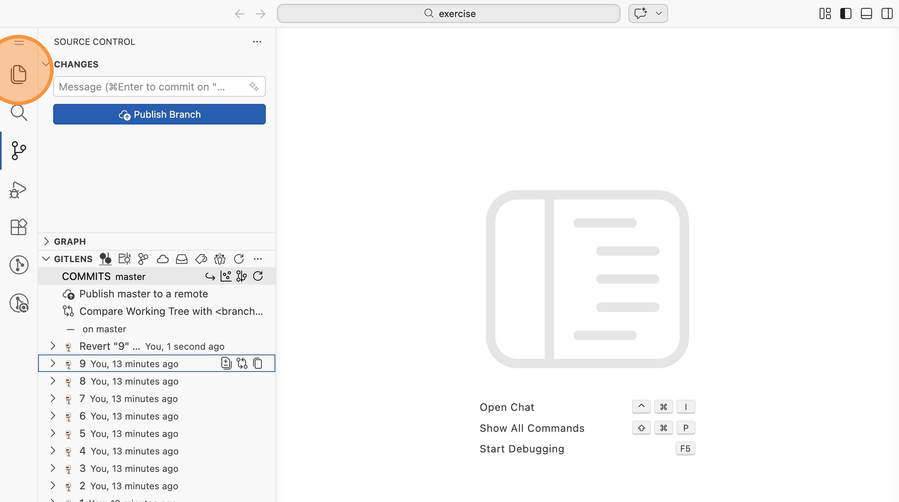

# Lab 09: Git Reset und Revert in VS Code

In dieser Übung nutzt du GitLens, um verschiedene Reset-Modi (`--soft`,
`--mixed`, `--hard`) auszuprobieren und einen Commit mit Revert rückgängig zu
machen.

Öffne VS Code im Verzeichnis `labs/09-reset/exercise`.

## Ausgangszustand

1. Wechsle in die Repository-Ansicht und scrolle nach unten zur
   **GitLens**-Sektion. Unter "COMMITS" siehst du 10 Commits (1-10).

## Reset --soft

2. Rechtsklicke auf Commit **9** und wähle "Reset Current Branch to Commit..."

3. Wähle "Soft Reset --soft". Die Änderungen aus Commit 10 landen in der Staging
   Area.

4. Prüfe das Ergebnis: Die Datei `10.txt` ist jetzt unter "Staged Changes" und
   die Commit-Liste zeigt nur noch 9 Commits. **Committe die Änderung erneut.**

## Reset --mixed

5. Rechtsklicke erneut auf Commit **9** und wähle "Reset Current Branch to
   Commit...", diesmal mit "Reset --mixed". Die Änderungen landen im Working
   Directory, sind aber **nicht gestaged**.

6. Prüfe das Ergebnis: Die Datei liegt unter "Changes" (nicht "Staged Changes").
   **Stage sie und committe erneut.**

## Reset --hard

7. Rechtsklicke wieder auf Commit **9** und wähle "Hard Reset --hard". Alle
   Änderungen aus Commit 10 gehen **unwiderruflich verloren**.

8. Prüfe das Ergebnis: Die Datei `10.txt` ist verschwunden, die Commit-Liste
   zeigt nur noch 9 Commits, und es gibt keine offenen Änderungen.

## Revert

9. Rechtsklicke auf Commit **9** und wähle "Revert Commit..."

10. Wähle "Revert --no-edit". Git erstellt einen neuen Commit, der die
    Änderungen von Commit 9 rückgängig macht – die Historie bleibt aber
    erhalten.

11. Prüfe das Ergebnis: Ein neuer Commit "Revert '9' ..." steht oben in der
    Liste.

