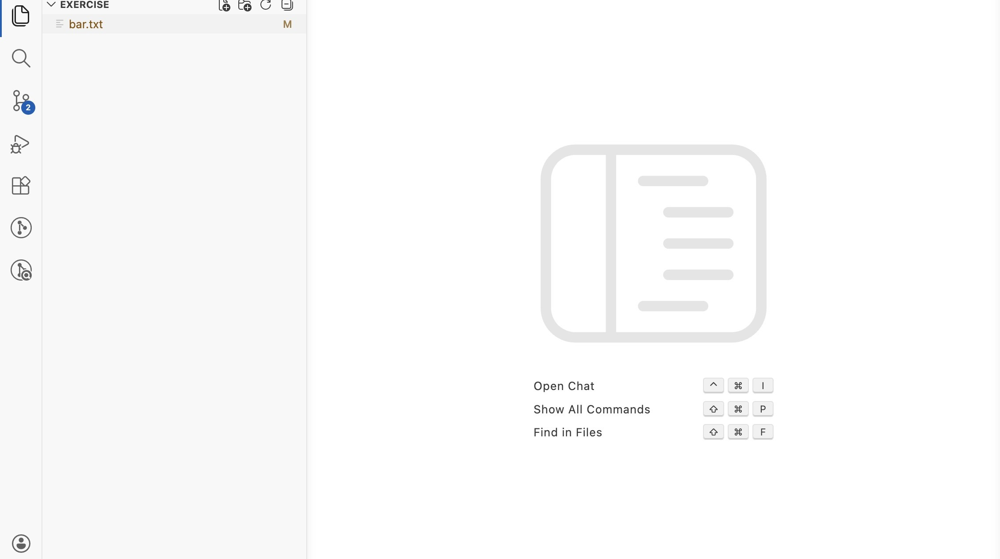
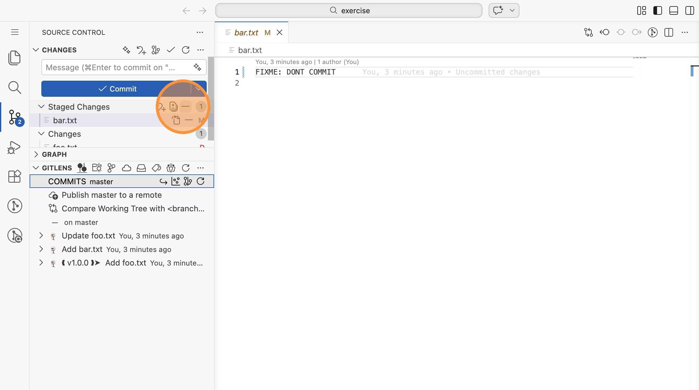
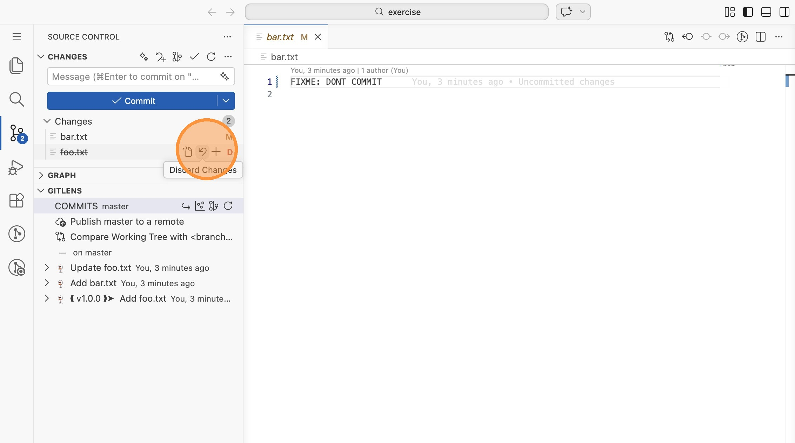
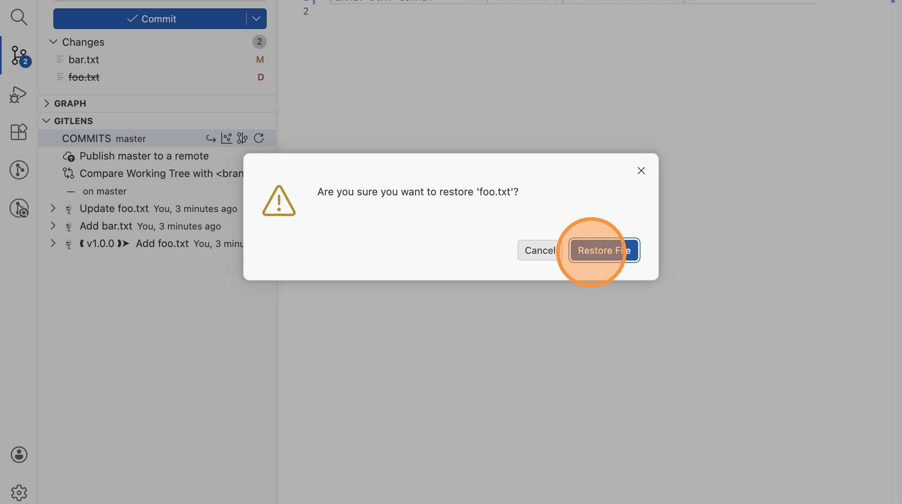
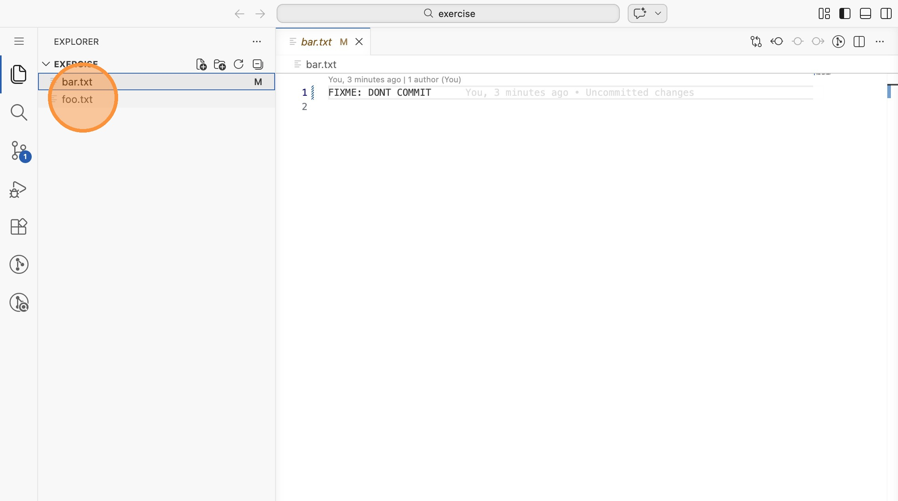

# Lab 10: Dateien wiederherstellen (VS Code)

In dieser Übung lernst du, wie du in VS Code Änderungen verwirfst, Staging
rückgängig machst und gelöschte Dateien wiederherstellst.

Öffne VS Code im Verzeichnis `labs/10-restore/exercise`.

## Ausgangszustand

1. Im Explorer siehst du nur `bar.txt` (M = modified). Die Datei `foo.txt`
   fehlt - sie wurde gelöscht. Wechsle in die Repository-Ansicht.

2. Du siehst: `bar.txt` ist unter "Staged Changes" (bereits gestaged) und
   `foo.txt` unter "Changes" (als gelöscht markiert, D). In der GitLens-Sektion
   erkennst du auch den Tag `v1.0.0`.

## Staging rückgängig machen

3. Klicke auf das `-` neben `bar.txt` unter "Staged Changes", um das Staging
   rückgängig zu machen. Die Datei wandert zurück unter "Changes".

## Gelöschte Datei wiederherstellen

4. Klicke bei `foo.txt` auf "Discard Changes" (das Rückgängig-Symbol).
   Bestätige mit "Restore File".

5. Wechsle in den Explorer: `foo.txt` ist wiederhergestellt. Nur `bar.txt`
   hat noch offene Änderungen.

