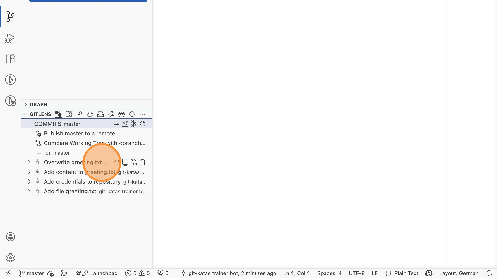
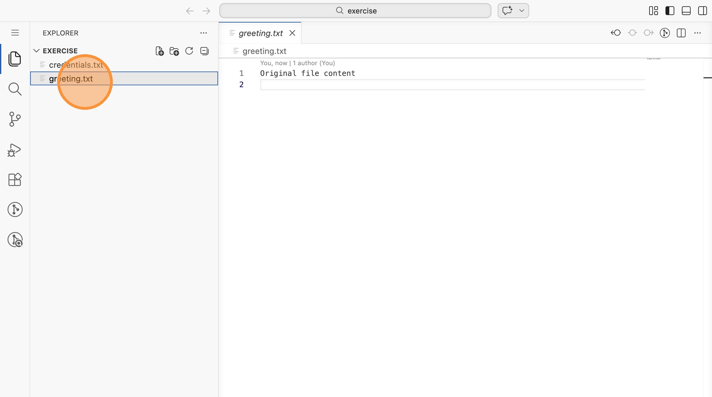
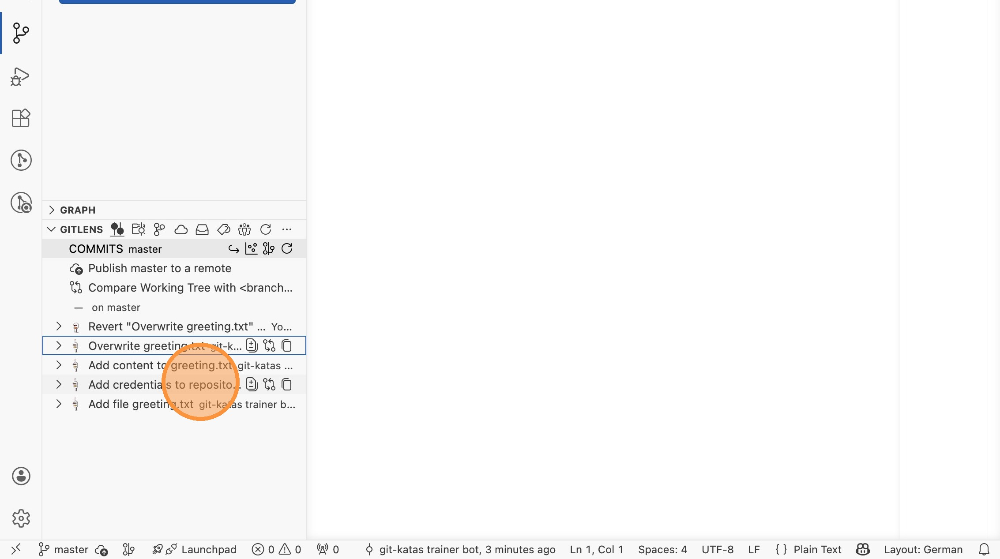
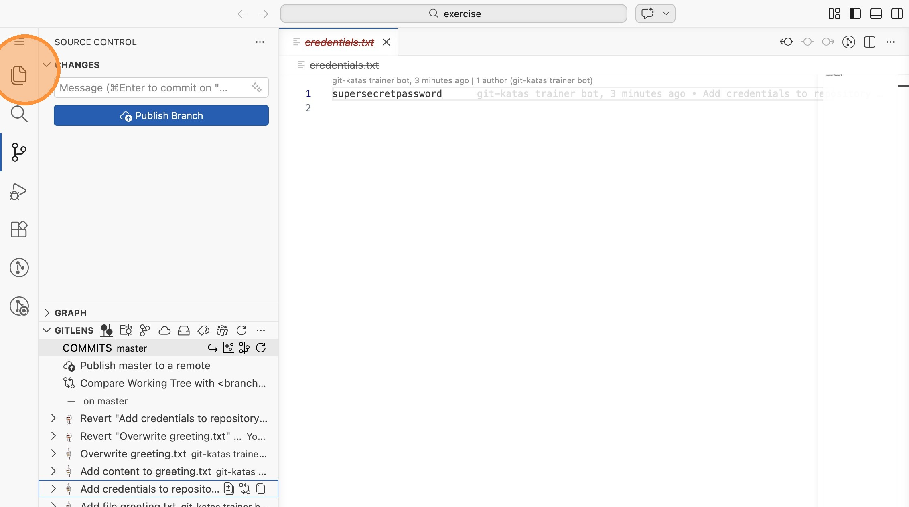
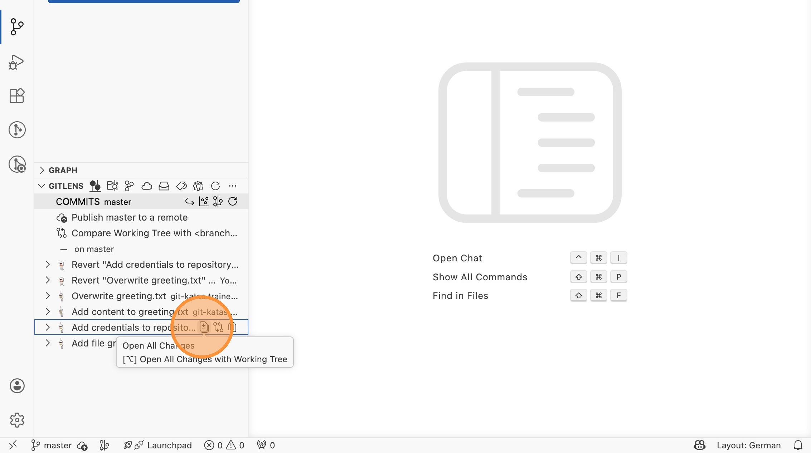

# Lab 11: Git Revert (VS Code)

In dieser Übung revertest du gezielt einzelne Commits über GitLens und
beobachtest, wie sich die Historie und das Arbeitsverzeichnis verändern.

Öffne VS Code im Verzeichnis `labs/11-basic-revert/exercise`.

## Den letzten Commit reverten

1. Öffne `greeting.txt` und schau dir den aktuellen Inhalt an. Wechsle dann in
   die Repository-Ansicht und scrolle zur GitLens-Sektion. Du siehst vier
   Commits.

2. Rechtsklicke auf den Commit "Overwrite greeting.txt" und wähle "Revert
   Commit..." → "Revert --no-edit".

3. Prüfe das Ergebnis: `greeting.txt` enthält wieder "Original file content".
   In der Commit-Liste steht ein neuer Revert-Commit oben.

## Einen bestimmten Commit reverten

4. Suche in der GitLens-Commit-Liste den Commit "Add credentials to
   repository". Rechtsklicke darauf und wähle "Revert Commit..." → "Revert
   --no-edit".

5. Prüfe das Ergebnis: Die Datei `credentials.txt` ist aus dem
   Arbeitsverzeichnis verschwunden. Beide Revert-Commits stehen oben in der
   Historie.

## Revert löscht nichts aus der Historie

6. Klicke in GitLens auf den ursprünglichen Commit "Add credentials to
   repository". Du kannst dir über "Open All Changes" anzeigen lassen, dass die
   Credentials-Datei **immer noch in der Git-Historie existiert**.

> **Sicherheitshinweis:** Ein Revert entfernt Daten aus dem aktuellen Stand,
> aber **nicht aus der Git-Historie**. Wenn Passwörter oder API-Keys committet
> wurden, reicht ein Revert nicht aus - die Secrets müssen sofort rotiert
> werden.
