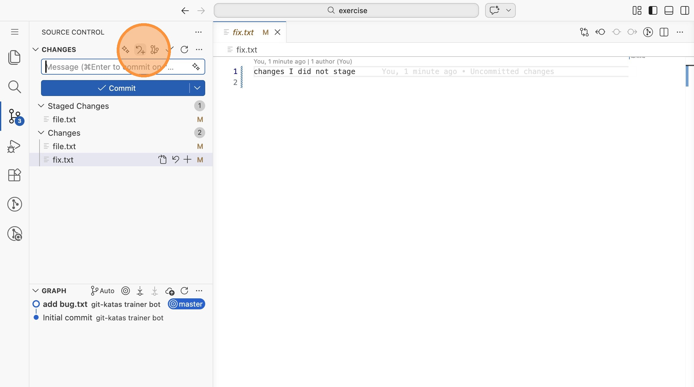
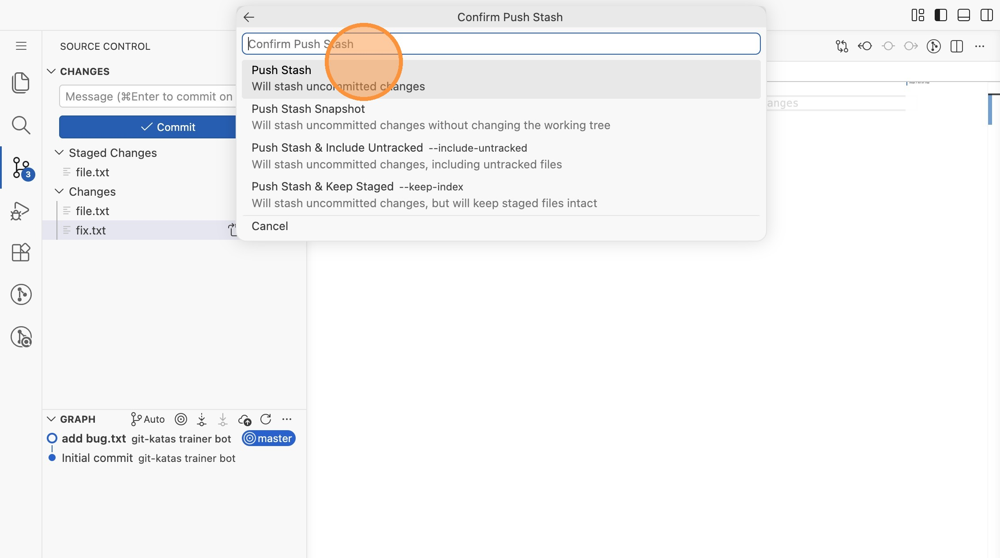
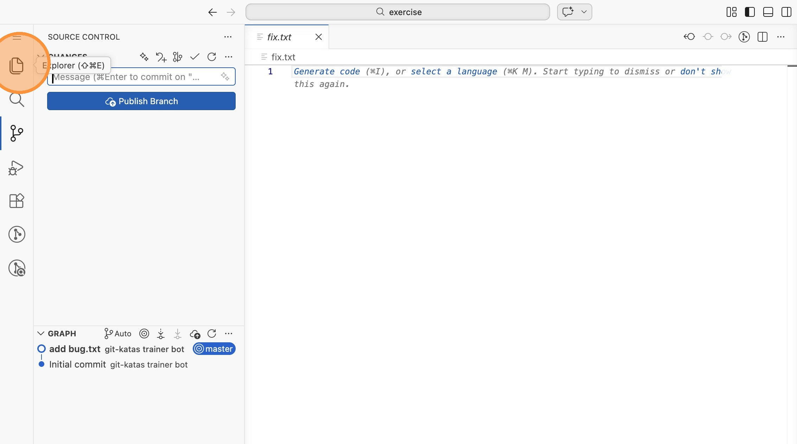
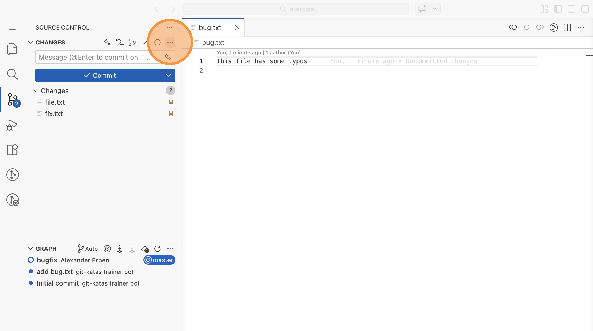
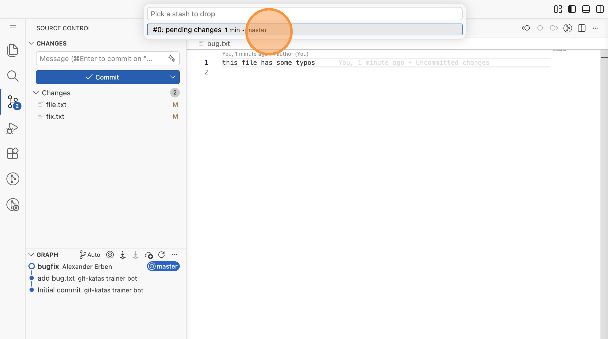
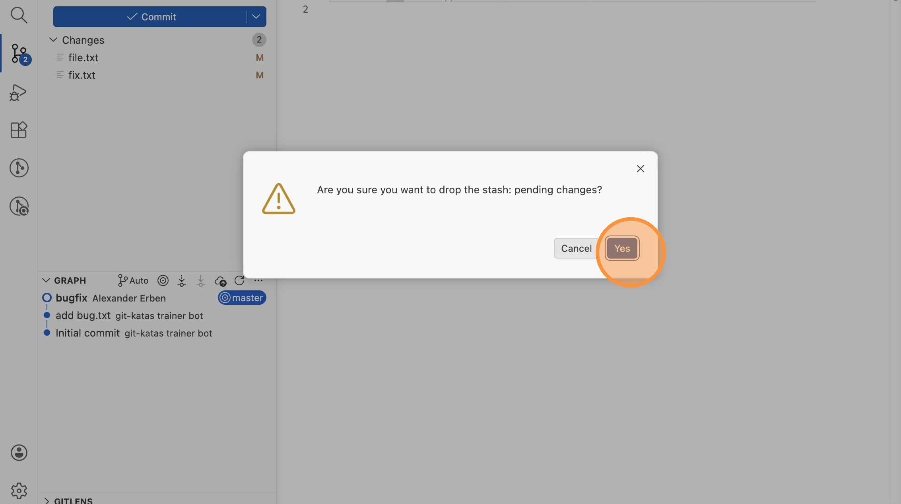

# Lab 12: Git Stash (VS Code)

Stell dir vor, du arbeitest an einem Feature und ein dringender Bug wird
gemeldet. Deine halbfertigen Änderungen willst du weder committen noch
verlieren. Dafür gibt es Stash.

Öffne VS Code im Verzeichnis `labs/12-basic-stashing/exercise`.

## Ausgangszustand

1. Schau dir die Dateien an: `file.txt` hat sowohl gestagte als auch nicht
   gestagte Änderungen, `fix.txt` hat nur nicht gestagte Änderungen. Wechsle
   in die Repository-Ansicht.

## Arbeit stashen

2. Klicke in der Toolbar auf das Stash-Symbol (das Pfeil-nach-unten-Symbol
   neben den anderen Icons). Gib als Nachricht "pending changes" ein und wähle
   "Push Stash".

3. Das Arbeitsverzeichnis ist jetzt sauber - alle Änderungen sind im Stash
   gespeichert.

## Den dringenden Bug fixen

4. Öffne `bug.txt`, behebe die Tippfehler und committe die Änderung als
   "bugfix". Stage und committe wie gewohnt.

## Arbeit wiederherstellen

5. Klicke auf das `...`-Menü in der Repository-Ansicht und wähle "Stash" →
   "Apply Latest Stash". Deine Änderungen an `file.txt` und `fix.txt` sind
   wieder da.

> **Hinweis:** Alle Änderungen kommen als **unstaged** zurück - auch die, die
> vorher in der Staging Area waren.

## Aufräumen

6. Der Stash wird bei "Apply" nicht automatisch gelöscht. Klicke auf `...` →
   "Stash" → "Drop Stash...", wähle den Eintrag "pending changes" und bestätige
   mit "Yes".

> **Tipp:** Wenn du den Stash anwenden und gleichzeitig entfernen möchtest,
> nutze stattdessen "Pop Latest Stash" aus dem gleichen Menü.
