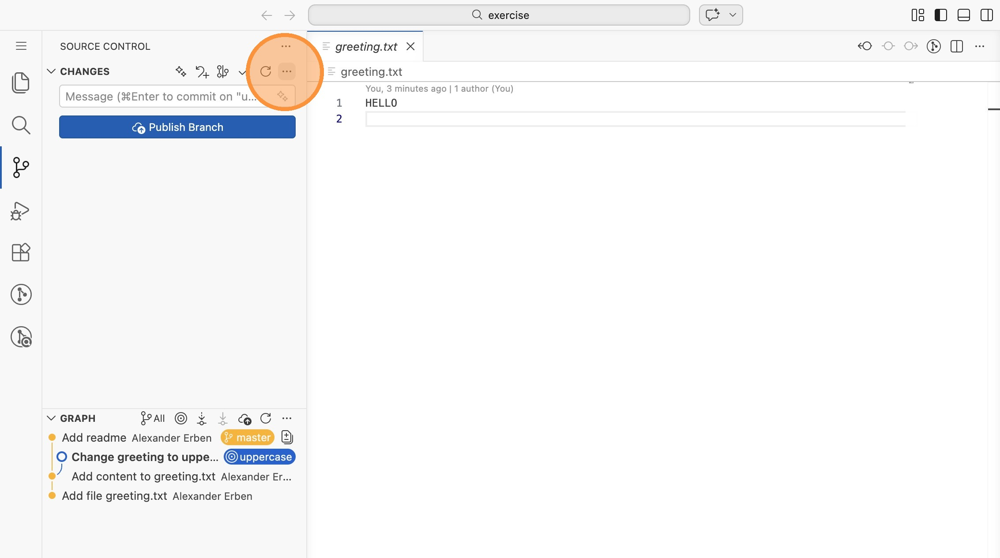
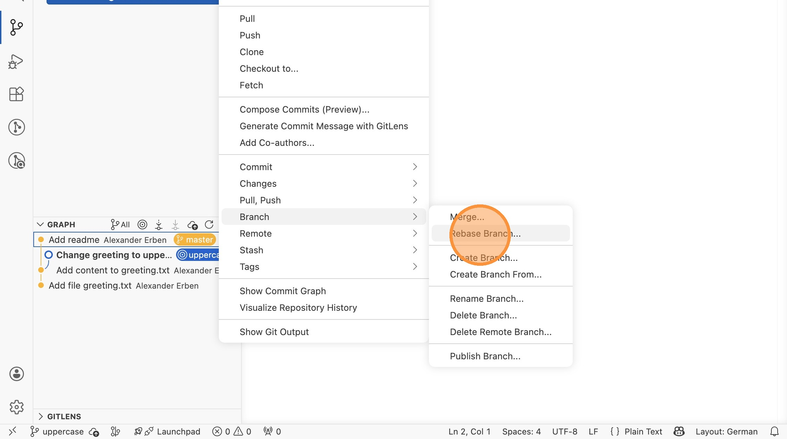
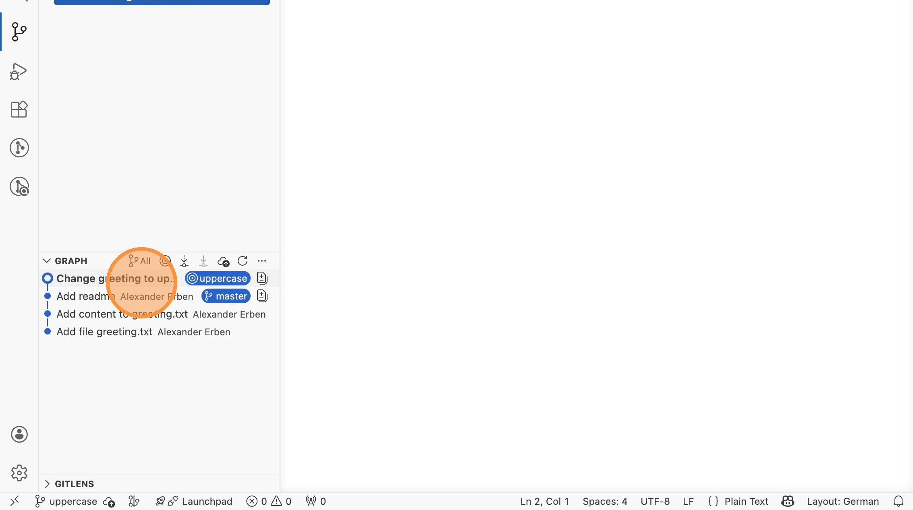
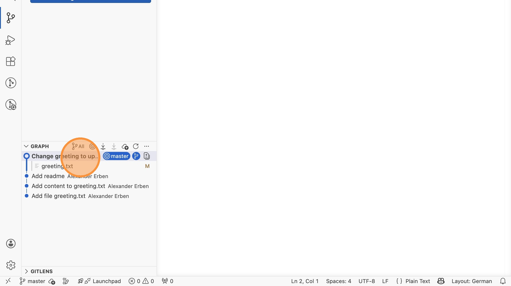

# Lab 14: Rebase (VS Code)

Beim Rebase werden die Commits eines Branches auf die Spitze eines anderen
Branches aufgesetzt. Das Ergebnis ist eine lineare Historie ohne Merge-Commits.

Öffne VS Code im Verzeichnis `labs/14-rebase-branch/exercise`.

## Ausgangszustand

1. Wechsle in die Repository-Ansicht und stelle den Graphen auf "All", um alle
   Branches zu sehen. Es gibt zwei Branches: `master` und `uppercase`, die
   auseinanderlaufen.

## Rebase durchführen

2. Stelle sicher, dass du auf dem Branch `uppercase` bist. Klicke auf `...` →
   "Branch" → "Rebase Branch..." und wähle `master` als Basis.

3. Prüfe das Ergebnis im Graphen: Die Commits von `uppercase` wurden auf die
   Spitze von `master` aufgesetzt. Es gibt keine Verzweigung mehr - die
   Historie ist linear.

## Fast-Forward-Merge nach dem Rebase

4. Wechsle auf `master` und merge `uppercase` über `...` → "Branch" →
   "Merge..."

5. Prüfe das Ergebnis: Da `master` direkt hinter `uppercase` lag, hat Git
   einen Fast-Forward-Merge durchgeführt. Beide Branch-Zeiger stehen jetzt auf
   dem gleichen Commit - eine perfekt lineare Historie.

> **Typischer Workflow:** Viele Teams nutzen das Muster "erst rebasen, dann
> mergen". Dadurch bleibt die Historie auf `master` immer linear.
