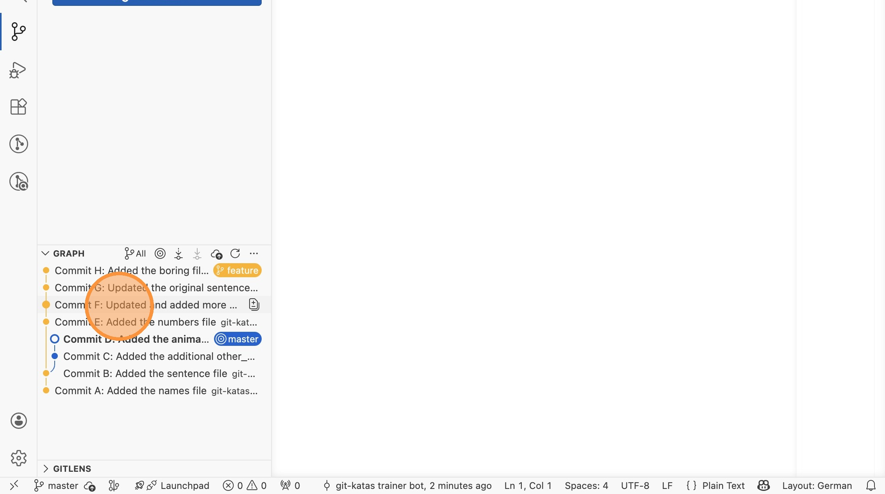
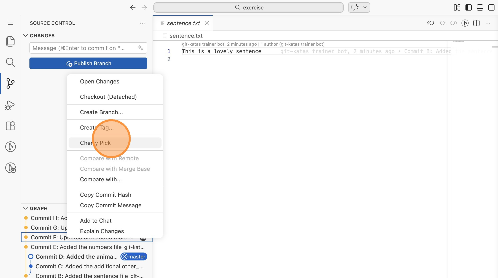
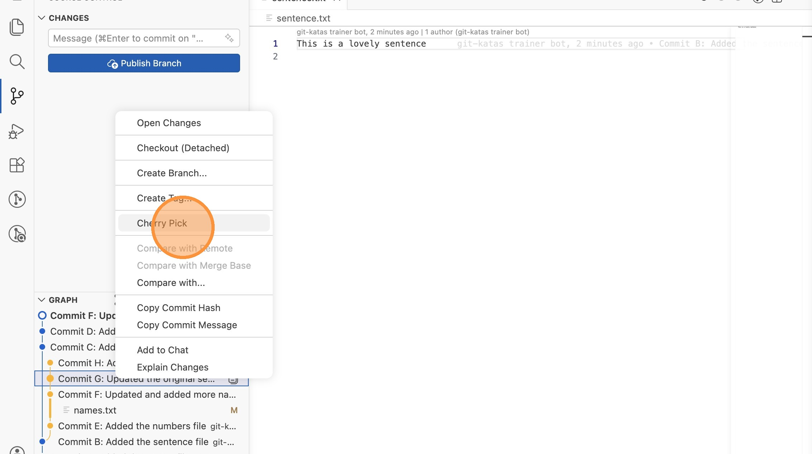
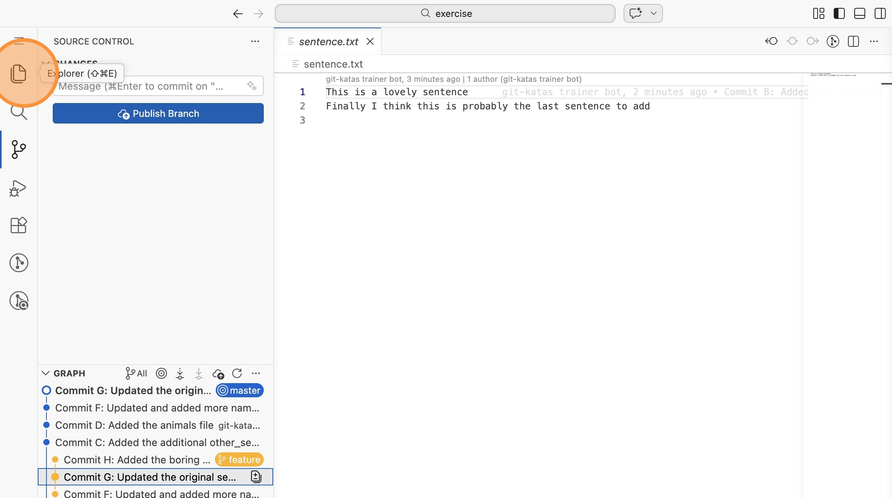

# Lab 15: Cherry-Pick (VS Code)

Mit Cherry-Pick kannst du einzelne Commits aus einem anderen Branch übernehmen,
ohne den ganzen Branch zu mergen.

Öffne VS Code im Verzeichnis `labs/15-basic-cherry-pick/exercise`.

## Ausgangszustand

1. Wechsle in die Repository-Ansicht und stelle den Graphen auf "All". Du
   siehst zwei Branches: `master` (Commits A-D) und `feature` (Commits E-H).
   Ziel: Die Commits F und G sollen auf `master` übernommen werden, aber nicht
   E und H.

## Commits cherry-picken

2. Stelle sicher, dass du auf `master` bist. Rechtsklicke im Graphen auf
   "Commit F: Updated and added more names..." und wähle "Cherry Pick".

3. Rechtsklicke danach auf "Commit G: Updated the original sentence..." und
   wähle erneut "Cherry Pick".

## Ergebnis prüfen

4. Prüfe den Graphen: Die Commits F und G erscheinen als neue Commits auf
   `master`. Der `feature`-Branch bleibt unverändert. Prüfe auch den Inhalt
   von `names.txt` und `sentence.txt`.

> **Merke:** Cherry-Pick erstellt **neue Commits** mit neuen Hashes. Die
> Original-Commits auf dem Feature-Branch bleiben unverändert.
