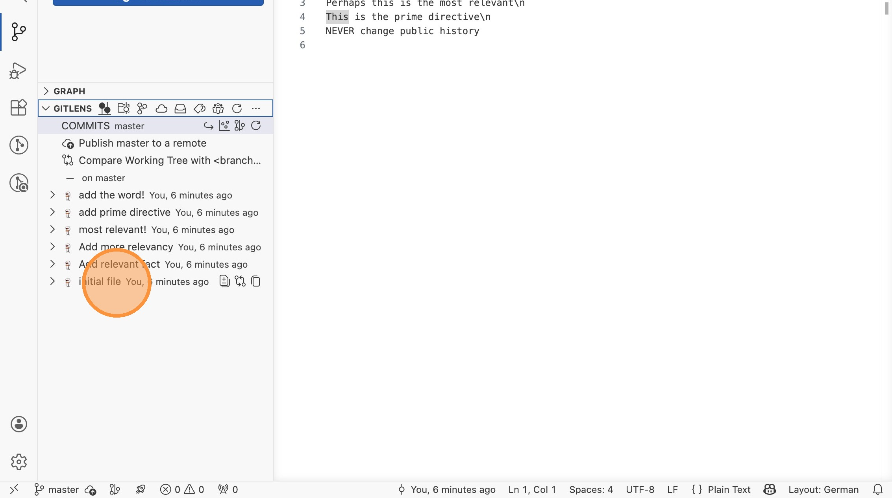
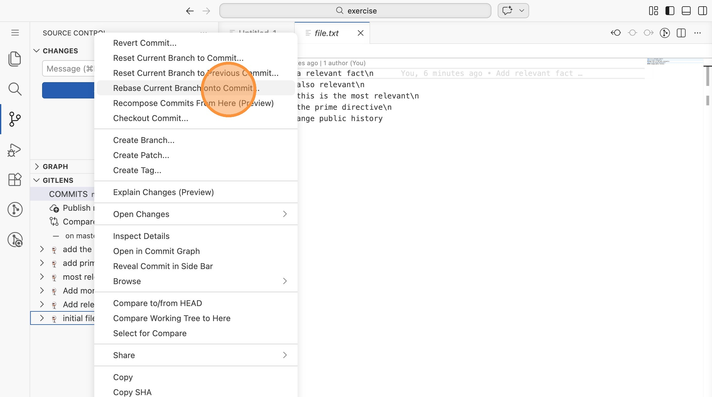
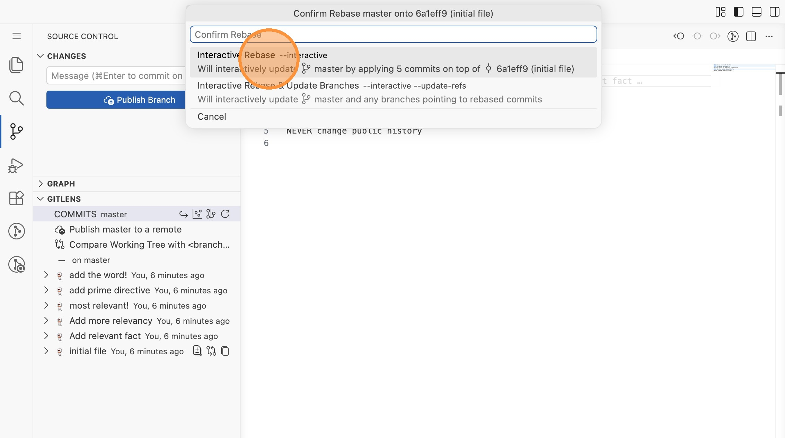
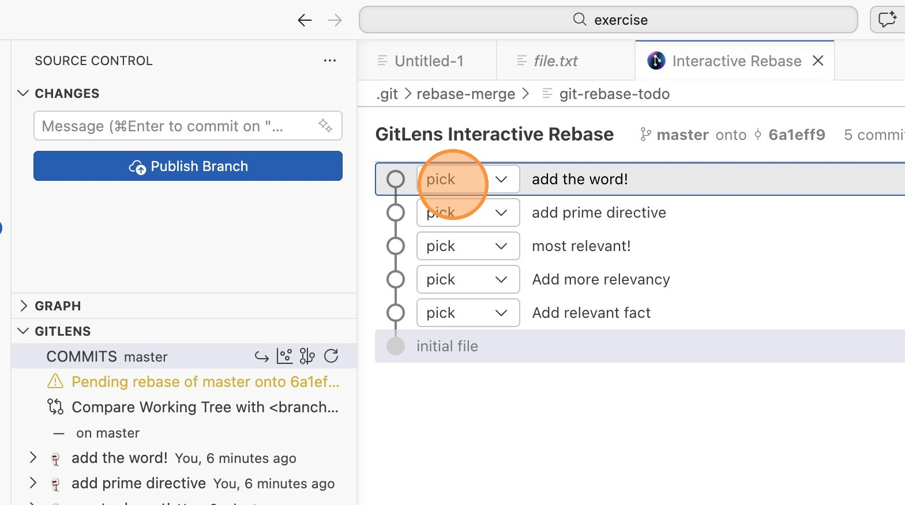
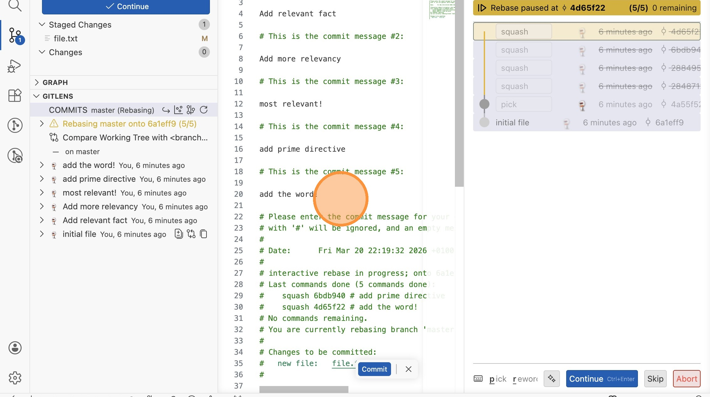
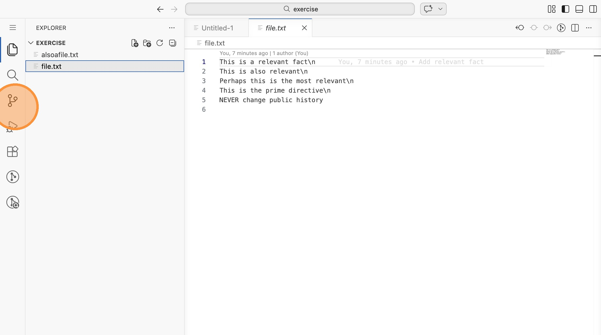

# Lab 16: Squashing mit Interactive Rebase (VS Code)

Vor dem Teilen deiner Arbeit ist es sinnvoll, viele kleine Commits ("WIP", "Fix
typo") zu einem sauberen Commit zusammenzufassen. GitLens bietet dafür einen
visuellen Interactive Rebase Editor.

Öffne VS Code im Verzeichnis `labs/16-squashing/exercise`.

## Ausgangszustand

1. Wechsle in die Repository-Ansicht und scrolle zur GitLens-Sektion. Du
   siehst 6 Commits, von denen die oberen 5 alle `file.txt` bearbeiten und
   logisch zusammengehören.

## Interactive Rebase starten

2. Rechtsklicke in GitLens auf den Commit "initial file" und wähle "Rebase
   Current Branch onto Commit..."

3. Wähle "Interactive Rebase --interactive".

## Commits zusammenfassen

4. Der GitLens Interactive Rebase Editor öffnet sich. Du siehst alle 5 Commits
   mit jeweils einem Dropdown auf "pick". Ändere bei den unteren vier Commits
   das Dropdown von "pick" zu "squash". Der oberste Commit bleibt auf "pick".

5. Klicke auf "Start Rebase". GitLens öffnet einen Editor mit den
   kombinierten Commit-Nachrichten. Schreibe eine neue, saubere Nachricht
   (z.B. "Collect words") und klicke auf "Commit".

## Ergebnis prüfen

6. Die GitLens-Commit-Liste zeigt jetzt nur noch zwei Commits statt sechs.
   Prüfe auch den Inhalt von `file.txt` - die Datei enthält noch `\n`-Zeichen,
   die du optional mit Amend aufräumen kannst.

