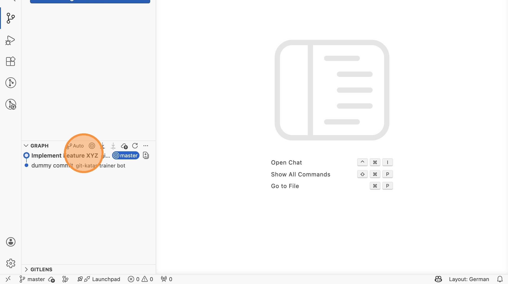
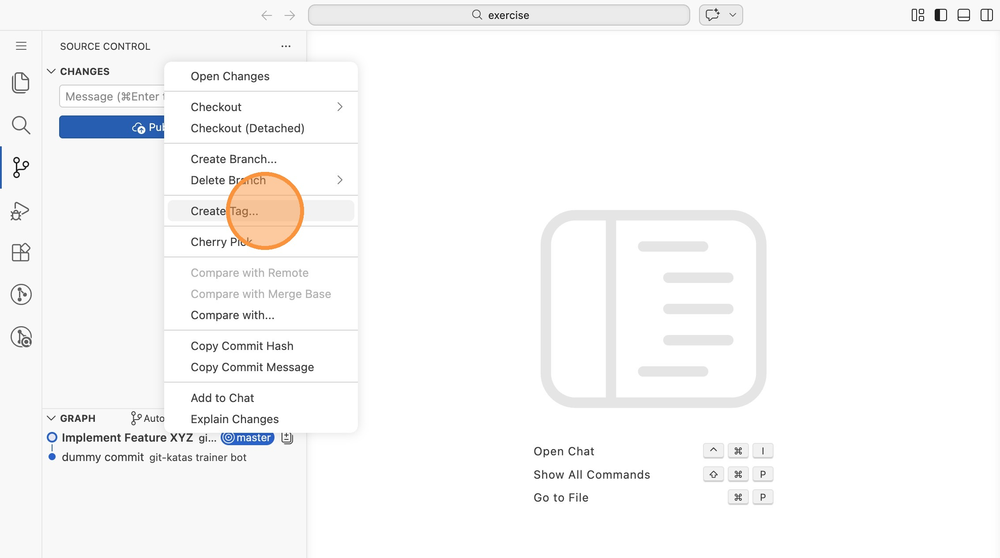
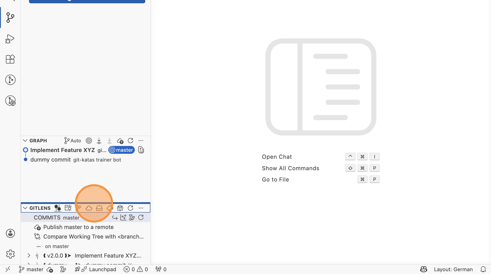
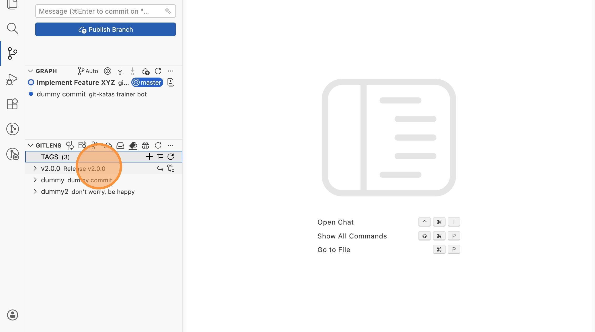

# Lab 17: Tags in VS Code

Tags markieren bestimmte Commits dauerhaft - z.B. Release-Versionen. Anders als
Branches bewegen sich Tags nicht weiter.

Öffne VS Code im Verzeichnis `labs/17-git-tag/exercise`.

## Vorhandene Tags ansehen

1. Wechsle in die Repository-Ansicht und scrolle in der GitLens-Sektion zum
   Abschnitt "TAGS". Dort siehst du bereits vorhandene Tags mit ihren
   Nachrichten. Klappe die Tags auf, um zu sehen, auf welche Commits sie
   zeigen.

## Einen neuen Commit erstellen und taggen

2. Erstelle eine kleine Änderung an einer Datei, stage und committe sie mit
   der Nachricht "Implement Feature XYZ".

3. Rechtsklicke im Graphen auf den neuen Commit und wähle "Create Tag..."

4. Gib als Tag-Name `v2.0.0` und als Nachricht `Release v2.0.0` ein.

## Ergebnis prüfen

5. In der GitLens-Sektion unter "TAGS" erscheint der neue Tag `v2.0.0` mit
   der Nachricht "Release v2.0.0". In der Commit-Liste ist der Tag ebenfalls
   neben dem Commit sichtbar.

