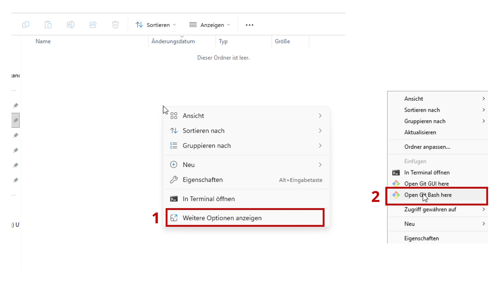
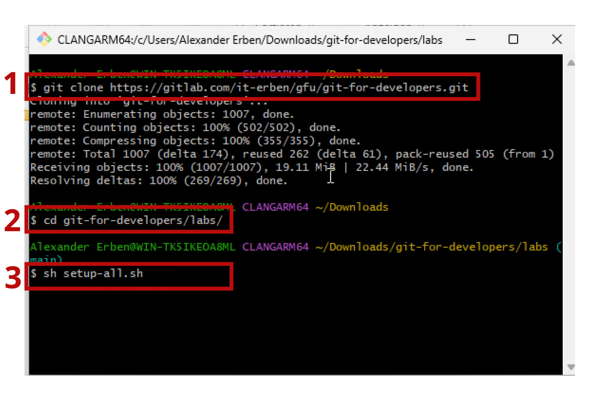

# Labs

Jedes Lab enthält ein Setup-Skript (`setup.sh` / `setup.ps1`), das die
Übungsumgebung vorbereitet. Labs 01–18 und 20 bieten Anleitungen für **Terminal
** und **VS Code**; die übrigen Labs sind werkzeugunabhängig.

## Installation auf Windows

Für die Labs stehen Skripte zur Verfügung, die alle Repositories vorbereiten
oder auch nur einzelne Aufgaben. Außerdem gibt es Skripte zum Aufsetzen jeder
Aufgabe einzeln.

### Alle Aufgaben vorbereiten

Um die Aufgaben bearbeiten zu können, muss **Git Bash** installiert sein. Der
Installer kann [hier](https://git-scm.com/install/windows)
heruntergeladen werden.

Öffnet in dem Verzeichnis, in dem ihr die Aufgaben ablegen wollt, eine 
Git Bash.



Clont nun das Repository mit folgendem Befehl:

```bash
git clone https://gitlab.com/it-erben/gfu/git-for-developers.git
```

Anschließend wechselt ihr in das `labs`-Verzeichnis und führt das Setup-Skript
aus:

```bash
cd git-for-developers/labs
sh setup-all.sh
```



### Alle Aufgaben aufräumen

Um alle Aufgaben aufzuräumen, öffnet in dem Verzeichnis des Git-Repositories
eine Git-Bash (siehe oben) und führt folgendes Skript aus:

```bash
cd labs
sh clean-all.sh
```

### Einzelne Aufgaben vorbereiten

Wenn ihr nur eine einzelne Aufgabe löschen und neu aufsetzen wollt, dann geht
folgendermaßen vor:

```bash
cd labs/01-basic-commits # ersetzt dies mit eurem gewünschten Lab-Verzeichnis
sh setup.sh
```

Um eine einzelne Aufgabe zu löschen, entfernt einfach das 
`exercise`-Verzeichnis.

## Grundlagen

| Lab                                       | Thema            | Beschreibung                                                                     |
|-------------------------------------------|------------------|----------------------------------------------------------------------------------|
| [01-basic-commits](01-basic-commits/)     | Erste Commits    | `git add`, `git commit`, `git status` und `git log` kennenlernen                 |
| [02-basic-staging](02-basic-staging/)     | Die Staging Area | Das Drei-Bereiche-Modell (Working Directory, Staging Area, Repository) verstehen |
| [03-ignore](03-ignore/)                   | .gitignore       | Dateien gezielt von der Versionskontrolle ausschließen                           |
| [04-basic-branching](04-basic-branching/) | Branching        | Branches erstellen, wechseln und deren Auswirkung beobachten                     |

## Merging

| Lab                                     | Thema              | Beschreibung                                        |
|-----------------------------------------|--------------------|-----------------------------------------------------|
| [05-ff-merge](05-ff-merge/)             | Fast-Forward-Merge | Lineares Zusammenführen ohne Merge-Commit           |
| [06-3-way-merge](06-3-way-merge/)       | 3-Way-Merge        | Zusammenführen paralleler Entwicklungslinien        |
| [07-merge-conflict](07-merge-conflict/) | Merge-Konflikte    | Konflikte erkennen, lösen und den Merge abschließen |

## Historie bearbeiten

| Lab                       | Thema   | Beschreibung                                               |
|---------------------------|---------|------------------------------------------------------------|
| [08-amend](08-amend/)     | Amend   | Den letzten Commit nachträglich korrigieren                |
| [09-reset](09-reset/)     | Reset   | Branch-Zeiger zurücksetzen (`--soft`, `--mixed`, `--hard`) |
| [10-restore](10-restore/) | Restore | Dateien auf einen früheren Stand zurücksetzen              |

## Fortgeschrittene lokale Operationen

| Lab                                                   | Thema                | Beschreibung                                                            |
|-------------------------------------------------------|----------------------|-------------------------------------------------------------------------|
| [11-basic-revert](11-basic-revert/)                   | Revert               | Commits sicher rückgängig machen, ohne die Historie zu ändern           |
| [12-basic-stashing](12-basic-stashing/)               | Stash                | Halbfertige Änderungen zwischenlagern und später wiederherstellen       |
| [13-repository-aufraeumen](13-repository-aufraeumen/) | Repository aufräumen | Gelerntes kombinieren, um ein unaufgeräumtes Repo in Ordnung zu bringen |
| [14-rebase-branch](14-rebase-branch/)                 | Rebase               | Commits auf die Spitze eines anderen Branches aufsetzen                 |
| [15-basic-cherry-pick](15-basic-cherry-pick/)         | Cherry-Pick          | Einzelne Commits gezielt in einen anderen Branch übernehmen             |
| [16-squashing](16-squashing/)                         | Squashing            | Mehrere Commits mit Interactive Rebase zusammenfassen                   |
| [17-git-tag](17-git-tag/)                             | Tags                 | Release-Versionen und Meilensteine mit Tags markieren                   |

## Debugging & Recovery

| Lab                                     | Thema  | Beschreibung                                                      |
|-----------------------------------------|--------|-------------------------------------------------------------------|
| [18-bisect](18-bisect/)                 | Bisect | Per binärer Suche den Commit finden, der einen Bug eingeführt hat |
| [19-save-my-commit](19-save-my-commit/) | Reflog | Scheinbar verlorene Commits über das Reflog wiederherstellen      |

## Zusammenarbeit

| Lab                                         | Thema            | Beschreibung                                                   |
|---------------------------------------------|------------------|----------------------------------------------------------------|
| [20-remotes](20-remotes/)                   | Remotes          | Push, Pull, Fetch und Remote-Branches verstehen                |
| [21-parallele-welten](21-parallele-welten/) | Parallele Welten | Ein chaotisches Repo mit parallelen Branches aufräumen         |
| [22-code-review-dojo](22-code-review-dojo/) | Code Review Dojo | Den PR-Workflow als Team durchlaufen (Paarübung)               |
| [23-release-workflow](23-release-workflow/) | Release Day      | Den gesamten Release-Zyklus von Bisect bis Hotfix durchspielen |

## CI/CD & Plattform

| Lab                                                                       | Thema                  | Beschreibung                                                        |
|---------------------------------------------------------------------------|------------------------|---------------------------------------------------------------------|
| [24-setup-und-erster-deploy](24-setup-und-erster-deploy/)                 | Projekt-Setup & Deploy | Eigenes Projekt einrichten und erste Pipeline ausführen             |
| [25-feature-branch-und-pull-request](25-feature-branch-und-pull-request/) | Feature Branch & PR    | Branch-basierter Workflow mit Pull Request und automatischem Deploy |
| [26-pipeline-verstehen](26-pipeline-verstehen/)                           | Pipeline verstehen     | GitHub Actions Workflows lesen und Fehler beheben                   |
| [27-zusammenarbeit-und-code-review](27-zusammenarbeit-und-code-review/)   | Zusammenarbeit         | Gegenseitiges Review von Pull Requests (Paarübung)                  |

## Hilfsskripte

| Datei                          | Beschreibung                                     |
|--------------------------------|--------------------------------------------------|
| [setup-all.sh](setup-all.sh)   | Alle Übungen auf einmal vorbereiten (Bash)       |
| [setup-all.ps1](setup-all.ps1) | Alle Übungen auf einmal vorbereiten (PowerShell) |
| [clean-all.sh](clean-all.sh)   | Alle Übungsverzeichnisse aufräumen (Bash)        |
| [clean-all.ps1](clean-all.ps1) | Alle Übungsverzeichnisse aufräumen (PowerShell)  |
| [utils/](utils/)               | Gemeinsame Hilfsskripte für die Lab-Setups       |
