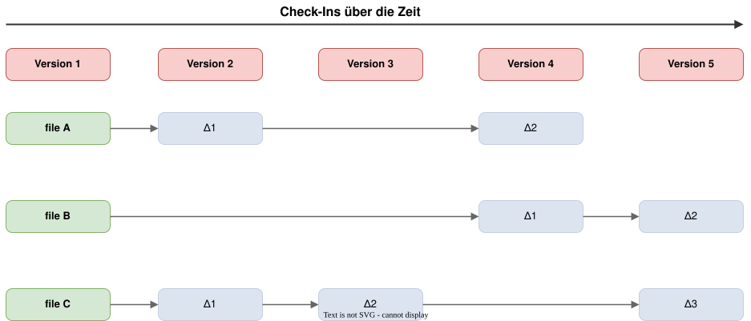
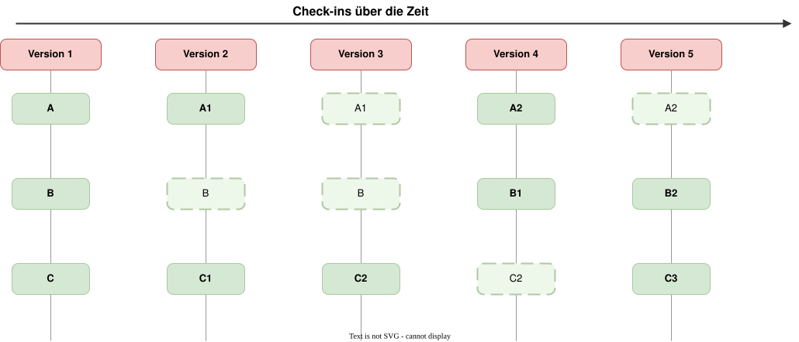
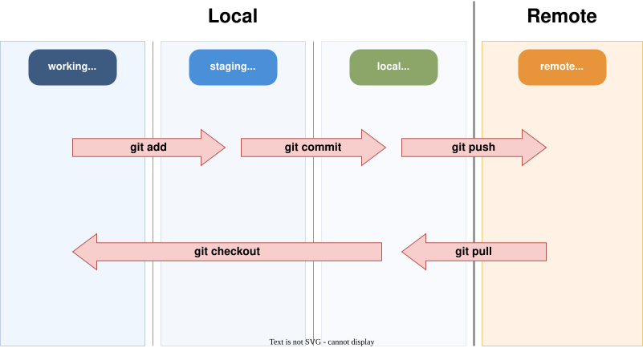
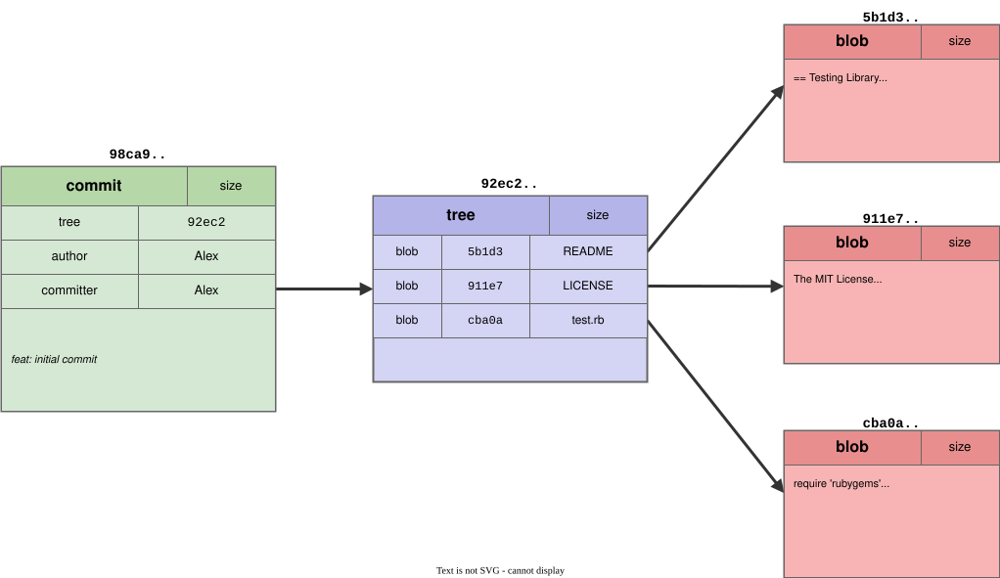
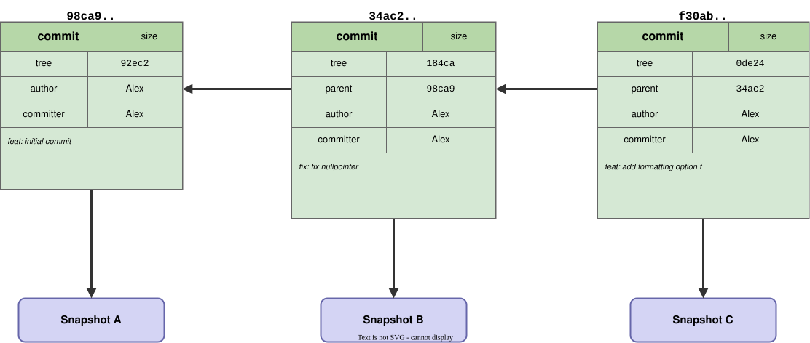

# Modul 01

## Git-Grundlagen & Konfiguration

---

## Wer von euch kennt das?

1. Ein Merge-Konflikt tritt auf... und du hast Angst, Code zu verlieren.
2. "Ich lösche einfach den Ordner und klone das Repo neu."
3. Du machst einen Commit, merkst einen Fehler und weißt nicht, wie du ihn
   *sauber* korrigierst.
4. Git fühlt sich an wie "Magie" - mal klappt es, mal nicht.

**Ziel dieses Kurses:** Git von einem “notwendigen Übel” zu einem Werkzeug
machen, das ihr versteht und kontrolliert.

---

## Wie Git Daten speichert: Snapshots statt Deltas

Die meisten älteren Versionskontrollsysteme speichern **Unterschiede** (Deltas)
zwischen Versionen.

**Git denkt anders:**

- Git macht bei jedem Commit einen **Snapshot** des gesamten Projekts
- Wenn eine Datei unverändert bleibt, speichert Git nur einen Verweis auf die
  bereits vorhandene Version
- Das macht Git extrem schnell bei Operationen wie Branching und Merging

---



---



---

## Die vier Bereiche von Git

Dateien bewegen sich durch vier Bereiche:

| Bereich               | Metapher     | Beschreibung                         |
|-----------------------|--------------|--------------------------------------|
| **Working Directory** | Werkstatt     | Hier arbeitest du (noch ungesichert) |
| **Staging Area**      | Versandbox    | Auswahl für den nächsten Commit      |
| **Local Repository**  | Lager         | Gesicherte Snapshots (Lokal)         |
| **Remote Repository** | Filiale       | Geteilter Stand auf dem Server       |

---



---

## Wiederherstellen von Änderungen

In Git ist (fast) nichts endgültig verloren. Du kannst meistens wieder zurück:

| Richtung           | Befehl                 | Wirkung                              |
|--------------------|------------------------|--------------------------------------|
| Workdir ⟲         | `git restore <file>`   | Werkbank aufräumen (Änderung weg)    |
| Staging → Workdir | `git restore --staged` | Aus Versandbox zurück auf Werkbank |
| Local → Workdir   | `git switch <branch>`  | Ganze Werkbank austauschen           |

---

## Aufbau eines Commits

Ein Commit ist kein bloßes "Diff", sondern ein Container mit:

- **Hash (ID):** Eindeutiger Fingerabdruck (z.B. `a1b2c3d4`)
- **Metadaten:** Wer hat wann was gemacht?
- **Snapshot:** Zeiger auf den kompletten Projektzustand
- **Parent:** Link zum Vorgänger (erzeugt die Historie)

> **Wichtig:** Sobald ein Commit eine ID hat, ist er gesichert.

---



---



---

## Konfiguration

Git speichert Konfiguration auf drei Ebenen:

| Ebene  | Befehl     | Datei            | Geltungsbereich    |
|--------|------------|------------------|--------------------|
| System | `--system` | `/etc/gitconfig` | Alle Benutzer      |
| Global | `--global` | `~/.gitconfig`   | Aktueller Benutzer |
| Lokal  | `--local`  | `.git/config`    | Aktuelles Repo     |

Spezifischere Ebenen überschreiben allgemeinere
(Lokal > Global > System).

---

## Pflicht-Konfiguration

Diese Angaben werden in **jedem Commit** gespeichert:

```bash
git config --global user.name "Max Mustermann"
git config --global user.email "max@example.com"
```

So sieht die resultierende `~/.gitconfig` aus:

```ini
[user]
    name = Max Mustermann
    email = max@example.com
```

---

## Nützliche Grundeinstellungen

```bash
# Standard-Branch-Name auf "main" setzen
git config --global init.defaultBranch main

# Farbige Ausgabe aktivieren
git config --global color.ui auto

# Standard-Editor auf VS Code setzen
git config --global core.editor "code --wait"
```

---

## Zeilenenden konfigurieren

```bash
# Windows - CRLF beim Checkout, LF beim Commit:
git config --global core.autocrlf true

# macOS/Linux - CRLF->LF beim Commit, LF bleibt:
git config --global core.autocrlf input
```

**Konfiguration überprüfen:**

```bash
git config --list --show-origin
```

---

## Credential Helper einrichten

Damit Git Zugangsdaten für GitHub speichert:

**Windows (Git Credential Manager ist vorinstalliert):**

```bash
git config --global credential.helper manager
```

**macOS:**

```bash
git config --global credential.helper osxkeychain
```

> `credential.helper store` speichert Passwörter als **Klartext**
>
> - nutze stattdessen `cache` mit Timeout.

---

## SSH-Key einrichten

GitHub empfiehlt SSH-Keys statt Passwörter/Tokens:

```bash
# 1. Schlüsselpaar erzeugen
ssh-keygen -t ed25519 -C "max@example.com"

# 2. Public Key anzeigen und kopieren
cat ~/.ssh/id_ed25519.pub
```

**3.** Public Key auf GitHub hinterlegen:
GitHub → Settings → SSH and GPG Keys → New SSH Key

**4.** Verbindung testen:

```bash
ssh -T git@github.com
```

---

## Nützliche Aliase

Aliase sparen Tipparbeit und machen die CLI mächtiger:

```bash
# Kurzbefehle
git config --global alias.st status
git config --global alias.br branch
git config --global alias.sw switch
git config --global alias.co checkout

# Ein schönerer Log-Graph
git config --global alias.lg "log --graph --oneline --all --decorate"
```

---

## Repository erstellen oder klonen

**Neues Repository erstellen:**

```bash
mkdir mein-projekt && cd mein-projekt
git init
```

**Bestehendes Repository klonen:**

```bash
git clone https://github.com/user/repo.git
```

> `git clone` erstellt eine vollständige Kopie inkl. gesamter
> Historie und konfiguriert den Remote `origin`.

---

## VS Code - Integrierte Git-Unterstützung

VS Code bringt Git-Support ohne Extensions mit:

- **Source Control Panel** (`Ctrl+Shift+G`) - Staging, Commits, Branches
  verwalten
- **Diff-Viewer** - Änderungen inline oder Side-by-Side anzeigen
- **Timeline View** - Lokale Historie einer Datei im Explorer (unten)
- **Gutter Indicators** - Geänderte Zeilen werden am Rand farbig markiert (
  grün = neu, blau = geändert, rot = gelöscht)

---

## VS Code - GitLens Extension

**GitLens** erweitert VS Code um fortgeschrittene Git-Funktionen:

- **Inline Blame** - Zeigt `git blame` direkt an jeder Codezeile
- **File History** - Vollständige Änderungshistorie pro Datei
- **Branch-Vergleiche** - Unterschiede zwischen Branches visualisieren
- **Commit Graph** - Interaktive Darstellung der Commit-Historie

```text
VS Code → Extensions → "GitLens" suchen → Install
```
