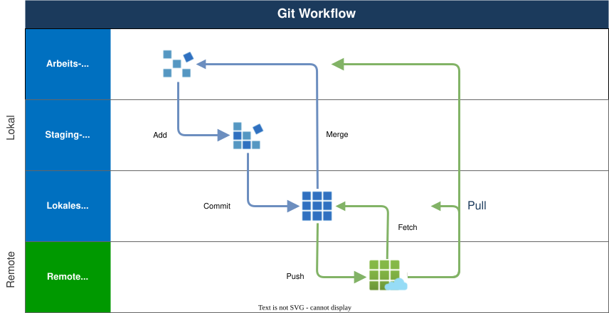

# Modul 02

## Der Arbeitsbereich: CLI & VS Code

---

## Lernziele

- `git status` und `git status -s` lesen können
- Diffs auswerten (CLI und VS Code)
- Atomare Commits: warum "klein" besser ist als "groß"
- Nur Teile einer Datei committen (Hunk Staging)
- Den Weg einer Codezeile durch die Historie verfolgen

---

## Der tägliche Git-Workflow



---

## `.gitignore`: Dateien ausschließen

Regel #1 für saubere Repos: **Müll gar nicht erst reinlassen.**

```gitignore
# AL-Spezifisch: Keine Binärdaten!
.alpackages/
*.app
.alcache/
```

**Was tun, wenn eine Datei "aus Versehen" schon drin ist?**
Das ist ein Klassiker: Die Datei steht in `.gitignore`, wird aber trotzdem
getrackt.

```bash
# Aus dem Index entfernen, aber auf der Festplatte behalten:
git rm --cached setup.json
```

---

## Zustand lesen (Short vs. Long)

Die Standard-Ausgabe von `git status` ist ausführlich. In der Praxis nutzt man
oft die Kurzform:

```bash
git status -s
```

**Die Kürzel verstehen:**

- ` M` (Leerstelle vor M): Datei geändert, aber **unstaged**
- `M ` (M vor Leerstelle): Datei geändert und **staged**
- `??`: Datei ist **untracked** (Git kennt sie noch nicht)
- `A `: Datei ist **neu hinzugefügt** (staged)

---

## Diffs lesen und verstehen

Ein `git diff` zeigt dir genau, was passieren wird.

```text
@@ -12,4 +12,6 @@   <-- Der "Chunk" Header (Startzeile, Länge)
- Old Code            <-- Entfernte Zeile
+ New Code            <-- Hinzugefügte Zeile
```

**Tipp für die CLI:**
Nutze `git diff --word-diff`, um Änderungen innerhalb einer Zeile besser zu
sehen.

---

## "Atomare" Commits

Einer der größten Fehler: **"Der Riesen-Commit"**.
(z.B. 15 Dateien geändert, 3 Features, 2 Bugfixes, 1 Refactoring).

**Warum das schlecht ist:**

1. Merges werden extrem komplex.
2. Code-Reviews sind unmöglich.
3. "Rollbacks" (Rückgängig machen) machen alles kaputt, was nebenbei noch drin
   war.

**Wichtig:** Ein Commit = Eine logische Änderung.

---

## Partielles Staging (Hunk Staging)

Du hast in einer Datei zwei Dinge gleichzeitig gemacht (z.B. Bugfix +
Kommentar)?

**In VS Code:**

1. Öffne das Diff der Datei im Source Control Panel.
2. Markiere nur die Zeilen, die du committen willst.
3. Rechtsklick → **"Stage Selected Ranges"**.

**Ergebnis:** Du hast zwei saubere Commits aus einer Datei gemacht.

---

## Gute Commit Messages

```text
Kurze Zusammenfassung (max. 50 Zeichen)

Optionaler ausführlicher Text, der erklärt WARUM die
Änderung gemacht wurde. Maximal 72 Zeichen pro Zeile.

Refs: #123
```

**Regeln:**

- **Imperativ verwenden:** "Add feature", nicht "Added feature"
- **Was und Warum**, nicht Wie
- Erste Zeile = Betreffzeile (kurz und prägnant)
- Leerzeile zwischen Betreffzeile und Body

---

## Commit Messages -Gute und schlechte Beispiele

|              | Message                                      | Problem/Vorteil                         |
|--------------|----------------------------------------------|-----------------------------------------|
| **Schlecht** | `fix`                                        | Sagt nichts aus                         |
| **Schlecht** | `Changed MyTable.al`                         | Beschreibt das _Was_, nicht das _Warum_ |
| **Schlecht** | `Added the field "Customer No." to table...` | Zu lang, zu detailliert                 |
| **Gut**      | `Add Customer No. field to Sales Header`     | Klar, prägnant, Imperativ               |
| **Gut**      | `Fix VAT calculation for EU customers`       | Beschreibt das gelöste Problem          |

---

## Die Historie lesen -`git log`

```bash
# "Bessere" Variante von git log:
git log --oneline --graph --decorate --all
```

> In VS Code nutzt man hierfür am besten **GitLens (Inline Blame)** oder die **Timeline View**.

---

## Push, Pull und die Gefahr des "Sync" Buttons

Der "Sync" Button in VS Code macht standardmäßig ein `git pull` gefolgt von
einem `git push`.

**Die Gefahr:** Wenn auf dem Server Änderungen sind, die du lokal nicht hast,
erstellt VS Code automatisch einen **Merge-Commit**.

**Besser:**

1. Erst `git pull` (um zu sehen, was kommt).
2. Konflikte lokal lösen.
3. Dann erst `git push`.

---

## Zusammenfassung: Wichtigste Befehle

| Ziel      | CLI                   | VS Code                    |
|-----------|-----------------------|----------------------------|
| Überblick | `git status -s`       | Source Control Panel       |
| Prüfung   | `git diff --staged`   | Diff-Viewer (Side-by-Side) |
| Präzision | `git add -p`          | Stage Selected Ranges      |
| Ordnung   | `git commit` (Editor) | Commit Input Box           |
| Historie  | `git log --graph`     | GitLens / Timeline         |
