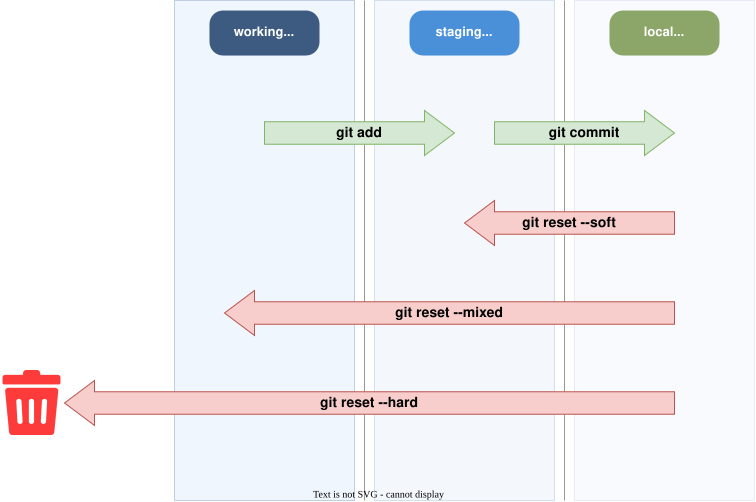
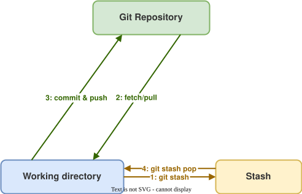
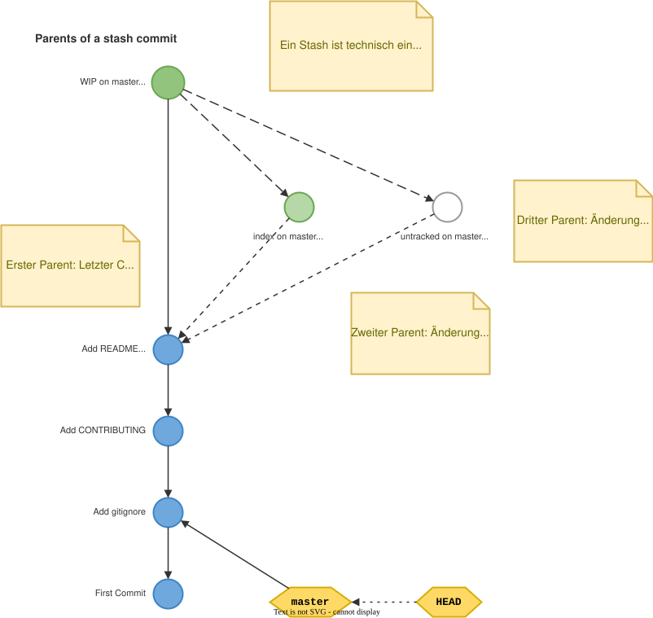
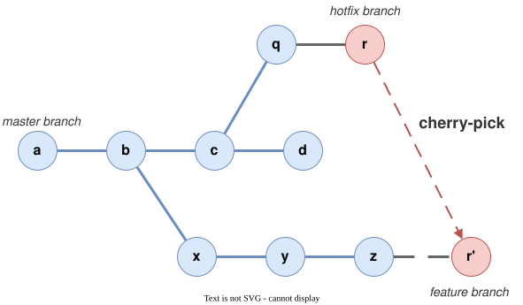
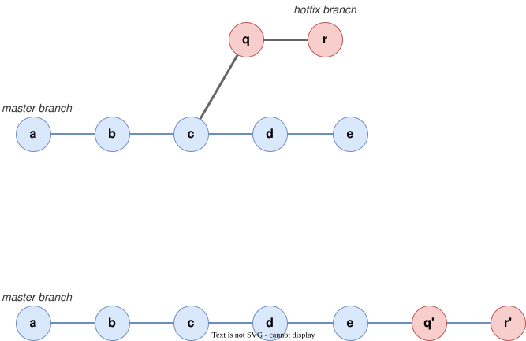

# Modul 03

## Änderungen korrigieren & umschreiben

---

## Lernziele

- **Den letzten Commit korrigieren** - `git commit --amend` nutzen
- **Die drei Stufen von Reset verstehen** - Soft, Mixed und Hard einsetzen
- **Gepushte Fehler rückgängig machen** mit `git revert`
- **Stashen** - Arbeit vorübergehend parken
- **Cherry-Picking anwenden** - Einzelne Commits in andere Branches übernehmen
- **Rebase verstehen** - History linearisieren und aufräumen

---

## Den letzten Commit "reparieren" (Amending)

Szenario: Du hast gerade committet, merkst aber:

- Ein Tippfehler in der Commit Message.
- Eine Datei vergessen zu stagen (`git add`).

```bash
# Ändert nur die Message des letzten Commits
git commit --amend -m "Neue, korrekte Message"

# Fügt vergessene Dateien zum letzten Commit hinzu
git add vergessene_datei.al
git commit --amend --no-edit
```

> **Wichtig:** Nutze `amend` nur für lokale Commits, die noch **nicht** gepusht
> wurden!

---

## Änderungen rückgängig machen

`git reset` ist nützlich, kann aber Schaden anrichten. Pass' auf die Flags auf:

| Flag-Modus     | Was passiert?                                 | Wann nutzen?                                 |
|-----------|-----------------------------------------------|----------------------------------------------|
| `--soft`  | Commit weg, Änderungen sind im **Staging** | "Ich will den Commit anders aufteilen"       |
| `--mixed` | Commit weg, Änderungen sind im **WorkDir** | "Ich will die Änderungen nochmal prüfen"     |
| `--hard`  | **Alles weg!** (Commit + Änderungen)              | "Vergiss alles, was ich gerade gemacht habe" |

---



---

## Wichtig: Gepushte Historie nicht ändern

**Ändere niemals die Historie, die bereits auf dem Server (Remote) liegt!**

- Wenn du `reset` oder `amend` auf gepushte Commits anwendest, weicht deine
  Historie von der deiner Kollegen ab.
- **Folge:** Ein "Force Push" wäre nötig, was das Repository für andere kaputt
  macht.

**Lösung für gepushte Fehler:** `git revert`
Es erstellt einen neuen Commit, der die Änderungen des fehlerhaften Commits
genau umkehrt.

---

## `git stash`: Arbeit zwischenspeichern

Du arbeitest an einem Feature, aber ein dringender Bugfix kommt rein?

```bash
# Aktuelle Arbeit "wegschließen"
git stash save "WIP: Layout Anpassungen"

# Branch wechseln, Bug fixen, zurückkehren...

# Arbeit wieder herausholen
git stash pop
```

**Tipp:** Nutze `git stash list`, um den Überblick zu behalten. Ein Stash ist keine Dauerlösung!

---



---

## Stash Internals

Ein Stash ist technisch intern ein virtueller **Merge-Commit** mit bis zu drei Parents:

| Parent | Referenz | Inhalt |
|--------|----------|--------|
| 1. | `stash@{0}^1` | HEAD-Commit zum Zeitpunkt des Stash |
| 2. | `stash@{0}^2` | Snapshot der Staging Area (Index) |
| 3. | `stash@{0}^3` | Untracked Files (nur bei `-u` oder `-a`) |

> Der Stash-Commit selbst enthalt die **modifizierten Dateien**
> aus dem Working Directory.

---



---

## Cherry-Picking

Einen einzelnen Commit in einen anderen Branch übernehmen:

```bash
# Commit-Hash herausfinden
git log --oneline main

# Commit in aktuellen Branch übernehmen
git cherry-pick abc1234
```

**Anwendungsfall:** Ein Bugfix wurde auf `main` commited und muss auch in den
`release/1.3`-Branch.

```bash
git switch release/1.3
git cherry-pick abc1234
```

---



---

## Cherry-Pick - Optionen

```bash
# Mehrere Commits
git cherry-pick abc1234 def5678

# Commit übernehmen, aber nicht sofort committen
git cherry-pick --no-commit abc1234

# Bei Konflikten: Abbrechen
git cherry-pick --abort

# Bei Konflikten: Weitermachen (nach Auflösung)
git cherry-pick --continue
```

> **Vorsicht:** Cherry-Pick erstellt einen **neuen Commit** mit neuem Hash. 
> Der Original-Commit und der Cherry-Pick sind nicht identisch.

---

## Rebase

Rebase verschiebt Commits auf eine neue Basis:



---

## Rebase (Fortsetzung)
```bash
git switch feature/customer-list
git rebase main
```

> Die Commits D und E werden **neu erstellt** (D', E') -
> sie haben neue Hashes.

---

## Rebase vs. Merge

|                       | Merge                        | Rebase                    |
|-----------------------|------------------------------|---------------------------|
| **History**           | Nicht-linear (Merge-Commits) | Linear                    |
| **Original-Commits**  | Bleiben erhalten             | Werden neu erstellt       |
| **Sicher nach Push?** | Ja                           | Nein (verändert History!) |
| **Konflikte**         | Einmal beim Merge            | Pro Commit einzeln        |

**Goldene Regel:**

> **Niemals Commits rebasen, die bereits gepusht und von
> anderen genutzt werden.**

---

## Wann Rebase nutzen?

**Empfohlen:**

- Feature-Branch auf aktuellen `main`-Stand bringen
  (vor dem PR)
- Lokale Commits aufräumen (Interactive Rebase)

**Nicht empfohlen:**

- Auf öffentlichen/geteilten Branches
- Wenn andere bereits auf dem Branch arbeiten

---

## Rebase (Fortsetzung)

```bash
# Feature-Branch aktualisieren (statt merge)
git switch feature/customer-list
git rebase main
git push --force-with-lease  # Nur eigener Branch!
```

---

## Interactive Rebase

Commits vor einem PR aufräumen:

```bash
# Die letzten 3 Commits bearbeiten
git rebase -i HEAD~3
```

---

**Aktionen im Editor:**

| Aktion   | Bedeutung                          |
|----------|------------------------------------|
| `pick`   | Commit beibehalten                 |
| `reword` | Commit Message ändern              |
| `squash` | Mit vorherigem Commit verschmelzen |
| `fixup`  | Wie squash, aber Message verwerfen |
| `drop`   | Commit entfernen                   |

---

## `reflog`: Verlorene Commits finden

Das Reflog speichert **jede Bewegung** von HEAD -auch nach `reset --hard` oder
fehlgeschlagenem Rebase.

```bash
git reflog
# Ausgabe:
# abc1234 HEAD@{0}: rebase: Add customer list
# def5678 HEAD@{1}: rebase: start
# ghi9012 HEAD@{2}: commit: Original commit
```

**Verlorenen Zustand wiederherstellen:**

```bash
git reset --hard HEAD@{2}
```

> Solange etwas im Reflog steht (Standard: 90 Tage), ist es wiederherstellbar.

---

## Häufige Rettungsszenarien

**Branch versehentlich gelöscht:**

```bash
git reflog
# Commit-Hash des Branch-Tips finden
git switch -c feature/recovered abc1234
```

**Reset --hard war ein Fehler:**

```bash
git reflog
git reset --hard HEAD@{1}
```

---

## Häufige Rettungsszenarien (Fortsetzung)

**Rebase ging schief:**

```bash
git rebase --abort
# Oder falls schon abgeschlossen:
git reflog
git reset --hard HEAD@{n}  # n = Zustand vor Rebase
```
