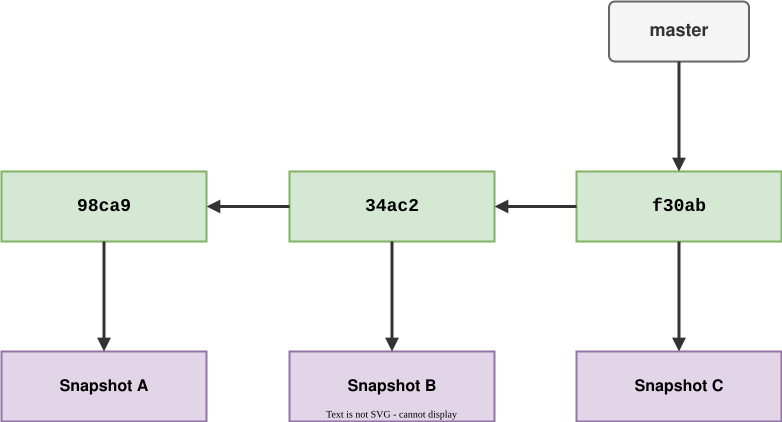
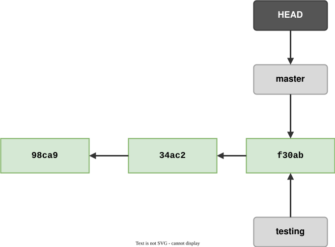
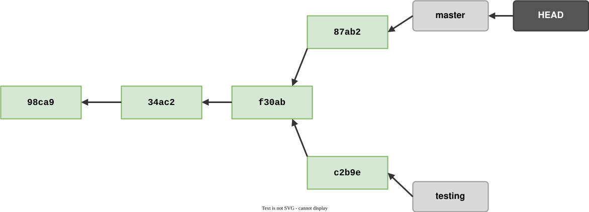
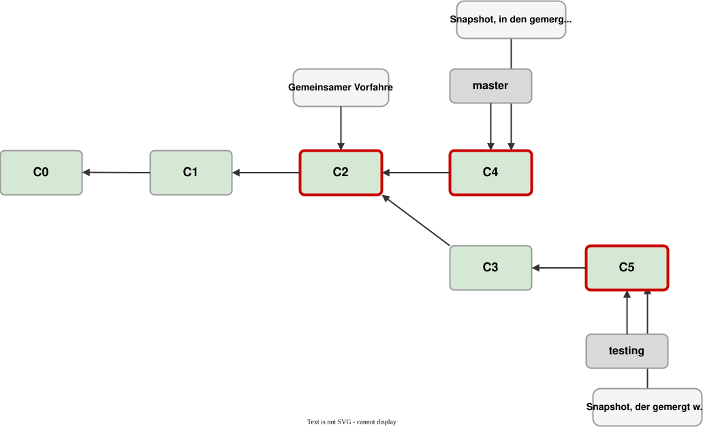
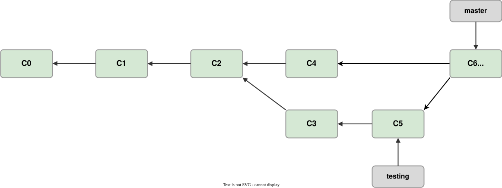

# Modul 04

## Branch & Merge: Parallel arbeiten

---

## Lernziele

Nach diesem Modul kannst du:

- **Das Zeiger-Modell verstehen**: Warum Branches in Git so leichtgewichtig sind
- **Merge-Strategien kennen**: Fast-Forward vs. Merge-Commits
- **Konflikte lösen**: Der VS Code Merge Editor
- **"Pull before Merge"** und Branch-Hygiene

---

## Was ist ein Branch?

In Git ist ein Branch nur ein **beweglicher Zeiger** auf einen Commit-Hash.

- `main` → zeigt auf Commit `a1b2`
- `feature/login` → zeigt auf Commit `c3d4`
- `HEAD` → zeigt auf den Branch, auf dem du gerade stehst.

**Der Vorteil:** Einen Branch zu erstellen kostet fast keinen Speicherplatz und
dauert Millisekunden.

---

## Branches als Zeiger

Ein Branch zeigt immer auf den **neuesten Commit** in seiner Kette.
Jeder Commit kennt seinen Vorgänger. So entsteht die History.



---

## HEAD und mehrere Branches

`HEAD` zeigt auf den Branch, auf dem du gerade arbeitest.
Mehrere Branches können auf denselben Commit zeigen, z.B. direkt nach
`git switch -c testing`.



---

## Merge-Varianten

Beim Zusammenführen von Arbeit gibt es zwei Szenarien:

### A) Fast-Forward (Der "einfache" Weg)

Wenn sich der `main` seit deinem Abzweig nicht verändert hat, schiebt Git
einfach den `main`-Zeiger auf deinen letzten Commit.
*Kein neuer Commit nötig.*

### B) Merge-Commit ("Knotenpunkt")

Wenn beide Branches sich weiterentwickelt haben, erstellt Git einen neuen
**Merge-Commit**, der zwei "Eltern" hat.

---

## Wann brauche ich einen Merge-Commit?

Wenn sich **beide Branches** seit dem Abzweig weiterentwickelt haben,
reicht ein einfaches Vorwärtsschieben des Zeigers nicht mehr.

Git muss die Änderungen beider Seiten zusammenführen.



---

## Der 3-Way-Merge

Git vergleicht drei Snapshots miteinander:

- **Gemeinsamer Vorfahre** — Wo haben sich die Branches getrennt?
- **Snapshot A** — Stand auf dem Ziel-Branch (`master`)
- **Snapshot B** — Stand auf dem Branch, der gemergt wird (`testing`)

---



---

## Ergebnis: Der Merge-Commit

Das Ergebnis ist ein neuer **Merge-Commit** (C6), der auf **beide Eltern**
zeigt — den letzten Commit von `master` und den letzten von `testing`.



---

## Merge-Konflikte

Ein Konflikt entsteht, wenn Git nicht automatisch entscheiden kann, welche
Änderung Vorrang hat.

**Häufige Ursachen:**

- Zwei Leute ändern dieselbe Zeile in der `app.json`.
- Ein Refactoring verschiebt Code, den jemand anderes gerade editiert hat.

**Regel:** Vor dem Merge immer `git status` prüfen. Ein sauberer
Arbeitsbereich macht das Lösen von Konflikten viel einfacher.

---

## Konflikte lösen in VS Code

Vergiss das manuelle Löschen von `<<<<<<< HEAD` Markern in der Textansicht.

**Der VS Code Merge Editor:**

1. Klicke auf **"Resolve in Merge Editor"**.
2. **Links (Incoming):** Was kommt vom anderen Branch?
3. **Rechts (Current):** Was hast du lokal?
4. **Unten (Result):** Wie soll es am Ende aussehen?

Wähle einfach per Checkbox die Zeilen aus, die du behalten willst.

---

## Pull before Merge

Bevor du deinen Feature-Branch in den `main` mergest, solltest du den `main` in
deinen Feature-Branch holen:

```bash
git switch feature/mein-cooles-feature
git merge main
# Eventuelle Konflikte HIER lösen, nicht im main!
```

**Der Vorteil:** Du testest die Integration in deiner geschützten Umgebung,
bevor du den stabilen `main`-Branch "belastest".
