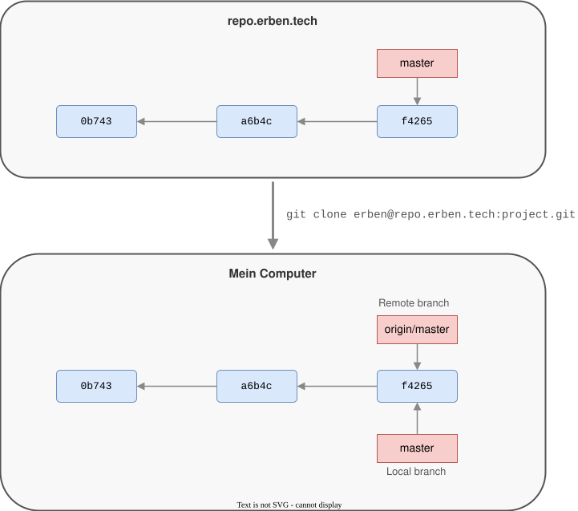
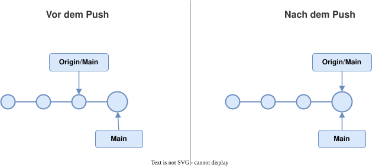
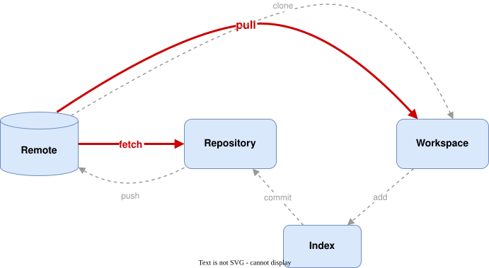

# Modul 05

## Remotes: Lokales Git trifft Server

---

## Lernziele

Nach diesem Modul kannst du:

- **Remote-Repositories verstehen**: Was `origin` ist und wie Remotes funktionieren
- **Push, Fetch und Pull unterscheiden**: Daten senden vs. holen
- **Tracking-Branches verstehen**: Was `origin/main` ist und warum es wichtig ist
- **Typische Remote-Workflows anwenden**: Zusammenarbeit über ein zentrales Repository

---

## Was ist ein Remote?

Ein Remote ist ein **Verweis auf ein anderes Repository** — meistens auf einem Server.

```bash
# Konfigurierte Remotes anzeigen
git remote -v
```

```text
origin  https://github.com/team/project.git (fetch)
origin  https://github.com/team/project.git (push)
```

- `origin` ist der **Standardname** für das Repository, von dem geklont wurde.
- Ein Remote ist nur eine URL mit einem Namen — nichts Magisches.

---



---

## Remotes verwalten

```bash
# Remote hinzufügen
git remote add origin https://github.com/team/project.git

# Remote umbenennen
git remote rename origin upstream

# Remote entfernen
git remote remove upstream

# URL eines Remotes ändern
git remote set-url origin https://github.com/team/new-url.git
```

> In der Praxis brauchst du `remote add` selten — `git clone` richtet `origin` automatisch ein.

---

## git clone

`git clone` erstellt eine vollständige Kopie eines Remote-Repositories:

```bash
git clone https://github.com/team/project.git
```

**Was passiert dabei?**

1. Neues Verzeichnis `project/` wird erstellt
2. Gesamte Historie wird heruntergeladen
3. Remote `origin` wird automatisch konfiguriert
4. Standard-Branch wird ausgecheckt
5. Tracking zwischen lokalem und Remote-Branch wird eingerichtet

---

## Pushen: Lokale Commits teilen

```bash
# Erstes Mal: Branch pushen + Tracking einrichten
git push -u origin main

# Danach reicht:
git push
```

**Was macht `-u` (bzw. `--set-upstream`)?**

Es verknüpft deinen lokalen Branch mit dem Remote-Branch. Danach weiß Git bei `git push` und `git pull` automatisch, wohin bzw. woher.

---

## Was passiert beim Push?



> **Wichtig:** Push funktioniert nur, wenn der Remote-Branch ein Vorgänger deines lokalen Stands ist. Sonst: erst pullen!

---

## Fetch: Informationen holen

`git fetch` holt neue Commits vom Remote, **ohne lokale Branches zu verändern**.

```bash
git fetch
```



---

## Pull: Fetch + Merge

`git pull` ist die Kombination aus `git fetch` + `git merge`:

```bash
# Standard: Fetch + Merge
git pull

# Alternative: Fetch + Rebase (lineare History)
git pull --rebase
```

---

## Fetch vs. Pull

| | `git fetch` | `git pull` |
|---|---|---|
| Holt Remote-Daten | Ja | Ja |
| Ändert lokale Branches | Nein | Ja (Merge/Rebase) |
| Kann Konflikte erzeugen | Nein | Ja |
| Sicher zum "Schauen" | Ja | Nein |

> **Empfehlung:** Im Zweifel erst `git fetch`, dann mit `git log origin/main` schauen, was kommt — und dann bewusst mergen oder rebasen.

---

## Remote-Tracking-Branches

Remote-Tracking-Branches (z.B. `origin/main`) sind **lokale Kopien** des Remote-Stands.

```bash
# Alle Branches anzeigen (lokal + remote)
git branch -a
```

```text
* main
  feature/login
  remotes/origin/main
  remotes/origin/feature/login
  remotes/origin/feature/api
```

- Du kannst sie **nicht direkt auschecken**. Sie werden durch `fetch`/`pull` aktualisiert.
- Sie zeigen dir, was der Remote-Stand **beim letzten Fetch** war.

---

## Auf einen Remote-Branch wechseln

Wenn ein Kollege einen Branch gepusht hat:

```bash
git fetch
git switch feature/api
```

Git erstellt automatisch einen **lokalen Tracking-Branch**, wenn ein passender Remote-Branch existiert.

Das ist die Kurzform von:

```bash
git switch -c feature/api origin/feature/api
```

---

## Typischer Workflow

```text
1. git fetch                    # Was gibt's Neues?
2. git pull                     # Remote-Stand integrieren
3. # ... arbeiten, committen ...
4. git push                     # Eigene Arbeit teilen
```

**Wenn der Push abgelehnt wird** (jemand war schneller):

```text
1. git pull --rebase            # Eigene Commits "nach hinten"
2. # Eventuelle Konflikte lösen
3. git push                     # Jetzt klappt's
```

---

## Zusammenfassung

| Befehl | Was passiert |
|--------|-------------|
| `git remote -v` | Konfigurierte Remotes anzeigen |
| `git clone <url>` | Repository klonen, `origin` wird eingerichtet |
| `git push -u origin <branch>` | Branch pushen + Tracking einrichten |
| `git push` | Lokale Commits zum Remote senden |
| `git fetch` | Remote-Infos holen, ohne lokal zu ändern |
| `git pull` | Fetch + Merge in den aktuellen Branch |
| `git branch -a` | Alle Branches (lokal + remote) anzeigen |
