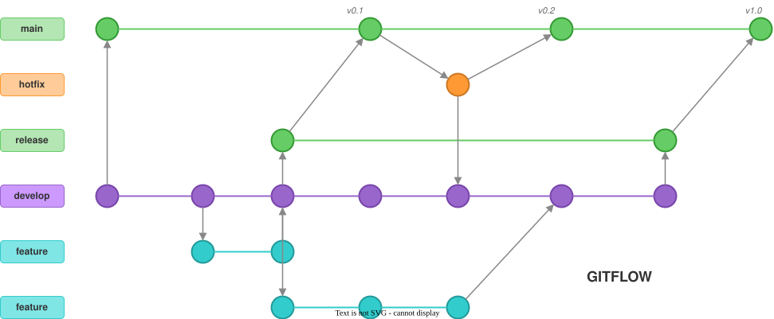
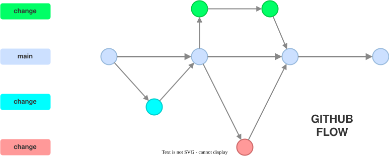

# Modul 07

## Branching-Strategien & Releases

---

## Lernziele

- Git Flow, GitHub Flow und Trunk-Based Development
  unterscheiden
- Die passende Strategie für euer Team finden
- Semantic Versioning: Versionsnummern richtig vergeben
- Git Tags für Releases (Lightweight vs. Annotated)

---

## Warum eine Branching-Strategie?

Ohne klare Regeln entsteht Chaos:

- Wer arbeitet auf welchem Branch?
- Wann wird ein Release erstellt?
- Wie kommt ein dringender Bugfix in die Produktion?
- Welche Änderungen sind in welchem Release?

> Eine Branching-Strategie ist die **Vereinbarung im Team**,
> wie Branches genutzt werden.

---

## 2. Git Flow

Das klassische Modell (Vincent Driessen, 2010):

| Branch | Rolle | Lebensdauer |
|--------|-------|-------------|
| `main` | Produktionsstand | Permanent |
| `develop` | Integrations-Branch | Permanent |
| `feature/*` | Neue Funktionalität | Temporär |
| `release/*` | Release-Vorbereitung | Temporär |
| `hotfix/*` | Dringender Bugfix | Temporär |

---

## 2.1 Git Flow - Ablauf



1. Feature von `develop` abzweigen, zurück nach `develop` mergen
2. Release von `develop` abzweigen, Bugfixes dort machen
3. Release nach `main` UND `develop` mergen
4. Hotfix von `main` abzweigen, nach `main` UND `develop` mergen

---

## 2.2 Git Flow - Bewertung

**Vorteile:**

- Klare Trennung zwischen Entwicklung und Produktion
- Parallele Releases möglich
- Gut für Software mit festen Release-Zyklen

**Nachteile:**

- Komplex - viele Branches gleichzeitig
- Langsamer Feedback-Zyklus
- `develop` kann zum Bottleneck werden

---

## GitHub Flow

Einfacheres Modell, PR-basiert:

| Branch | Rolle | Lebensdauer |
|--------|-------|-------------|
| `main` | Immer deploybar | Permanent |
| `feature/*` | Jede Änderung | Temporär |

---

## GitHub Flow (Fortsetzung)

**Ablauf:**

1. Branch von `main` erstellen
2. Commits machen
3. Pull Request öffnen
4. Review + CI-Checks
5. In `main` mergen → Deploy

---



---

## GitHub Flow: Bewertung

**Vorteile:**

- Einfach zu verstehen und umzusetzen
- Schneller Feedback-Zyklus
- Gut mit CI/CD und Branch Protection

**Nachteile:**

- Nur ein Produktions-Branch - kein paralleles
  Release-Management
- Setzt gute Test-Automatisierung voraus
- Hotfixes haben keinen eigenen Workflow

---

## Trunk-Based Development

Das radikalste Modell:

- **Alle arbeiten auf `main`** (dem "Trunk")
- Sehr kurzlebige Feature-Branches (max. 1-2 Tage)
- Continuous Integration im Wortsinne

**Vorteile:** Minimale Merge-Konflikte, schnellster
Feedback-Zyklus

**Nachteile:** Erfordert hohe Disziplin, Feature Flags,
exzellente Testabdeckung

---

## Welche Strategie passt?

| Kriterium | Git Flow | GitHub Flow | Trunk-Based |
|-----------|----------|-------------|-------------|
| Komplexität | Hoch | Niedrig | Niedrig |
| Release-Zyklen | Fest / geplant | Kontinuierlich | Kontinuierlich |
| Parallele Releases | Ja | Nein | Nein |
| Team-Größe | Groß | Klein bis Mittel | Klein bis Mittel |
| CI/CD nötig | Optional | Empfohlen | Pflicht |
| BC-Eignung | Gut | Gut | Bedingt |

> **Empfehlung für BC-Teams:** GitHub Flow als Basis.
> Bei Bedarf um Release-Branches ergänzen (Git Flow light).

---

## Semantic Versioning (SemVer)

Das Standard-Schema für Versionsnummern:

```text
MAJOR.MINOR.PATCH
  │     │     └── Bugfixes (abwärtskompatibel)
  │     └──────── Neue Features (abwärtskompatibel)
  └────────────── Breaking Changes (nicht kompatibel)
```

**Beispiele:**

- `1.0.0` → `1.0.1` - Bugfix
- `1.0.1` → `1.1.0` - Neues Feature
- `1.1.0` → `2.0.0` - Breaking Change

> Spezifikation: <https://semver.org>

---

## Versionierung in Business Central

BC verwendet ein **Vier-Teile-Schema** in `app.json`:

```json
{
  "version": "1.3.0.0"
}
```

```text
MAJOR.MINOR.BUILD.REVISION
  │     │     │      └── Automatisch (z.B. CI-Run)
  │     │     └───────── Automatisch (z.B. CI-Run)
  │     └─────────────── Manuell: Neue Features
  └───────────────────── Manuell: Breaking Changes
```

**Wichtig:** Die Version in `app.json` muss bei jedem Deployment **aufsteigend** sein.
Eine niedrigere Version kann nicht installiert werden.

---

## Git Tags für Releases

Tags markieren einen Commit als Release-Punkt.

**Lightweight Tag** (nur ein Zeiger):

```bash
git tag v1.3.0
```

**Annotated Tag** (empfohlen - mit Metadaten):

```bash
git tag -a v1.3.0 -m "Release 1.3.0: Customer list extension"
```

---

## Git Tags für Releases (Fortsetzung)

**Unterschied:**

| | Lightweight | Annotated |
|---|---|---|
| Autor/Datum | Nein | Ja |
| Message | Nein | Ja |
| Signierbar | Nein | Ja (GPG) |
| Empfehlung | Temporär | Releases |

---

## Tags verwalten

```bash
# Alle Tags anzeigen
git tag --list

# Tags mit Muster filtern
git tag --list "v1.3.*"

# Tag-Details anzeigen
git show v1.3.0

# Tags zum Remote pushen
git push origin v1.3.0
# Oder alle Tags:
git push origin --tags

# Tag löschen (lokal + remote)
git tag -d v1.3.0
git push origin --delete v1.3.0
```

---

## Wann wird die Version gebumpt?

Klare Regeln im Team definieren:

| Ereignis | Version-Bump | Beispiel |
|----------|-------------|---------|
| Bugfix | PATCH | `1.3.0` → `1.3.1` |
| Neues Feature | MINOR | `1.3.1` → `1.4.0` |
| Breaking Change | MAJOR | `1.4.0` → `2.0.0` |
| Hotfix | PATCH | `1.3.0` → `1.3.1` |

---

## Release-Workflow in der Praxis

**Szenario:** Version 1.3.0 wird vorbereitet.

```bash
# Release-Branch von main erstellen
git switch -c release/1.3.0 main

# Version in app.json bumpen
# Letzte Bugfixes machen
git commit -m "Bump version to 1.3.0.0"

# Nach main mergen und taggen
git switch main
git merge release/1.3.0
git tag -a v1.3.0 -m "Release 1.3.0"
git push origin main --tags
```

---

## Hotfix-Workflow

**Szenario:** Kritischer Bug in Produktion (v1.3.0).

```bash
# Hotfix-Branch von main/Tag erstellen
git switch -c hotfix/1.3.1 v1.3.0

# Fix implementieren und Version bumpen
git commit -m "Fix invoice calculation error"
git commit -m "Bump version to 1.3.1.0"

# Nach main mergen und taggen
git switch main
git merge hotfix/1.3.1
git tag -a v1.3.1 -m "Hotfix 1.3.1"
git push origin main --tags
```

---

## Was ist in welchem Release?

**Commits zwischen zwei Tags anzeigen:**

```bash
# Was kam nach v1.2.0 bis v1.3.0?
git log --oneline v1.2.0..v1.3.0
```

**Was kommt in den nächsten Release?**

```bash
# Commits auf main seit letztem Tag
git log --oneline v1.3.0..main
```

**Ist ein bestimmter Commit in einem Release?**

```bash
# In welchen Tags ist Commit abc123 enthalten?
git tag --contains abc123
```

---

## Commits zwischen Branches vergleichen

```bash
# Was ist auf release/1.4 aber nicht auf main?
git log --oneline main..release/1.4

# Und umgekehrt?
git log --oneline release/1.4..main
```

> **Anwendungsfall:** Prüfen, ob alle Hotfixes von `main`
> auch im Release-Branch sind.

---

## Conventional Commits

Ein Standard für strukturierte Commit Messages:

```text
feat: add customer list page extension
fix: correct invoice calculation for negative amounts
docs: update README with setup instructions
refactor: extract validation logic to separate codeunit
```

**Vorteile:**

- Automatische Changelog-Generierung
- Automatisches Version-Bumping möglich
- Einheitliche History im ganzen Team
